# Design Document: API Route Tests

## Overview

This design covers comprehensive API route testing for the AgentCore Public Stack backend. The backend has two FastAPI applications — App API (port 8000, 15+ route modules) and Inference API (port 8001, 2 route modules) — with zero route-level test coverage today.

The testing approach uses FastAPI's `TestClient` with `app.dependency_overrides` to mock authentication (`get_current_user`), RBAC guards (`require_roles`, `require_admin`), and service-layer dependencies (DynamoDB, S3, Bedrock). This keeps tests fast, deterministic, and isolated from AWS infrastructure.

Key design decisions:
- **Per-module minimal FastAPI apps**: Each test module creates a `FastAPI()` instance mounting only the router under test, matching the existing pattern in `tests/auth/test_auth_routes.py`.
- **Shared fixtures in a route-test conftest**: A new `backend/tests/routes/conftest.py` provides reusable authenticated/unauthenticated clients, mock user factories, and service mock helpers.
- **Hypothesis for request validation**: Property-based tests generate random invalid payloads to verify routes reject malformed input consistently.
- **Route introspection for auth sweep**: Requirement 17 uses `app.routes` to programmatically discover all protected routes and verify they return 401 without auth.

## Architecture

```mermaid
graph TD
    subgraph Test Infrastructure
        CF[routes/conftest.py<br/>Shared fixtures]
    end

    subgraph Per-Module Route Tests
        H[test_health.py]
        S[test_sessions.py]
        F[test_files.py]
        C[test_chat.py]
        A[test_auth.py]
        AD[test_admin.py]
        T[test_tools.py]
        M[test_memory.py]
        CO[test_costs.py]
        U[test_users.py]
        MO[test_models.py]
        AS[test_assistants.py]
        D[test_documents.py]
        I[test_inference.py]
    end

    subgraph Property Tests
        PV[test_pbt_request_validation.py]
        PA[test_pbt_auth_sweep.py]
    end

    CF --> H & S & F & C & A & AD & T & M & CO & U & MO & AS & D & I
    CF --> PV & PA

    subgraph Mocked Dependencies
        AUTH[get_current_user<br/>→ mock User]
        RBAC[require_admin<br/>→ mock admin User]
        SVC[Service deps<br/>→ AsyncMock]
    end

    CF -.-> AUTH & RBAC & SVC
```



### Test File Layout

```
backend/tests/routes/
├── __init__.py
├── conftest.py                    # Shared fixtures (Req 1)
├── test_health.py                 # Req 2
├── test_sessions.py               # Req 3
├── test_files.py                  # Req 4
├── test_chat.py                   # Req 5
├── test_auth.py                   # Req 6
├── test_admin.py                  # Req 7
├── test_tools.py                  # Req 8
├── test_memory.py                 # Req 9
├── test_costs.py                  # Req 10
├── test_users.py                  # Req 11
├── test_models.py                 # Req 12
├── test_assistants.py             # Req 13
├── test_documents.py              # Req 14
├── test_inference.py              # Req 15
├── test_pbt_request_validation.py # Req 16
└── test_pbt_auth_sweep.py         # Req 17
```

### Testing Pattern

Every per-module test file follows this pattern:

1. Create a minimal `FastAPI()` app with only the router under test
2. Apply `dependency_overrides` for auth and service dependencies
3. Use `TestClient(app)` (synchronous) for request/response assertions
4. Group tests by endpoint in classes (e.g., `TestListSessions`, `TestDeleteSession`)

This matches the established pattern in `tests/auth/test_auth_routes.py`.

## Components and Interfaces

### 1. Shared Test Fixtures (`routes/conftest.py`)

Provides reusable pytest fixtures consumed by all route test modules.

```python
# Key fixtures:

def make_user() -> Callable[..., User]:
    """Factory: create User with configurable email, user_id, name, roles."""

def mock_auth_user(app: FastAPI, user: User) -> None:
    """Override get_current_user to return the given User."""

def mock_no_auth(app: FastAPI) -> None:
    """Override get_current_user to raise HTTP 401."""

def authenticated_client(app: FastAPI, user: User) -> TestClient:
    """TestClient with auth overridden to return user."""

def unauthenticated_client(app: FastAPI) -> TestClient:
    """TestClient with no auth override (real dependency raises 401)."""

def admin_client(app: FastAPI) -> TestClient:
    """TestClient with auth overridden to return admin-role user."""

def mock_service(app: FastAPI, dependency: Callable, mock: Any) -> None:
    """Override any FastAPI Depends() with a mock."""
```

The `make_user` factory mirrors the existing `tests/auth/conftest.py` pattern but lives in the shared routes conftest so all route tests can use it.

### 2. Per-Module Test Files

Each test file:
- Imports the specific router from `apis.app_api.<module>.routes`
- Creates a local `@pytest.fixture def app()` mounting that router
- Uses `dependency_overrides` to mock `get_current_user` and any service dependencies
- Tests happy path (200), auth rejection (401), RBAC rejection (403), validation errors (400/422), and not-found (404) as applicable

### 3. Auth Sweep Test (`test_pbt_auth_sweep.py`)

Uses FastAPI's `app.routes` introspection to:
1. Import the full App API `app` from `apis.app_api.main`
2. Iterate all `APIRoute` objects
3. Skip known public routes (`/health`, `/auth/providers`, `/auth/login`, etc.)
4. For each protected route, send a request with no `Authorization` header
5. Assert HTTP 401

This is implemented as a parametrized test, not a Hypothesis property test, since the route list is finite and deterministic.

### 4. Property-Based Request Validation (`test_pbt_request_validation.py`)

Uses Hypothesis strategies to generate:
- Random invalid session IDs (UUIDs, empty strings, special characters)
- Random PresignRequest payloads with invalid MIME types
- Random payloads missing required fields

Each strategy targets a specific route and asserts the appropriate 4xx status code.

## Data Models

### Test User Model

The tests reuse the existing `User` dataclass from `apis.shared.auth.models`:

```python
@dataclass
class User:
    email: str
    user_id: str
    name: str
    roles: List[str]
    picture: Optional[str] = None
    raw_token: Optional[str] = None
```

### Mock User Presets

| Preset | email | user_id | roles | Purpose |
|--------|-------|---------|-------|---------|
| `default_user` | `test@example.com` | `user-001` | `["User"]` | Standard authenticated user |
| `admin_user` | `admin@example.com` | `admin-001` | `["Admin"]` | Admin route access |
| `no_role_user` | `norole@example.com` | `norole-001` | `[]` | RBAC rejection testing |

### Dependency Override Map

| Real Dependency | Override For | Mock Behavior |
|----------------|-------------|---------------|
| `get_current_user` | Auth tests | Returns mock `User` or raises `HTTPException(401)` |
| `get_current_user_id` | Document tests | Returns `user_id` string |
| `get_current_user_trusted` | Inference API tests | Returns mock `User` |
| `require_admin` | Admin tests | Returns admin `User` or raises `HTTPException(403)` |
| `require_roles(...)` | RBAC tests | Returns `User` with matching roles |
| `get_file_upload_service` | File tests | Returns `AsyncMock` of `FileUploadService` |
| `get_model_access_service` | Model tests | Returns `AsyncMock` of `ModelAccessService` |
| `get_user_repository` | User tests | Returns `AsyncMock` of `UserRepository` |
| `CostAggregator` | Cost tests | Patched via `unittest.mock.patch` |
| `SessionService` | Session tests | Patched via `unittest.mock.patch` |


## Correctness Properties

*A property is a characteristic or behavior that should hold true across all valid executions of a system — essentially, a formal statement about what the system should do. Properties serve as the bridge between human-readable specifications and machine-verifiable correctness guarantees.*

The following properties were derived from the acceptance criteria prework analysis. Each property is universally quantified and suitable for property-based testing with Hypothesis.

### Property 1: Pagination limit invariant

*For any* valid limit value N (1 ≤ N ≤ 1000) and any mock session list of arbitrary length, when GET /sessions is called with `limit=N`, the number of sessions returned SHALL be at most N.

**Validates: Requirements 3.3**

### Property 2: Invalid MIME type rejection

*For any* randomly generated MIME type string that is not in the ALLOWED_MIME_TYPES set, when sent as part of a PresignRequest to POST /files/presign, the App_API SHALL return HTTP 400.

**Validates: Requirements 4.2, 16.2**

### Property 3: Oversized file rejection

*For any* file size greater than MAX_FILE_SIZE (4MB), when sent as part of a PresignRequest to POST /files/presign with a valid MIME type, the App_API SHALL return HTTP 400.

**Validates: Requirements 4.3**

### Property 4: Non-admin role rejection

*For any* User whose roles list does not contain "Admin", "SuperAdmin", or "DotNetDevelopers", when that user sends a request to an admin-protected endpoint, the App_API SHALL return HTTP 403. This includes the edge case where the roles list is empty.

**Validates: Requirements 7.2, 7.3**

### Property 5: Invalid session ID rejection

*For any* randomly generated string used as a session_id in GET /sessions/{session_id}/metadata, when the underlying session lookup returns no result, the App_API SHALL return HTTP 404 or HTTP 422.

**Validates: Requirements 16.1**

### Property 6: Missing required fields rejection

*For any* randomly generated JSON object that is missing one or more required fields expected by a route's request model, when sent to that route, the App_API SHALL return HTTP 422.

**Validates: Requirements 16.3**

### Property 7: Auth enforcement across all protected routes

*For any* protected route in the App_API (discovered via `app.routes` introspection, excluding known public endpoints), when a request is sent without an Authorization header OR with an invalid/expired token, the App_API SHALL return HTTP 401.

**Validates: Requirements 17.1, 17.2**

## Error Handling

### Test-Level Error Handling

Tests themselves don't need error handling — they assert on expected outcomes. However, the test infrastructure must handle:

1. **Dependency override cleanup**: Each test that modifies `app.dependency_overrides` must restore the original state. Using per-test `app` fixtures (created fresh each test) avoids this issue entirely.

2. **Mock service exceptions**: When testing error paths (e.g., DynamoDB timeout), service mocks should raise the appropriate exception type so the route's `try/except` block produces the expected HTTP error response.

3. **Hypothesis health checks**: Hypothesis may flag tests that are too slow or filter too many examples. Configure `@settings(suppress_health_check=[HealthCheck.too_slow])` where needed, and keep strategies focused to minimize filtering.

### Expected Error Response Patterns

The routes follow consistent error patterns that tests should verify:

| Scenario | Expected Status | Expected Detail Pattern |
|----------|----------------|------------------------|
| No auth token | 401 | "Authentication required" |
| Invalid/expired token | 401 | "Authentication failed" |
| Missing RBAC role | 403 | "Access denied. Required roles: ..." |
| Empty roles list | 403 | "User has no assigned roles" |
| Validation error (Pydantic) | 422 | FastAPI auto-generated validation detail |
| Invalid MIME type | 400 | "Unsupported file type: ..." |
| File too large | 400 | "File exceeds ...MB limit" |
| Quota exceeded | 403 | QuotaExceededModel JSON |
| Resource not found | 404 | "... not found ..." |
| Server error | 500 | "Failed to ..." |

## Testing Strategy

### Dual Testing Approach

This feature uses both unit tests (specific examples) and property-based tests (universal properties) as complementary strategies:

- **Unit tests** (per-module test files): Verify specific examples, edge cases, and error conditions for each route. These cover the majority of acceptance criteria (Requirements 2–15) with concrete request/response assertions.
- **Property-based tests** (Hypothesis): Verify universal properties across randomly generated inputs. These cover Requirements 3.3, 4.2, 4.3, 7.2, 16.1–16.3, and 17.1–17.2 with 100+ iterations per property.

Together they provide comprehensive coverage — unit tests catch concrete bugs in specific scenarios, property tests verify general correctness across the input space.

### Property-Based Testing Configuration

- **Library**: [Hypothesis](https://hypothesis.readthedocs.io/) (already in `pyproject.toml` dev dependencies as `hypothesis>=6.0.0`)
- **Minimum iterations**: 100 per property test via `@settings(max_examples=100)`
- **Each correctness property is implemented by a single `@given` test function**
- **Tag format**: Each test includes a docstring comment referencing the design property:
  ```python
  @given(...)
  @settings(max_examples=100)
  def test_invalid_mime_type_rejection(mime_type):
      """Feature: api-route-tests, Property 2: Invalid MIME type rejection"""
  ```

### Test Organization

| Test File | Requirements | Type | Key Assertions |
|-----------|-------------|------|----------------|
| `test_health.py` | 2.1–2.3 | Unit | 200, response fields |
| `test_sessions.py` | 3.1–3.8 | Unit | 200, 401, pagination |
| `test_files.py` | 4.1–4.10 | Unit | 200, 204, 400, 403, 404 |
| `test_chat.py` | 5.1–5.4 | Unit | 200, 401, content-type |
| `test_auth.py` | 6.1–6.4 | Unit | 200, 400/401 |
| `test_admin.py` | 7.1–7.7 | Unit | 200, 401, 403 |
| `test_tools.py` | 8.1–8.2 | Unit | 200, 401 |
| `test_memory.py` | 9.1–9.2 | Unit | 200, 401 |
| `test_costs.py` | 10.1–10.2 | Unit | 200, 401 |
| `test_users.py` | 11.1–11.2 | Unit | 200, 401 |
| `test_models.py` | 12.1–12.2 | Unit | 200, 401 |
| `test_assistants.py` | 13.1–13.2 | Unit | 200, 401 |
| `test_documents.py` | 14.1–14.2 | Unit | 200, 401 |
| `test_inference.py` | 15.1–15.3 | Unit | 200, 422, streaming |
| `test_pbt_request_validation.py` | 16.1–16.3, 3.3, 4.2, 4.3 | Property | Properties 1–3, 5–6 |
| `test_pbt_auth_sweep.py` | 17.1–17.3, 7.2–7.3 | Property + Unit | Properties 4, 7 |

### Running Tests

All test commands must run inside the Docker container:

```bash
# Run all route tests
docker compose exec dev bash -c "cd /workspace/bsu-org/agentcore-public-stack/backend && python -m pytest tests/routes/ -v"

# Run a specific module
docker compose exec dev bash -c "cd /workspace/bsu-org/agentcore-public-stack/backend && python -m pytest tests/routes/test_sessions.py -v"

# Run only property-based tests
docker compose exec dev bash -c "cd /workspace/bsu-org/agentcore-public-stack/backend && python -m pytest tests/routes/test_pbt_*.py -v"

# Run with coverage
docker compose exec dev bash -c "cd /workspace/bsu-org/agentcore-public-stack/backend && python -m pytest tests/routes/ -v --cov=src/apis"
```
