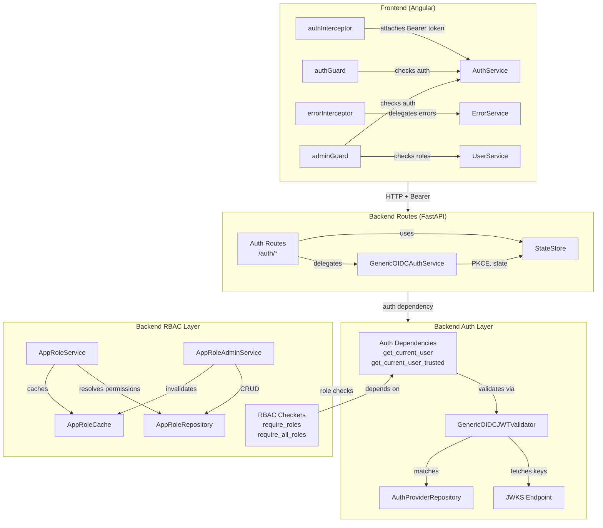

# Design Document: Auth & RBAC Test Suite

## Overview

This design covers comprehensive test coverage for the Auth & RBAC modules in the AgentCore Public Stack. The modules under test are the highest-risk untested surface in the system — zero tests currently exist for JWT validation, role guards, or access control.

The test suite spans two platforms:
- **Backend (Python):** pytest + pytest-asyncio for unit/integration tests, Hypothesis for property-based tests
- **Frontend (Angular/TypeScript):** Vitest for unit tests, fast-check for property-based tests

The scope includes 15 requirements covering: JWT validation, legacy code removal, FastAPI auth dependencies, RBAC role checkers, AppRole permission resolution, AppRole admin CRUD, cache TTL/invalidation, OIDC state management, PKCE generation, OIDC auth service flows, auth route integration tests, and frontend auth service/guard/interceptor tests.

A key prerequisite across all requirements is a docstring/comment audit of each module before writing tests, ensuring documentation accurately reflects current behavior.

## Architecture

The auth and RBAC system is layered across backend and frontend:



### Test Architecture

Tests are organized by module, with each requirement mapping to one or more test files:

```
backend/tests/
├── conftest.py                          # Shared fixtures (User factory, mock providers)
├── auth/
│   ├── conftest.py                      # Auth-specific fixtures
│   ├── test_generic_jwt_validator.py    # Req 1: JWT validation
│   ├── test_dependencies.py            # Req 3: FastAPI auth deps
│   ├── test_rbac.py                    # Req 4: Role checkers
│   ├── test_state_store.py             # Req 8: OIDC state store
│   ├── test_pkce.py                    # Req 9: PKCE generation
│   ├── test_oidc_auth_service.py       # Req 10: OIDC auth flows
│   └── test_auth_routes.py            # Req 11: Auth route integration
├── rbac/
│   ├── conftest.py                      # RBAC-specific fixtures
│   ├── test_app_role_service.py        # Req 5: Permission resolution
│   ├── test_app_role_admin_service.py  # Req 6: Admin CRUD
│   └── test_app_role_cache.py          # Req 7: Cache TTL
└── property/
    └── test_pbt_permissions.py         # Req 15: Property-based tests

frontend/ai.client/src/app/auth/
├── auth.service.spec.ts                # Req 12: AuthService tests
├── auth.guard.spec.ts                  # Req 13: authGuard tests
├── admin.guard.spec.ts                 # Req 13: adminGuard tests
├── auth.interceptor.spec.ts            # Req 14: authInterceptor tests
├── error.interceptor.spec.ts           # Req 14: errorInterceptor tests
└── auth-pbt.spec.ts                    # Req 15: Frontend PBT
```

## Components and Interfaces

### Backend Components Under Test

| Component | Source File | Test Approach |
|-----------|-----------|---------------|
| `GenericOIDCJWTValidator` | `shared/auth/generic_jwt_validator.py` | Unit tests with mocked JWKS/providers |
| `EntraIDJWTValidator` (legacy) | `shared/auth/jwt_validator.py` | Deletion verification (Req 2) |
| `get_current_user` / `get_current_user_trusted` | `shared/auth/dependencies.py` | Unit tests with mocked validator |
| `require_roles` / `require_all_roles` / `has_any_role` / `has_all_roles` | `shared/auth/rbac.py` | Unit tests + PBT |
| `AppRoleService` | `shared/rbac/service.py` | Unit tests with mocked repo/cache + PBT |
| `AppRoleAdminService` | `shared/rbac/admin_service.py` | Unit tests with mocked repo/cache |
| `AppRoleCache` | `shared/rbac/cache.py` | Unit tests with time manipulation |
| `InMemoryStateStore` | `shared/auth/state_store.py` | Unit tests + PBT |
| `generate_pkce_pair` | `app_api/auth/service.py` | Unit tests + PBT |
| `GenericOIDCAuthService` | `app_api/auth/service.py` | Unit tests with mocked HTTP |
| Auth Routes | `app_api/auth/routes.py` | Integration tests via FastAPI TestClient |

### Frontend Components Under Test

| Component | Source File | Test Approach |
|-----------|-----------|---------------|
| `AuthService` | `auth/auth.service.ts` | Vitest with mocked localStorage/HTTP |
| `authGuard` | `auth/auth.guard.ts` | Vitest with mocked AuthService/Router |
| `adminGuard` | `auth/admin.guard.ts` | Vitest with mocked AuthService/UserService/Router |
| `authInterceptor` | `auth/auth.interceptor.ts` | Vitest with mocked HttpHandler |
| `errorInterceptor` | `auth/error.interceptor.ts` | Vitest with mocked ErrorService |

### Key Interfaces for Mocking

**Backend mocks:**
- `AuthProviderRepository` — returns configured `AuthProvider` objects
- `AppRoleRepository` — returns `AppRole` objects, simulates DynamoDB
- `PyJWKClient` — returns signing keys for JWT verification
- `httpx.AsyncClient` — mocks token endpoint responses for OIDC flows
- `AppRoleCache` — in-memory cache (can use real instance or mock)

**Frontend mocks:**
- `localStorage` / `sessionStorage` — token storage
- `HttpClient` (via `HttpTestingController` or manual mock) — API calls
- `Router` — navigation assertions
- `AuthService` / `UserService` — for guard tests
- `ErrorService` — for error interceptor tests

## Data Models

### Backend Models

**`User`** (dataclass in `shared/auth/models.py`):
```python
@dataclass
class User:
    email: str
    user_id: str
    name: str
    roles: List[str]
    picture: Optional[str] = None
    raw_token: Optional[str] = None
```

**`AppRole`** (dataclass in `shared/rbac/models.py`):
```python
@dataclass
class AppRole:
    role_id: str
    display_name: str
    description: str
    jwt_role_mappings: List[str]
    inherits_from: List[str]
    effective_permissions: EffectivePermissions
    granted_tools: List[str]
    granted_models: List[str]
    priority: int = 0
    is_system_role: bool = False
    enabled: bool = True
```

**`EffectivePermissions`** (dataclass):
```python
@dataclass
class EffectivePermissions:
    tools: List[str]
    models: List[str]
    quota_tier: Optional[str] = None
```

**`UserEffectivePermissions`** (dataclass):
```python
@dataclass
class UserEffectivePermissions:
    user_id: str
    app_roles: List[str]
    tools: List[str]
    models: List[str]
    quota_tier: Optional[str]
    resolved_at: str
```

**`OIDCStateData`** (dataclass in `shared/auth/state_store.py`):
```python
@dataclass
class OIDCStateData:
    redirect_uri: Optional[str] = None
    code_verifier: Optional[str] = None
    nonce: Optional[str] = None
    provider_id: Optional[str] = None
```

### Frontend Models

**`User`** (interface in `auth/user.model.ts`):
```typescript
interface User {
    email: string;
    user_id: string;
    firstName: string;
    lastName: string;
    fullName: string;
    roles: string[];
    picture?: string;
}
```

### Test Data Generators (for PBT)

**Hypothesis strategies (backend):**
- `st_user()` — generates `User` with random email, user_id, name, roles
- `st_app_role()` — generates `AppRole` with random tools, models, priority, enabled flag
- `st_oidc_state_data()` — generates `OIDCStateData` with random fields
- `st_role_list()` — generates `List[str]` of role names

**fast-check arbitraries (frontend):**
- `arbRoleList()` — generates arrays of role name strings
- `arbToolList()` — generates arrays of tool ID strings


## Correctness Properties

*A property is a characteristic or behavior that should hold true across all valid executions of a system — essentially, a formal statement about what the system should do. Properties serve as the bridge between human-readable specifications and machine-verifiable correctness guarantees.*

### Property 1: Permission merge produces union of tools and models

*For any* list of `AppRole` objects with arbitrary `effective_permissions.tools` and `effective_permissions.models` lists, calling `_merge_permissions()` shall produce a `tools` set that is a superset of every individual role's effective tools, and a `models` set that is a superset of every individual role's effective models. This includes wildcard (`"*"`) propagation — if any role contains `"*"` in its tools or models, the merged result must also contain `"*"`.

**Validates: Requirements 5.2, 5.3, 5.7, 5.14, 15.2, 15.3**

### Property 2: Permission merge is idempotent

*For any* list of `AppRole` objects, merging permissions and then merging again with the same roles shall produce an identical `UserEffectivePermissions` result (same tools, models, and quota_tier).

**Validates: Requirements 5.15, 15.4**

### Property 3: Quota tier comes from highest-priority role

*For any* list of `AppRole` objects with varying `priority` values and non-null `quota_tier` in their effective permissions, the `quota_tier` in the merged `UserEffectivePermissions` shall equal the `quota_tier` of the role with the highest `priority` value.

**Validates: Requirements 5.4, 15.5**

### Property 4: Wildcard grants universal tool access

*For any* `User` whose resolved permissions contain `"*"` in the tools list, and *for any* `tool_id` string, `can_access_tool(user, tool_id)` shall return `True`.

**Validates: Requirements 5.8**

### Property 5: PKCE round-trip correctness

*For any* PKCE pair generated by `generate_pkce_pair()`, the `code_verifier` shall be between 43 and 128 characters in length, and recomputing `BASE64URL(SHA256(code_verifier))` with padding stripped shall equal the returned `code_challenge`.

**Validates: Requirements 9.2, 9.3, 9.4, 15.6**

### Property 6: PKCE verifier uniqueness

*For any* set of PKCE pairs generated by repeated calls to `generate_pkce_pair()`, all `code_verifier` values shall be distinct.

**Validates: Requirements 9.5**

### Property 7: State store round-trip

*For any* state token string and `OIDCStateData` object, storing via `store_state()` and then retrieving via `get_and_delete_state()` shall return `(True, data)` where `data` has equivalent `redirect_uri`, `code_verifier`, `nonce`, and `provider_id` to the original.

**Validates: Requirements 8.2, 8.7, 15.7**

### Property 8: State store one-time-use

*For any* state token stored in the `InMemoryStateStore`, after the first successful `get_and_delete_state()` call, a second call with the same state shall return `(False, None)`.

**Validates: Requirements 8.3**

### Property 9: has_any_role is set intersection

*For any* `User` object with an arbitrary roles list and *for any* set of query roles, `has_any_role(user, *roles)` shall return `True` if and only if the intersection of `user.roles` and `roles` is non-empty.

**Validates: Requirements 15.8**

### Property 10: has_all_roles is subset check

*For any* `User` object with an arbitrary roles list and *for any* set of query roles, `has_all_roles(user, *roles)` shall return `True` if and only if `roles` is a subset of `user.roles`.

**Validates: Requirements 15.9**

### Property 11: Dot-notation claim extraction traverses nested dicts

*For any* nested dictionary and *for any* dot-notation path where each segment is a valid key at its level, `_extract_claim(payload, path)` shall return the value at the leaf of the path.

**Validates: Requirements 1.21**

## Error Handling

### Backend Error Handling Strategy

Tests must verify the following error patterns:

| Error Condition | Expected Status | Expected Detail Pattern |
|----------------|----------------|------------------------|
| Invalid JWT signature | 401 | "Invalid token signature" |
| Expired JWT | 401 | "Token expired" |
| Issuer mismatch | 401 | — |
| Audience mismatch | 401 | "Invalid token audience" |
| Missing required scope | 401 | "Token missing required scope" |
| Invalid user_id pattern | 401 | "Invalid user." |
| Missing user_id claim | 401 | "Invalid user." |
| No credentials provided | 401 | WWW-Authenticate header present |
| Malformed token (trusted) | 401 | "Malformed token." |
| Auth service not configured | 500 | "Authentication service not configured" |
| Missing role (OR logic) | 403 | "Access denied. Required roles:" |
| Missing role (AND logic) | 403 | "Access denied. Missing required roles:" |
| Empty roles list | 403 | "User has no assigned roles." |
| Invalid OIDC state | 400 | "Invalid or expired state" |
| Nonce mismatch | 400 | "ID token nonce validation failed." |
| Expired refresh token | 401 | "Invalid or expired refresh token" |
| Non-existent parent role | ValueError | — |
| Duplicate role creation | ValueError | — |
| Delete system role | ValueError | "Cannot delete system role" |
| Update protected system role fields | ValueError | lists protected fields |

### Frontend Error Handling Strategy

| Error Condition | Expected Behavior |
|----------------|-------------------|
| No token, route guarded | Redirect to `/auth/login` with `returnUrl` |
| Expired token, refresh fails | Redirect to `/auth/login`, clear tokens |
| 401 response | Retry once with refreshed token |
| 401 retry fails | Clear tokens, propagate original error |
| HTTP error on non-streaming endpoint | `errorService.handleHttpError()` called |
| HTTP error on streaming endpoint | Error propagated without interception |
| HTTP error on silent endpoint | Error propagated without display |
| `ensureAuthenticated()` with no token | Throws `Error("not authenticated")` |

### Mock Error Injection

Backend tests use `unittest.mock.patch` and `AsyncMock` to inject errors:
- Mock `PyJWKClient.get_signing_key_from_jwt()` to raise `jwt.exceptions.InvalidSignatureError`
- Mock `httpx.AsyncClient.post()` to return error responses
- Mock `AppRoleRepository` methods to raise exceptions

Frontend tests use Vitest mocks:
- Mock `AuthService.refreshAccessToken()` to reject
- Mock `HttpHandler` `next()` to return error observables
- Mock `localStorage` to return null/expired values

## Testing Strategy

### Dual Testing Approach

This test suite uses both unit tests and property-based tests as complementary strategies:

- **Unit tests** verify specific examples, edge cases, error conditions, and integration points. They cover the majority of acceptance criteria (concrete scenarios like "expired token → 401").
- **Property-based tests** verify universal invariants across randomly generated inputs. They cover the 11 correctness properties defined above (union merging, idempotence, round-trips, set operations).

Together they provide comprehensive coverage: unit tests catch concrete bugs at specific boundaries, property tests verify general correctness across the input space.

### Backend Testing Stack

- **Framework:** pytest + pytest-asyncio
- **PBT Library:** Hypothesis (do NOT implement PBT from scratch)
- **Mocking:** `unittest.mock.patch`, `AsyncMock`, `MagicMock`
- **HTTP Testing:** FastAPI `TestClient` for route integration tests
- **JWT Generation:** `PyJWT` to create test tokens signed with test RSA keys

### Frontend Testing Stack

- **Framework:** Vitest
- **PBT Library:** fast-check (do NOT implement PBT from scratch)
- **Angular Testing:** `TestBed` for DI, manual mocks for services
- **HTTP Mocking:** Manual mock of `HttpHandler` `next()` function

### Property-Based Test Configuration

- Each property test MUST run a minimum of **100 iterations** (Hypothesis: `@settings(max_examples=100)`, fast-check: `fc.assert(..., { numRuns: 100 })`)
- Each property test MUST be tagged with a comment referencing the design property:
  - Backend format: `# Feature: auth-rbac-tests, Property {N}: {title}`
  - Frontend format: `// Feature: auth-rbac-tests, Property {N}: {title}`
- Each correctness property MUST be implemented by a SINGLE property-based test

### Hypothesis Strategies (Backend PBT)

```python
from hypothesis import strategies as st

# Role name strategy
st_role_name = st.text(
    alphabet=st.characters(whitelist_categories=("L", "N"), whitelist_characters="_-"),
    min_size=1, max_size=30
)

# Tool/model ID strategy
st_tool_id = st.text(
    alphabet=st.characters(whitelist_categories=("L", "N"), whitelist_characters="_-:."),
    min_size=1, max_size=50
)

# AppRole strategy
@st.composite
def st_app_role(draw):
    return AppRole(
        role_id=draw(st.text(min_size=3, max_size=20, alphabet=string.ascii_lowercase)),
        display_name=draw(st.text(min_size=1, max_size=50)),
        description="",
        effective_permissions=EffectivePermissions(
            tools=draw(st.lists(st_tool_id, max_size=10)),
            models=draw(st.lists(st_tool_id, max_size=10)),
            quota_tier=draw(st.one_of(st.none(), st.sampled_from(["free", "basic", "pro", "enterprise"]))),
        ),
        priority=draw(st.integers(min_value=0, max_value=999)),
        enabled=True,
    )

# User strategy
@st.composite
def st_user(draw):
    return User(
        email=draw(st.emails()),
        user_id=draw(st.uuids().map(str)),
        name=draw(st.text(min_size=1, max_size=50)),
        roles=draw(st.lists(st_role_name, max_size=10)),
    )

# OIDCStateData strategy
@st.composite
def st_oidc_state_data(draw):
    return OIDCStateData(
        redirect_uri=draw(st.one_of(st.none(), st.text(min_size=1, max_size=100))),
        code_verifier=draw(st.one_of(st.none(), st.text(min_size=43, max_size=128))),
        nonce=draw(st.one_of(st.none(), st.text(min_size=1, max_size=64))),
        provider_id=draw(st.one_of(st.none(), st.text(min_size=1, max_size=30))),
    )
```

### fast-check Arbitraries (Frontend PBT)

```typescript
import * as fc from 'fast-check';

const arbRoleName = fc.stringOf(
  fc.constantFrom(...'abcdefghijklmnopqrstuvwxyzABCDEFGHIJKLMNOPQRSTUVWXYZ0123456789_-'.split('')),
  { minLength: 1, maxLength: 30 }
);

const arbRoleList = fc.array(arbRoleName, { maxLength: 10 });
```

### Test File Mapping

| Requirement | Test File | Type |
|------------|-----------|------|
| Req 1: JWT Validator | `backend/tests/auth/test_generic_jwt_validator.py` | Unit |
| Req 2: Legacy Removal | Verified by file deletion + grep | Manual |
| Req 3: Auth Dependencies | `backend/tests/auth/test_dependencies.py` | Unit |
| Req 4: RBAC Checkers | `backend/tests/auth/test_rbac.py` | Unit |
| Req 5: AppRoleService | `backend/tests/rbac/test_app_role_service.py` | Unit |
| Req 6: AppRoleAdminService | `backend/tests/rbac/test_app_role_admin_service.py` | Unit |
| Req 7: AppRoleCache | `backend/tests/rbac/test_app_role_cache.py` | Unit |
| Req 8: State Store | `backend/tests/auth/test_state_store.py` | Unit |
| Req 9: PKCE | `backend/tests/auth/test_pkce.py` | Unit |
| Req 10: OIDC Auth Service | `backend/tests/auth/test_oidc_auth_service.py` | Unit |
| Req 11: Auth Routes | `backend/tests/auth/test_auth_routes.py` | Integration |
| Req 12: FE AuthService | `frontend/ai.client/src/app/auth/auth.service.spec.ts` | Unit |
| Req 13: FE Guards | `frontend/ai.client/src/app/auth/auth.guard.spec.ts`, `admin.guard.spec.ts` | Unit |
| Req 14: FE Interceptors | `frontend/ai.client/src/app/auth/auth.interceptor.spec.ts`, `error.interceptor.spec.ts` | Unit |
| Req 15: PBT | `backend/tests/property/test_pbt_permissions.py`, `frontend/ai.client/src/app/auth/auth-pbt.spec.ts` | PBT |

### Running Tests

All commands must execute inside the Docker container:

```bash
# Backend tests
docker compose exec dev bash -c "cd /workspace/bsu-org/agentcore-public-stack/backend && python -m pytest tests/auth/ tests/rbac/ tests/property/ -v"

# Frontend tests
docker compose exec dev bash -c "cd /workspace/bsu-org/agentcore-public-stack/frontend/ai.client && npx vitest --run src/app/auth/"
```
