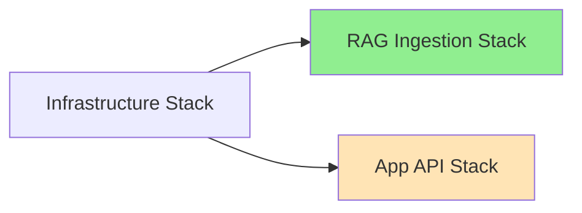

# Design Document: RAG Ingestion Stack

## Overview

This design document specifies the architecture for extracting the RAG (Retrieval-Augmented Generation) ingestion pipeline into an independent CDK stack. The new `RagIngestionStack` will be a carbon copy of the existing AppApiStack RAG implementation, reusing the same Dockerfile and code, but deployed as a separate modular stack with its own CI/CD pipeline.

### Design Goals

1. **Modularity**: Create a single-responsibility stack that owns all RAG ingestion resources
2. **Independence**: Enable independent deployment without affecting AppApiStack
3. **Code Reuse**: Reuse existing Dockerfile and Lambda handler code without modifications
4. **Loose Coupling**: Use SSM Parameter Store for cross-stack communication
5. **DevOps Compliance**: Follow all project DevOps conventions and patterns
6. **Non-Interference**: Deploy alongside existing RAG resources without conflicts

### Key Principles

- **Carbon Copy Implementation**: Functionally identical to existing AppApiStack RAG implementation
- **Distinct Resource Names**: All resources use unique names to avoid conflicts
- **Shared Code**: Reuse `backend/Dockerfile.rag-ingestion` and Lambda handler
- **SSM-Based Integration**: Export resource names via SSM for future integration
- **Parallel Deployment**: Can coexist with existing AppApiStack RAG resources

## Architecture

### High-Level Architecture

```mermaid
graph TB
    subgraph "Infrastructure Stack"
        VPC[VPC]
        Subnets[Private Subnets]
    end
    
    subgraph "RAG Ingestion Stack (NEW)"
        DocBucket[Documents Bucket<br/>rag-documents]
        VectorBucket[Vector Store Bucket<br/>rag-vector-store]
        VectorIndex[Vector Index<br/>rag-vector-index]
        AssistTable[Assistants Table<br/>rag-assistants]
        Lambda[Ingestion Lambda<br/>rag-ingestion]
        ECR[ECR Repository<br/>rag-ingestion]
    end
    
    subgraph "App API Stack (UNCHANGED)"
        ExistingDocBucket[Documents Bucket<br/>assistants-documents]
        ExistingVectorBucket[Vector Store<br/>assistants-vector-store]
        ExistingTable[Assistants Table<br/>assistants]
        ExistingLambda[Ingestion Lambda<br/>assistants-ingestion]
        ECS[ECS Service]
    end
    
    subgraph "SSM Parameter Store"
        SSM1[/rag/documents-bucket-name]
        SSM2[/rag/assistants-table-name]
        SSM3[/rag/vector-bucket-name]
        SSM4[/rag/vector-index-name]
        SSM5[/rag/ingestion-lambda-arn]
        SSM6[/rag-ingestion/image-tag]
    end
    
    subgraph "AWS Bedrock"
        Titan[Titan Embeddings Model]
    end
    
    DocBucket -->|S3 Event| Lambda
    Lambda -->|Read| DocBucket
    Lambda -->|Write| AssistTable
    Lambda -->|Write Vectors| VectorBucket
    Lambda -->|Query| VectorIndex
    Lambda -->|Invoke| Titan
    ECR -->|Pull Image| Lambda
    
    Lambda -.->|Exports| SSM1
    Lambda -.->|Exports| SSM2
    Lambda -.->|Exports| SSM3
    Lambda -.->|Exports| SSM4
    Lambda -.->|Exports| SSM5
    
    VPC -.->|Network| Lambda
    
    ExistingDocBucket -->|S3 Event| ExistingLambda
    ExistingLambda -->|Read| ExistingDocBucket
    ExistingLambda -->|Write| ExistingTable
    ExistingLambda -->|Write Vectors| ExistingVectorBucket
    ECS -->|Uses| ExistingTable
    ECS -->|Uses| ExistingDocBucket
    ECS -->|Uses| ExistingVectorBucket
    
    style Lambda fill:#90EE90
    style DocBucket fill:#90EE90
    style VectorBucket fill:#90EE90
    style VectorIndex fill:#90EE90
    style AssistTable fill:#90EE90
    style ECR fill:#90EE90
    style ExistingDocBucket fill:#FFE4B5
    style ExistingVectorBucket fill:#FFE4B5
    style ExistingTable fill:#FFE4B5
    style ExistingLambda fill:#FFE4B5
```

### Stack Dependencies



**Deployment Order:**
1. Infrastructure Stack (VPC, Subnets, ALB, ECS Cluster)
2. RAG Ingestion Stack (parallel with App API Stack)
3. App API Stack (parallel with RAG Ingestion Stack)

### Resource Naming Strategy

All new resources use the prefix "rag-" to distinguish from existing "assistants-" resources:

| Resource Type | Existing Name | New Name |
|--------------|---------------|----------|
| S3 Bucket | `assistants-documents` | `rag-documents` |
| Vector Bucket | `assistants-vector-store-v1` | `rag-vector-store-v1` |
| Vector Index | `assistants-vector-index-v1` | `rag-vector-index-v1` |
| DynamoDB Table | `assistants` | `rag-assistants` |
| Lambda Function | `assistants-documents-ingestion` | `rag-ingestion` |
| ECR Repository | N/A (in app-api repo) | `rag-ingestion` |

## Components and Interfaces

### 1. CDK Stack: RagIngestionStack

**File:** `infrastructure/lib/rag-ingestion-stack.ts`

**Purpose:** Define all RAG ingestion AWS resources as Infrastructure as Code

**Interface:**
```typescript
export interface RagIngestionStackProps extends cdk.StackProps {
  config: AppConfig;
}

export class RagIngestionStack extends cdk.Stack {
  public readonly documentsBucket: s3.Bucket;
  public readonly assistantsTable: dynamodb.Table;
  public readonly ingestionLambda: lambda.DockerImageFunction;
  
  constructor(scope: Construct, id: string, props: RagIngestionStackProps);
}
```

**Responsibilities:**
- Import VPC and network resources from Infrastructure Stack via SSM
- Create S3 Documents Bucket with CORS configuration
- Create S3 Vectors Bucket and Index (CfnResource)
- Create DynamoDB Assistants Table with GSIs
- Create Lambda function using Docker image from ECR
- Configure IAM permissions for Lambda
- Configure S3 event notifications
- Export resource names to SSM Parameter Store
- Apply standard tags and naming conventions

**Dependencies:**
- Infrastructure Stack (VPC, Subnets via SSM)
- ECR Repository (created by CI/CD pipeline)
- SSM Parameter for image tag

### 2. Configuration: RagIngestionConfig

**File:** `infrastructure/lib/config.ts`

**Purpose:** Centralize all RAG-specific configuration

**Interface:**
```typescript
export interface RagIngestionConfig {
  enabled: boolean;                    // Enable/disable RAG stack
  corsOrigins: string;                 // Comma-separated CORS origins
  lambdaMemorySize: number;            // Lambda memory in MB (default: 10240)
  lambdaTimeout: number;               // Lambda timeout in seconds (default: 900)
  embeddingModel: string;              // Bedrock model ID (default: "amazon.titan-embed-text-v2")
  vectorDimension: number;             // Embedding dimension (default: 1024)
  vectorDistanceMetric: string;        // Distance metric (default: "cosine")
}

export interface AppConfig {
  // ... existing fields
  ragIngestion: RagIngestionConfig;
}
```

**Configuration Loading:**
```typescript
ragIngestion: {
  enabled: parseBooleanEnv(process.env.CDK_RAG_ENABLED) ?? 
           scope.node.tryGetContext('ragIngestion')?.enabled ?? true,
  corsOrigins: process.env.CDK_RAG_CORS_ORIGINS || 
               scope.node.tryGetContext('ragIngestion')?.corsOrigins,
  lambdaMemorySize: parseIntEnv(process.env.CDK_RAG_LAMBDA_MEMORY) || 
                    scope.node.tryGetContext('ragIngestion')?.lambdaMemorySize || 10240,
  lambdaTimeout: parseIntEnv(process.env.CDK_RAG_LAMBDA_TIMEOUT) || 
                 scope.node.tryGetContext('ragIngestion')?.lambdaTimeout || 900,
  embeddingModel: process.env.CDK_RAG_EMBEDDING_MODEL || 
                  scope.node.tryGetContext('ragIngestion')?.embeddingModel || 
                  "amazon.titan-embed-text-v2",
  vectorDimension: parseIntEnv(process.env.CDK_RAG_VECTOR_DIMENSION) || 
                   scope.node.tryGetContext('ragIngestion')?.vectorDimension || 1024,
  vectorDistanceMetric: process.env.CDK_RAG_DISTANCE_METRIC || 
                        scope.node.tryGetContext('ragIngestion')?.vectorDistanceMetric || 
                        "cosine",
}
```

### 3. CI/CD Workflow

**File:** `.github/workflows/rag-ingestion.yml`

**Purpose:** Automated build, test, and deployment pipeline

**Jobs:**

1. **install**: Install and cache dependencies
   - Install system dependencies
   - Install Python packages
   - Install Node.js packages
   - Cache for reuse

2. **build-docker**: Build Docker image
   - Build from `backend/Dockerfile.rag-ingestion`
   - Tag with git commit SHA
   - Export as tar artifact
   - Output: `image-tag`

3. **build-cdk**: Compile TypeScript
   - Compile CDK TypeScript code
   - Validate syntax

4. **test-docker**: Validate Docker image
   - Load image from artifact
   - Verify Lambda handler exists
   - Verify Python packages installed
   - Test container startup

5. **test-cdk**: Validate CloudFormation
   - Validate template syntax
   - Verify resources present
   - Check IAM permissions

6. **synth-cdk**: Synthesize templates
   - Run on ARM64 runner (ubuntu-24.04-arm)
   - Synthesize CloudFormation templates
   - Upload templates as artifact

7. **push-to-ecr**: Push to ECR
   - Create ECR repository if needed
   - Push Docker image
   - Store image tag in SSM

8. **deploy-infrastructure**: Deploy stack
   - Run on ARM64 runner
   - Deploy using synthesized templates
   - Output deployment results

**Workflow Triggers:**
- Push to main branch (paths: backend/src/rag/, backend/Dockerfile.rag-ingestion, infrastructure/lib/rag-ingestion-stack.ts, scripts/stack-rag-ingestion/, .github/workflows/rag-ingestion.yml)
- Pull requests (same paths)
- Manual workflow_dispatch

**Environment Variables:**
```yaml
env:
  CDK_AWS_REGION: ${{ vars.AWS_REGION }}
  CDK_PROJECT_PREFIX: ${{ vars.CDK_PROJECT_PREFIX }}
  CDK_VPC_CIDR: ${{ vars.CDK_VPC_CIDR }}
  CDK_RAG_ENABLED: ${{ vars.CDK_RAG_ENABLED }}
  CDK_RAG_CORS_ORIGINS: ${{ vars.CDK_RAG_CORS_ORIGINS }}
  CDK_AWS_ACCOUNT: ${{ secrets.CDK_AWS_ACCOUNT }}
  AWS_ROLE_ARN: ${{ secrets.AWS_ROLE_ARN }}
  AWS_ACCESS_KEY_ID: ${{ secrets.AWS_ACCESS_KEY_ID }}
  AWS_SECRET_ACCESS_KEY: ${{ secrets.AWS_SECRET_ACCESS_KEY }}
```

### 4. Shell Scripts

**Directory:** `scripts/stack-rag-ingestion/`

**Scripts:**

1. **install.sh**: Install dependencies
   - Install Python packages from pyproject.toml
   - Install Node.js packages from package.json
   - Verify installations

2. **build.sh**: Build Docker image
   - Build from backend/Dockerfile.rag-ingestion
   - Tag with IMAGE_TAG environment variable
   - Validate build success

3. **build-cdk.sh**: Compile TypeScript
   - Run `npm run build` in infrastructure/
   - Validate compilation

4. **synth.sh**: Synthesize CDK
   - Source load-env.sh
   - Build context parameters
   - Run `cdk synth RagIngestionStack`
   - Output to infrastructure/cdk.out/

5. **deploy.sh**: Deploy stack
   - Source load-env.sh
   - Check for pre-synthesized templates
   - Bootstrap CDK if needed
   - Deploy RagIngestionStack
   - Output deployment results

6. **test-docker.sh**: Test Docker image
   - Load image from tar or local
   - Run container
   - Verify Lambda handler
   - Verify Python packages

7. **test-cdk.sh**: Test CloudFormation
   - Validate template syntax
   - Check required resources
   - Verify SSM exports

8. **push-to-ecr.sh**: Push to ECR
   - Create ECR repository if needed
   - Authenticate to ECR
   - Tag image
   - Push to ECR
   - Store image tag in SSM

9. **tag-latest.sh**: Tag as latest
   - Tag current image as latest
   - Push latest tag to ECR

**Common Utilities:**
- All scripts source `scripts/common/load-env.sh`
- Use `build_cdk_context_params()` for consistent context
- Follow `set -euo pipefail` error handling
- Use logging functions: `log_info`, `log_error`, `log_success`

### 5. Lambda Function: RAG Ingestion

**Docker Image:** `backend/Dockerfile.rag-ingestion` (REUSED, not modified)

**Handler:** Existing Lambda handler code (REUSED, not modified)

**Configuration:**
- Architecture: ARM64 (Graviton2)
- Memory: 10240 MB (10 GB)
- Timeout: 900 seconds (15 minutes)
- Runtime: Python 3.11 (via Docker)

**Environment Variables:**
```typescript
environment: {
  ASSISTANTS_DOCUMENTS_BUCKET_NAME: documentsBucket.bucketName,
  ASSISTANTS_TABLE_NAME: assistantsTable.tableName,
  ASSISTANTS_VECTOR_STORE_BUCKET_NAME: vectorBucketName,
  ASSISTANTS_VECTOR_STORE_INDEX_NAME: vectorIndexName,
  BEDROCK_REGION: config.awsRegion,
}
```

**IAM Permissions:**
- S3: Read from Documents Bucket
- DynamoDB: Read/Write to Assistants Table
- S3 Vectors: PutVectors, GetVectors, ListVectors, DeleteVector
- Bedrock: InvokeModel for Titan embeddings

**Trigger:**
- S3 Event: ObjectCreated on Documents Bucket with prefix "assistants/"

### 6. S3 Documents Bucket

**Resource Type:** `AWS::S3::Bucket`

**Configuration:**
- Bucket Name: `${projectPrefix}-rag-documents`
- Encryption: S3_MANAGED
- Public Access: BLOCK_ALL
- Versioning: Enabled
- Removal Policy: RETAIN
- Auto Delete Objects: false

**CORS Configuration:**
```typescript
cors: [{
  allowedOrigins: config.ragIngestion.corsOrigins.split(',').map(o => o.trim()),
  allowedMethods: [s3.HttpMethods.GET, s3.HttpMethods.PUT, s3.HttpMethods.HEAD],
  allowedHeaders: ['Content-Type', 'Content-Length', 'x-amz-*'],
  exposedHeaders: ['ETag', 'Content-Length', 'Content-Type'],
  maxAge: 3600,
}]
```

**Event Notifications:**
- Trigger Lambda on ObjectCreated with prefix "assistants/"

### 7. S3 Vectors Bucket and Index

**Vector Bucket:**
- Resource Type: `AWS::S3Vectors::VectorBucket`
- Bucket Name: `${projectPrefix}-rag-vector-store-v1`

**Vector Index:**
- Resource Type: `AWS::S3Vectors::Index`
- Index Name: `${projectPrefix}-rag-vector-index-v1`
- Data Type: float32
- Dimension: 1024 (Titan V2)
- Distance Metric: cosine
- Metadata Configuration:
  - Filterable: assistant_id, document_id, source
  - Non-Filterable: text

### 8. DynamoDB Assistants Table

**Configuration:**
- Table Name: `${projectPrefix}-rag-assistants`
- Partition Key: PK (String)
- Sort Key: SK (String)
- Billing Mode: PAY_PER_REQUEST
- Point-in-Time Recovery: Enabled
- Encryption: AWS_MANAGED

**Global Secondary Indexes:**

1. **OwnerStatusIndex**
   - Partition Key: GSI_PK (String)
   - Sort Key: GSI_SK (String)
   - Projection: ALL

2. **VisibilityStatusIndex**
   - Partition Key: GSI2_PK (String)
   - Sort Key: GSI2_SK (String)
   - Projection: ALL

3. **SharedWithIndex**
   - Partition Key: GSI3_PK (String)
   - Sort Key: GSI3_SK (String)
   - Projection: ALL

### 9. SSM Parameter Exports

**Parameters Created:**

| Parameter Name | Value | Description |
|----------------|-------|-------------|
| `/${projectPrefix}/rag/documents-bucket-name` | Documents Bucket Name | S3 bucket for document uploads |
| `/${projectPrefix}/rag/documents-bucket-arn` | Documents Bucket ARN | S3 bucket ARN |
| `/${projectPrefix}/rag/assistants-table-name` | Assistants Table Name | DynamoDB table name |
| `/${projectPrefix}/rag/assistants-table-arn` | Assistants Table ARN | DynamoDB table ARN |
| `/${projectPrefix}/rag/vector-bucket-name` | Vector Bucket Name | S3 Vectors bucket name |
| `/${projectPrefix}/rag/vector-index-name` | Vector Index Name | S3 Vectors index name |
| `/${projectPrefix}/rag/ingestion-lambda-arn` | Lambda ARN | Ingestion Lambda ARN |
| `/${projectPrefix}/rag-ingestion/image-tag` | Docker Image Tag | Current deployed image tag |

### 10. ECR Repository

**Repository Name:** `${projectPrefix}-rag-ingestion`

**Creation:** Created by CI/CD pipeline (push-to-ecr.sh)

**Image Tags:**
- Git commit SHA (e.g., `abc1234`)
- `latest` (updated after successful deployment)

**Lifecycle Policy:** (Optional, can be added later)
- Keep last 10 images
- Expire untagged images after 7 days

## Data Models

### DynamoDB Assistants Table Schema

**Base Table:**
```
PK: String (Partition Key)
SK: String (Sort Key)
```

**Item Types:**

1. **Assistant Metadata:**
```
PK: "ASSISTANT#{assistantId}"
SK: "META"
assistantId: String
name: String
description: String
ownerId: String
visibility: String ("private" | "shared" | "public")
status: String ("active" | "archived")
createdAt: ISO8601 Timestamp
updatedAt: ISO8601 Timestamp
GSI_PK: "OWNER#{ownerId}"
GSI_SK: "STATUS#{status}#CREATED#{createdAt}"
GSI2_PK: "VISIBILITY#{visibility}"
GSI2_SK: "STATUS#{status}#CREATED#{createdAt}"
```

2. **Shared Access:**
```
PK: "ASSISTANT#{assistantId}"
SK: "SHARED#{userId}"
userId: String
permission: String ("read" | "write")
sharedAt: ISO8601 Timestamp
GSI3_PK: "USER#{userId}"
GSI3_SK: "ASSISTANT#{assistantId}"
```

### S3 Vectors Metadata Schema

**Vector Metadata:**
```json
{
  "assistant_id": "string",
  "document_id": "string",
  "source": "string",
  "text": "string (non-filterable)",
  "chunk_index": "number",
  "total_chunks": "number"
}
```

**Vector ID Format:** `{assistant_id}#{document_id}#{chunk_index}`

### S3 Documents Bucket Key Structure

**Document Upload Path:**
```
assistants/{assistant_id}/{document_id}/{filename}
```

**Example:**
```
assistants/asst_abc123/doc_xyz789/research_paper.pdf
```

## Correctness Properties

*A property is a characteristic or behavior that should hold true across all valid executions of a system—essentially, a formal statement about what the system should do. Properties serve as the bridge between human-readable specifications and machine-verifiable correctness guarantees.*


### Property 1: CloudFormation Template Completeness

*For any* synthesized CloudFormation template for RagIngestionStack, the template should contain all required AWS resources: S3 Documents Bucket, S3 Vectors Bucket, S3 Vectors Index, DynamoDB Assistants Table, Lambda Function, and all required IAM roles and policies.

**Validates: Requirements 2.1, 2.2, 2.3, 2.4, 2.5, 2.7, 2.8, 9.1-9.14, 10.1-10.8, 11.1-11.10, 12.1-12.12**

### Property 2: No Cross-Stack References

*For any* synthesized CloudFormation template for RagIngestionStack, the template should not contain any direct CloudFormation cross-stack references (Fn::ImportValue) to AppApiStack resources.

**Validates: Requirements 1.3**

### Property 3: SSM Parameter Exports

*For any* synthesized CloudFormation template for RagIngestionStack, the template should create SSM parameters for all exported resource names and ARNs (documents bucket, assistants table, vector bucket, vector index, ingestion lambda) with the correct parameter name pattern `/${projectPrefix}/rag/*`.

**Validates: Requirements 3.1, 3.2, 3.3, 3.4, 3.5, 3.6, 3.7**

### Property 4: Configuration Loading

*For any* set of environment variables and context values, the loadConfig function should correctly load RagIngestionConfig with environment variables taking precedence over context values, and context values taking precedence over defaults.

**Validates: Requirements 4.1-4.10**

### Property 5: Script Execution

*For any* script in `scripts/stack-rag-ingestion/`, when executed with valid environment variables, the script should complete successfully (exit code 0) and produce expected outputs or side effects.

**Validates: Requirements 7.1-7.14**

### Property 6: Resource Naming Uniqueness

*For any* resource created by RagIngestionStack, the resource name should use the "rag-" prefix and should be distinct from any existing AppApiStack resource names (which use "assistants-" prefix), ensuring no naming conflicts.

**Validates: Requirements 20.1-20.10, 21.1-21.18**

### Property 7: Docker Image Reuse

*For any* Docker build of the RAG ingestion Lambda, the build should use the existing `backend/Dockerfile.rag-ingestion` without modifications, and the resulting image should contain the same Lambda handler code as the existing AppApiStack implementation.

**Validates: Requirements 21.4, 21.5, 21.18**

## Error Handling

### CDK Stack Errors

**Missing SSM Parameters:**
- **Scenario:** Infrastructure Stack not deployed, SSM parameters don't exist
- **Handling:** CDK synthesis will fail with clear error message indicating missing parameters
- **Recovery:** Deploy Infrastructure Stack first

**Invalid Configuration:**
- **Scenario:** Invalid CORS origins, invalid memory size, invalid timeout
- **Handling:** CDK validation will fail during synthesis with descriptive error
- **Recovery:** Fix configuration values in environment variables or context

**Resource Name Conflicts:**
- **Scenario:** Resource names already exist (unlikely with "rag-" prefix)
- **Handling:** CloudFormation deployment will fail with resource already exists error
- **Recovery:** Delete conflicting resources or use different project prefix

### Lambda Function Errors

**Document Processing Failures:**
- **Scenario:** Invalid document format, corrupted file, unsupported file type
- **Handling:** Lambda logs error, returns failure, document remains in S3
- **Recovery:** Manual intervention to fix or remove document

**Bedrock API Errors:**
- **Scenario:** Rate limiting, service unavailable, invalid model ID
- **Handling:** Lambda retries with exponential backoff, logs error if all retries fail
- **Recovery:** Automatic retry on next invocation, or manual re-upload

**Vector Store Errors:**
- **Scenario:** Vector write failure, index not ready, quota exceeded
- **Handling:** Lambda logs error, document metadata marked as failed in DynamoDB
- **Recovery:** Retry mechanism or manual reprocessing

**DynamoDB Errors:**
- **Scenario:** Throttling, item size too large, conditional check failure
- **Handling:** Lambda retries with exponential backoff, logs error
- **Recovery:** Automatic retry or manual intervention

### CI/CD Pipeline Errors

**Docker Build Failures:**
- **Scenario:** Dockerfile syntax error, missing dependencies, build timeout
- **Handling:** Build job fails, workflow stops, error logged
- **Recovery:** Fix Dockerfile or dependencies, re-run workflow

**CDK Synthesis Failures:**
- **Scenario:** TypeScript compilation error, invalid CDK code, missing dependencies
- **Handling:** Synth job fails, workflow stops, error logged
- **Recovery:** Fix TypeScript code, re-run workflow

**Deployment Failures:**
- **Scenario:** CloudFormation rollback, resource limit exceeded, permission denied
- **Handling:** Deploy job fails, CloudFormation rolls back, error logged
- **Recovery:** Fix issue, re-run deployment

**Test Failures:**
- **Scenario:** Docker image validation fails, CloudFormation template invalid
- **Handling:** Test job fails, workflow stops before deployment
- **Recovery:** Fix issue, re-run workflow

### Cross-Stack Integration Errors

**SSM Parameter Not Found:**
- **Scenario:** AppApiStack tries to import RAG resources before RagIngestionStack deployed
- **Handling:** SSM parameter read returns empty or throws error
- **Recovery:** Deploy RagIngestionStack first, or make import optional

**Resource Access Denied:**
- **Scenario:** AppApiStack ECS task tries to access RAG resources without permissions
- **Handling:** AWS API returns access denied error
- **Recovery:** Grant appropriate IAM permissions to ECS task role

## Testing Strategy

### Dual Testing Approach

This feature requires both unit tests and property-based tests for comprehensive coverage:

**Unit Tests:**
- Verify specific CloudFormation resource configurations
- Test individual script functions
- Validate configuration loading with specific inputs
- Test error handling for known edge cases

**Property-Based Tests:**
- Verify CloudFormation template structure across all valid configurations
- Test configuration loading across all valid environment variable combinations
- Verify resource naming patterns across all valid project prefixes
- Test script execution across different environments

### Unit Testing

**CDK Stack Tests:**
```typescript
// infrastructure/test/rag-ingestion-stack.test.ts

describe('RagIngestionStack', () => {
  test('creates S3 documents bucket with correct configuration', () => {
    // Verify bucket encryption, versioning, CORS
  });
  
  test('creates DynamoDB table with correct GSIs', () => {
    // Verify table keys, GSIs, billing mode
  });
  
  test('creates Lambda function with correct configuration', () => {
    // Verify memory, timeout, environment variables
  });
  
  test('exports all required SSM parameters', () => {
    // Verify SSM parameter names and values
  });
  
  test('configures IAM permissions correctly', () => {
    // Verify Lambda role has required permissions
  });
});
```

**Configuration Tests:**
```typescript
// infrastructure/test/config.test.ts

describe('RagIngestionConfig', () => {
  test('loads from environment variables', () => {
    // Set env vars, verify config loaded correctly
  });
  
  test('falls back to context values', () => {
    // No env vars, verify context values used
  });
  
  test('uses defaults when not specified', () => {
    // No env vars or context, verify defaults used
  });
});
```

**Script Tests:**
```bash
# scripts/stack-rag-ingestion/test.sh

# Test that scripts can be sourced without errors
test_script_syntax() {
  bash -n install.sh
  bash -n build.sh
  bash -n synth.sh
  bash -n deploy.sh
}

# Test that scripts fail on missing environment variables
test_missing_env_vars() {
  unset CDK_PROJECT_PREFIX
  ! bash synth.sh  # Should fail
}
```

### Property-Based Testing

**Property Test Configuration:**
- Minimum 100 iterations per property test
- Each test references its design document property
- Tag format: **Feature: rag-ingestion-stack, Property {number}: {property_text}**

**Property Test 1: CloudFormation Template Completeness**
```typescript
// Feature: rag-ingestion-stack, Property 1: CloudFormation Template Completeness
// For any synthesized CloudFormation template for RagIngestionStack, 
// the template should contain all required AWS resources

import * as fc from 'fast-check';

fc.assert(
  fc.property(
    fc.record({
      projectPrefix: fc.stringMatching(/^[a-z][a-z0-9-]{1,20}$/),
      awsRegion: fc.constantFrom('us-east-1', 'us-west-2', 'eu-west-1'),
      corsOrigins: fc.array(fc.webUrl(), { minLength: 1, maxLength: 5 }),
    }),
    (config) => {
      const template = synthesizeStack(config);
      
      // Verify all required resources present
      expect(template.Resources).toHaveProperty('DocumentsBucket');
      expect(template.Resources).toHaveProperty('VectorBucket');
      expect(template.Resources).toHaveProperty('VectorIndex');
      expect(template.Resources).toHaveProperty('AssistantsTable');
      expect(template.Resources).toHaveProperty('IngestionLambda');
      
      // Verify resource types
      expect(template.Resources.DocumentsBucket.Type).toBe('AWS::S3::Bucket');
      expect(template.Resources.VectorBucket.Type).toBe('AWS::S3Vectors::VectorBucket');
      expect(template.Resources.VectorIndex.Type).toBe('AWS::S3Vectors::Index');
      expect(template.Resources.AssistantsTable.Type).toBe('AWS::DynamoDB::Table');
      expect(template.Resources.IngestionLambda.Type).toBe('AWS::Lambda::Function');
    }
  ),
  { numRuns: 100 }
);
```

**Property Test 2: No Cross-Stack References**
```typescript
// Feature: rag-ingestion-stack, Property 2: No Cross-Stack References
// For any synthesized CloudFormation template for RagIngestionStack,
// the template should not contain any direct CloudFormation cross-stack references

fc.assert(
  fc.property(
    fc.record({
      projectPrefix: fc.stringMatching(/^[a-z][a-z0-9-]{1,20}$/),
      awsRegion: fc.constantFrom('us-east-1', 'us-west-2'),
    }),
    (config) => {
      const template = synthesizeStack(config);
      const templateString = JSON.stringify(template);
      
      // Verify no Fn::ImportValue references
      expect(templateString).not.toContain('Fn::ImportValue');
      expect(templateString).not.toContain('ImportValue');
      
      // Verify no references to AppApiStack
      expect(templateString).not.toContain('AppApiStack');
    }
  ),
  { numRuns: 100 }
);
```

**Property Test 3: SSM Parameter Exports**
```typescript
// Feature: rag-ingestion-stack, Property 3: SSM Parameter Exports
// For any synthesized CloudFormation template for RagIngestionStack,
// the template should create SSM parameters for all exported resource names

fc.assert(
  fc.property(
    fc.record({
      projectPrefix: fc.stringMatching(/^[a-z][a-z0-9-]{1,20}$/),
    }),
    (config) => {
      const template = synthesizeStack(config);
      
      // Find all SSM parameter resources
      const ssmParams = Object.values(template.Resources)
        .filter((r: any) => r.Type === 'AWS::SSM::Parameter');
      
      // Verify required parameters exist
      const paramNames = ssmParams.map((p: any) => p.Properties.Name);
      expect(paramNames).toContain(`/${config.projectPrefix}/rag/documents-bucket-name`);
      expect(paramNames).toContain(`/${config.projectPrefix}/rag/documents-bucket-arn`);
      expect(paramNames).toContain(`/${config.projectPrefix}/rag/assistants-table-name`);
      expect(paramNames).toContain(`/${config.projectPrefix}/rag/assistants-table-arn`);
      expect(paramNames).toContain(`/${config.projectPrefix}/rag/vector-bucket-name`);
      expect(paramNames).toContain(`/${config.projectPrefix}/rag/vector-index-name`);
      expect(paramNames).toContain(`/${config.projectPrefix}/rag/ingestion-lambda-arn`);
    }
  ),
  { numRuns: 100 }
);
```

**Property Test 4: Configuration Loading**
```typescript
// Feature: rag-ingestion-stack, Property 4: Configuration Loading
// For any set of environment variables and context values,
// the loadConfig function should correctly load RagIngestionConfig

fc.assert(
  fc.property(
    fc.record({
      envEnabled: fc.option(fc.boolean()),
      contextEnabled: fc.option(fc.boolean()),
      envCorsOrigins: fc.option(fc.array(fc.webUrl()).map(urls => urls.join(','))),
      contextCorsOrigins: fc.option(fc.array(fc.webUrl()).map(urls => urls.join(','))),
    }),
    (testCase) => {
      // Set environment variables
      if (testCase.envEnabled !== null) {
        process.env.CDK_RAG_ENABLED = String(testCase.envEnabled);
      }
      if (testCase.envCorsOrigins !== null) {
        process.env.CDK_RAG_CORS_ORIGINS = testCase.envCorsOrigins;
      }
      
      // Create context
      const context = {
        ragIngestion: {
          enabled: testCase.contextEnabled,
          corsOrigins: testCase.contextCorsOrigins,
        }
      };
      
      const config = loadConfig(context);
      
      // Verify precedence: env > context > default
      if (testCase.envEnabled !== null) {
        expect(config.ragIngestion.enabled).toBe(testCase.envEnabled);
      } else if (testCase.contextEnabled !== null) {
        expect(config.ragIngestion.enabled).toBe(testCase.contextEnabled);
      } else {
        expect(config.ragIngestion.enabled).toBe(true); // default
      }
      
      if (testCase.envCorsOrigins !== null) {
        expect(config.ragIngestion.corsOrigins).toBe(testCase.envCorsOrigins);
      } else if (testCase.contextCorsOrigins !== null) {
        expect(config.ragIngestion.corsOrigins).toBe(testCase.contextCorsOrigins);
      }
      
      // Cleanup
      delete process.env.CDK_RAG_ENABLED;
      delete process.env.CDK_RAG_CORS_ORIGINS;
    }
  ),
  { numRuns: 100 }
);
```

**Property Test 6: Resource Naming Uniqueness**
```typescript
// Feature: rag-ingestion-stack, Property 6: Resource Naming Uniqueness
// For any resource created by RagIngestionStack,
// the resource name should use the "rag-" prefix and be distinct from AppApiStack resources

fc.assert(
  fc.property(
    fc.record({
      projectPrefix: fc.stringMatching(/^[a-z][a-z0-9-]{1,20}$/),
    }),
    (config) => {
      const template = synthesizeStack(config);
      
      // Get all resource names
      const resourceNames = Object.values(template.Resources)
        .map((r: any) => {
          // Extract name from different resource types
          if (r.Properties.BucketName) return r.Properties.BucketName;
          if (r.Properties.TableName) return r.Properties.TableName;
          if (r.Properties.FunctionName) return r.Properties.FunctionName;
          if (r.Properties.VectorBucketName) return r.Properties.VectorBucketName;
          return null;
        })
        .filter(name => name !== null);
      
      // Verify all names use "rag-" prefix
      resourceNames.forEach(name => {
        expect(name).toMatch(new RegExp(`${config.projectPrefix}-rag-`));
      });
      
      // Verify no names use "assistants-" prefix (old naming)
      resourceNames.forEach(name => {
        expect(name).not.toMatch(/assistants-/);
      });
    }
  ),
  { numRuns: 100 }
);
```

### Integration Testing

**Stack Deployment Test:**
```bash
# Test full deployment cycle
1. Deploy Infrastructure Stack
2. Deploy RAG Ingestion Stack
3. Verify all resources created
4. Upload test document to S3
5. Verify Lambda triggered
6. Verify embeddings stored in vector store
7. Verify metadata in DynamoDB
8. Clean up test resources
```

**Cross-Stack Integration Test:**
```bash
# Test SSM parameter integration
1. Deploy RAG Ingestion Stack
2. Read SSM parameters
3. Verify parameter values match deployed resources
4. Test that AppApiStack can read parameters (future)
```

### Test Execution

**Local Testing:**
```bash
# Run CDK tests
cd infrastructure
npm test

# Run script tests
cd scripts/stack-rag-ingestion
bash test.sh

# Synthesize locally
bash synth.sh
```

**CI/CD Testing:**
- All tests run automatically on pull requests
- Tests must pass before deployment
- Property tests run with 100 iterations minimum
- Test results uploaded as artifacts

### Test Coverage Goals

- CDK Stack: 90% code coverage
- Configuration: 100% code coverage
- Scripts: 80% code coverage
- Property Tests: All 7 properties implemented
- Integration Tests: Full deployment cycle

## Implementation Notes

### Phase 1: Infrastructure Setup (This Spec)

1. Create RagIngestionStack CDK code
2. Add RagIngestionConfig to config.ts
3. Create CI/CD workflow
4. Create shell scripts
5. Deploy and verify

### Phase 2: Verification (Future)

1. Deploy both stacks in parallel
2. Test both implementations with same data
3. Verify identical behavior
4. Compare performance metrics

### Phase 3: Migration (Future)

1. Update AppApiStack to use new RAG resources via SSM
2. Deploy AppApiStack with new configuration
3. Verify application works with new resources
4. Remove old RAG resources from AppApiStack
5. Clean up old resources

### Deployment Checklist

**Prerequisites:**
- [ ] Infrastructure Stack deployed
- [ ] GitHub Variables configured (CDK_RAG_ENABLED, CDK_RAG_CORS_ORIGINS)
- [ ] GitHub Secrets configured (AWS credentials)
- [ ] cdk.context.json updated with ragIngestion config

**Deployment Steps:**
1. [ ] Merge PR to main branch
2. [ ] Workflow triggers automatically
3. [ ] Monitor workflow execution
4. [ ] Verify all jobs pass
5. [ ] Check CloudFormation stack created
6. [ ] Verify resources in AWS Console
7. [ ] Test Lambda function with sample document
8. [ ] Verify SSM parameters created

**Verification:**
- [ ] S3 bucket created with correct name
- [ ] DynamoDB table created with GSIs
- [ ] Lambda function deployed with correct config
- [ ] Vector store bucket and index created
- [ ] SSM parameters exported
- [ ] Lambda can process documents
- [ ] Embeddings stored in vector store
- [ ] Metadata stored in DynamoDB

### Rollback Plan

**If deployment fails:**
1. CloudFormation automatically rolls back
2. Review CloudFormation events for error details
3. Fix issue in code
4. Re-run workflow

**If Lambda function fails:**
1. Check CloudWatch Logs for errors
2. Verify IAM permissions
3. Verify environment variables
4. Test with sample document
5. Update Lambda code if needed
6. Redeploy stack

**If integration issues:**
1. Verify SSM parameters exist
2. Verify parameter values correct
3. Verify IAM permissions for cross-stack access
4. Test parameter reads manually

### Monitoring and Observability

**CloudWatch Metrics:**
- Lambda invocations
- Lambda errors
- Lambda duration
- DynamoDB read/write capacity
- S3 bucket requests

**CloudWatch Logs:**
- Lambda function logs
- CloudFormation deployment logs
- CDK synthesis logs

**Alarms:**
- Lambda error rate > 5%
- Lambda duration > 10 minutes
- DynamoDB throttling
- S3 4xx/5xx errors

**Dashboards:**
- RAG Ingestion Pipeline Overview
- Lambda Performance Metrics
- Resource Utilization

### Security Considerations

**IAM Permissions:**
- Lambda function has least-privilege permissions
- No wildcard permissions
- Scoped to specific resources

**Data Encryption:**
- S3 bucket uses S3-managed encryption
- DynamoDB uses AWS-managed encryption
- Data in transit uses TLS

**Network Security:**
- Lambda runs in VPC (optional, can be added later)
- Security groups restrict access
- No public endpoints

**Secrets Management:**
- No secrets in code or environment variables
- AWS credentials via IAM roles
- Bedrock API access via IAM

### Cost Optimization

**Lambda:**
- ARM64 architecture (20% cheaper)
- Right-sized memory allocation
- Timeout prevents runaway costs

**DynamoDB:**
- On-demand billing for variable workload
- Point-in-time recovery for data protection

**S3:**
- Lifecycle policies for old documents (future)
- Intelligent tiering for cost optimization (future)

**S3 Vectors:**
- Pay per vector stored and queried
- Optimize vector dimension if possible

### Future Enhancements

**Performance:**
- Batch processing for multiple documents
- Parallel chunk processing
- Caching for frequently accessed embeddings

**Features:**
- Support for more document types
- Custom embedding models
- Vector search API
- Document versioning

**Operations:**
- Automated testing of deployed Lambda
- Canary deployments
- Blue/green deployments
- Automated rollback on errors

**Integration:**
- AppApiStack migration to new resources
- Shared resource access patterns
- Multi-tenant isolation
