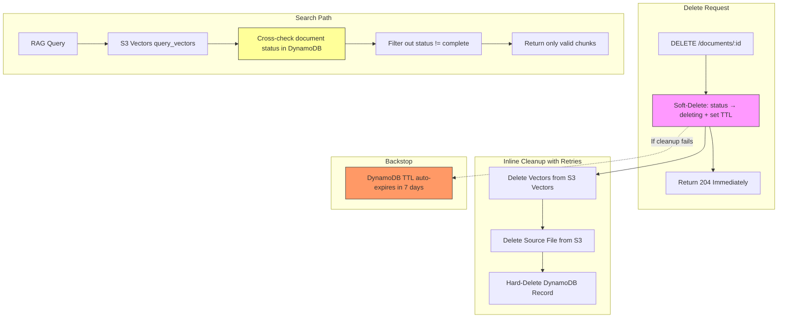
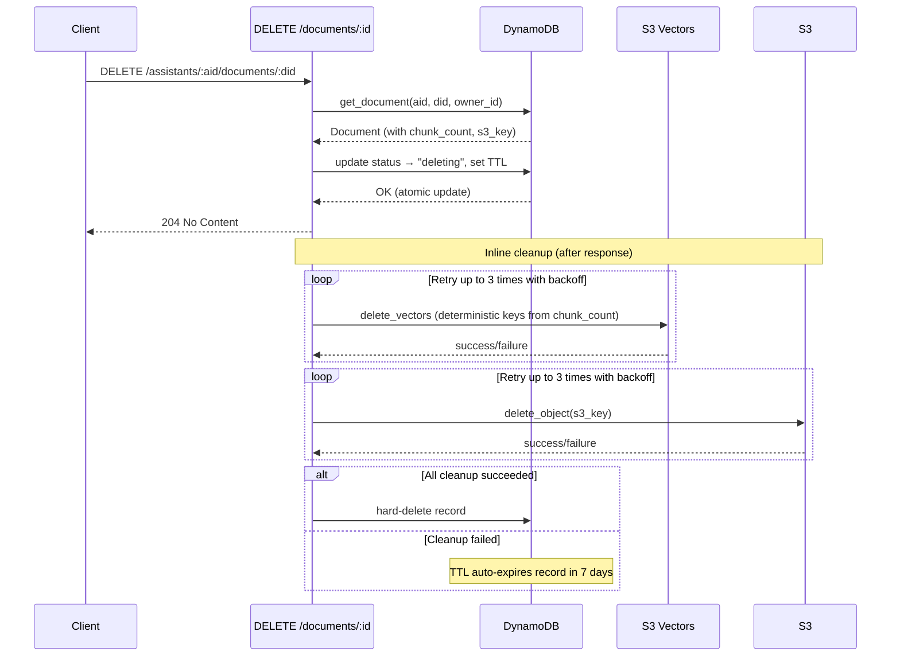
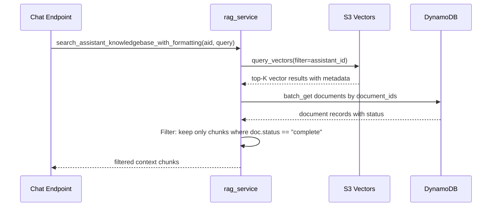
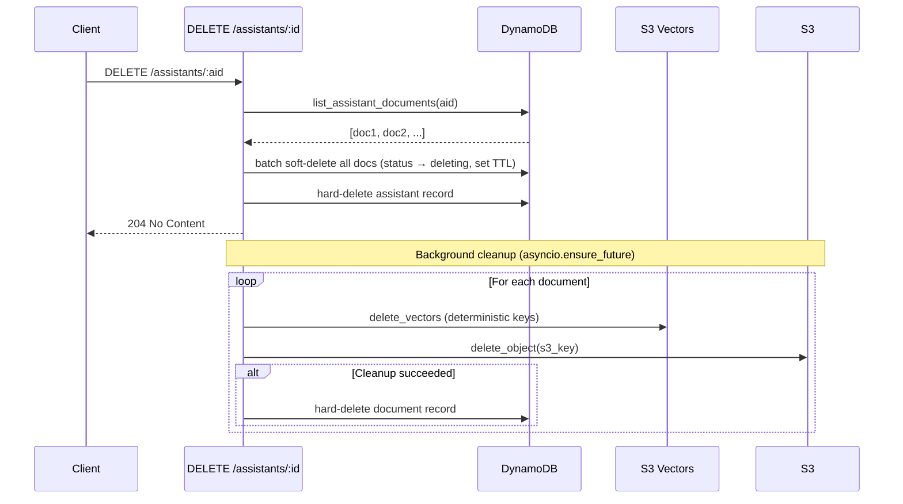

# Design Document: Reliable Document Deletion

## Overview

The current document deletion pipeline deletes from three independent stores (DynamoDB, S3, S3 Vectors) sequentially, with failures silently swallowed. When S3 Vectors deletion fails, orphaned vectors remain in the index. The RAG search path (`search_assistant_knowledgebase`) only filters by `assistant_id`, so orphaned vectors from deleted documents still appear as search results — returning stale citations to users.

This design introduces a **soft-delete + inline cleanup with retries + DynamoDB TTL** pattern that treats DynamoDB as the single source of truth for document existence. Documents are atomically marked as `deleting`, immediately hidden from search results, then cleaned up with retries. A TTL backstop auto-expires records if cleanup fails, while orphaned S3/vector data becomes harmless since search always cross-checks document status.

The same pattern applies to both the single-document DELETE endpoint and the assistant deletion endpoint, which bulk-deletes all documents for an assistant.

## Architecture



## Sequence Diagrams

### Single Document Deletion



### RAG Search with Document Status Filtering



### Assistant Deletion (Bulk Document Cleanup)



## Components and Interfaces

### Component 1: Document Model (models.py)

**Purpose**: Extend `DocumentStatus` to include `deleting` status and add TTL field.

```python
# Extended status type
DocumentStatus = Literal["uploading", "chunking", "embedding", "complete", "failed", "deleting"]

class Document(BaseModel):
    # ... existing fields ...
    ttl: Optional[int] = Field(None, alias="ttl", description="DynamoDB TTL epoch timestamp for auto-expiry")
```

**Responsibilities**:
- Define the `deleting` status as a valid document lifecycle state
- Carry TTL epoch timestamp for DynamoDB auto-expiry

### Component 2: Document Service — Soft Delete (document_service.py)

**Purpose**: Atomic status transition to `deleting` with TTL, replacing the current hard-delete.

```python
async def soft_delete_document(
    assistant_id: str,
    document_id: str,
    owner_id: str,
    ttl_days: int = 7,
) -> Optional[Document]:
    """
    Atomically mark a document as 'deleting' and set a TTL for auto-expiry.
    Returns the document (with chunk_count, s3_key) needed for cleanup.
    Returns None if document not found or not owned by user.
    """
    ...
```

```python
async def hard_delete_document(
    assistant_id: str,
    document_id: str,
) -> bool:
    """
    Unconditionally remove the DynamoDB record. Called after successful
    cleanup of S3 and vectors. No ownership check needed — caller has
    already verified ownership during soft-delete.
    """
    ...
```

```python
async def batch_soft_delete_documents(
    assistant_id: str,
    document_ids: list[str],
    ttl_days: int = 7,
) -> int:
    """
    Batch soft-delete multiple documents for an assistant.
    Used during assistant deletion. Returns count of documents marked.
    """
    ...
```

**Responsibilities**:
- Atomic `status → deleting` transition with conditional expression (only if current status allows)
- Set `ttl` attribute to `now + ttl_days` as epoch seconds
- Return full document record for cleanup (chunk_count, s3_key needed)

### Component 3: Cleanup with Retries (new: cleanup_service.py)

**Purpose**: Orchestrate deletion of vectors and S3 objects with retry logic.

```python
async def cleanup_document_resources(
    document_id: str,
    assistant_id: str,
    s3_key: str,
    chunk_count: Optional[int],
    max_retries: int = 3,
    base_delay: float = 0.5,
) -> bool:
    """
    Delete vectors and S3 source file with exponential backoff retries.
    Returns True if all resources cleaned up successfully.
    """
    ...
```

```python
async def cleanup_assistant_documents(
    assistant_id: str,
    documents: list[Document],
    max_retries: int = 3,
) -> tuple[int, int]:
    """
    Bulk cleanup for assistant deletion. Processes documents concurrently.
    Returns (success_count, failure_count).
    """
    ...
```

**Responsibilities**:
- Retry vector deletion and S3 deletion independently (up to `max_retries`)
- Use exponential backoff with jitter
- Call `hard_delete_document` only when both vector and S3 cleanup succeed
- Log failures but never raise — cleanup is best-effort after soft-delete

### Component 4: Deterministic Vector Deletion (bedrock_embeddings.py)

**Purpose**: Replace probe-and-scan with deterministic key generation using `chunk_count`.

```python
async def delete_vectors_for_document_deterministic(
    document_id: str,
    chunk_count: int,
) -> int:
    """
    Delete vectors using deterministic keys: {document_id}#{i} for i in range(chunk_count).
    No probing, no list-scan. O(chunk_count) with a single batch delete call.
    """
    ...
```

**Responsibilities**:
- Generate keys deterministically from `chunk_count`
- Batch delete in groups of 500 (S3 Vectors API limit)
- Fall back to existing `delete_vectors_for_document` (probe+scan) only when `chunk_count is None`

### Component 5: Search Path Filtering (rag_service.py)

**Purpose**: Cross-check vector results against DynamoDB to filter out non-`complete` documents.

```python
async def search_assistant_knowledgebase_with_formatting(
    assistant_id: str,
    query: str,
    top_k: int = 5,
) -> list[dict[str, Any]]:
    """
    Search vector store, then cross-check document status in DynamoDB.
    Only return chunks from documents with status='complete'.
    """
    ...
```

**Responsibilities**:
- After vector search, extract unique `document_id` values from results
- Batch-get document records from DynamoDB
- Filter out chunks whose document has `status != 'complete'` (or doesn't exist)
- Return only valid chunks to the caller

### Component 6: DynamoDB TTL Configuration (rag-ingestion-stack.ts)

**Purpose**: Enable TTL on the assistants table using the `ttl` attribute.

```typescript
this.assistantsTable = new dynamodb.Table(this, 'RagAssistantsTable', {
    // ... existing config ...
    timeToLiveAttribute: 'ttl',  // NEW: enable TTL
});
```

**Responsibilities**:
- Enable DynamoDB TTL on the `ttl` attribute
- DynamoDB automatically deletes expired items (typically within 48 hours of TTL epoch)

## Data Models

### Document Record (DynamoDB)

```python
# Existing fields (unchanged)
{
    "PK": "AST#{assistant_id}",
    "SK": "DOC#{document_id}",
    "documentId": "DOC-abc123",
    "assistantId": "AST-xyz789",
    "filename": "report.pdf",
    "contentType": "application/pdf",
    "sizeBytes": 1048576,
    "s3Key": "assistants/AST-xyz789/DOC-abc123/report.pdf",
    "status": "complete",          # NEW: "deleting" added as valid value
    "chunkCount": 42,              # Used for deterministic vector key generation
    "createdAt": "2024-01-15T10:30:00Z",
    "updatedAt": "2024-01-15T10:31:00Z",

    # NEW field
    "ttl": 1737504600              # Epoch seconds, set only when status="deleting"
}
```

**Validation Rules**:
- `ttl` is only set when `status = "deleting"`
- `ttl` value = current epoch + (7 * 86400) seconds
- `chunk_count` may be `None` if Lambda crashed before the embedding phase
- `status` transitions: any terminal state → `deleting` (but not from `deleting` → anything else via API)

### Vector Key Pattern

```python
# Deterministic key format
key = f"{document_id}#{chunk_index}"
# Example: "DOC-abc123#0", "DOC-abc123#1", ..., "DOC-abc123#41"

# Total keys = chunk_count (stored in DynamoDB document record)
keys = [f"{document_id}#{i}" for i in range(chunk_count)]
```

## Key Functions with Formal Specifications

### Function 1: soft_delete_document()

```python
async def soft_delete_document(
    assistant_id: str,
    document_id: str,
    owner_id: str,
    ttl_days: int = 7,
) -> Optional[Document]:
```

**Preconditions:**
- `assistant_id` is a valid assistant ID owned by `owner_id`
- `document_id` exists under the given assistant
- `ttl_days > 0`

**Postconditions:**
- Document `status` is atomically set to `"deleting"` in DynamoDB
- `ttl` attribute is set to `int(now_epoch + ttl_days * 86400)`
- `updatedAt` is refreshed to current timestamp
- Returns the full Document record (including `chunk_count`, `s3_key`) for cleanup
- Returns `None` if document not found or ownership check fails
- If document is already in `"deleting"` status, the update is idempotent

**Loop Invariants:** N/A (single atomic DynamoDB update)

### Function 2: cleanup_document_resources()

```python
async def cleanup_document_resources(
    document_id: str,
    assistant_id: str,
    s3_key: str,
    chunk_count: Optional[int],
    max_retries: int = 3,
    base_delay: float = 0.5,
) -> bool:
```

**Preconditions:**
- Document has already been soft-deleted (status = `"deleting"`)
- `s3_key` is the S3 object key for the source file
- `chunk_count` is the number of vector chunks (may be `None`)
- `max_retries >= 1`, `base_delay > 0`

**Postconditions:**
- If `chunk_count is not None`: vectors with keys `{document_id}#0` through `{document_id}#{chunk_count-1}` are deleted from S3 Vectors
- If `chunk_count is None`: falls back to probe-and-scan deletion
- S3 object at `s3_key` is deleted
- Returns `True` if and only if both vector deletion and S3 deletion succeeded
- On `True`, the DynamoDB record is hard-deleted
- On `False`, the DynamoDB record remains with `status="deleting"` and TTL will auto-expire it
- Never raises exceptions — all failures are logged and swallowed

**Loop Invariants:**
- For retry loop: `attempt < max_retries` and previous attempt failed
- Delay between retries = `base_delay * 2^attempt + random_jitter`

### Function 3: delete_vectors_for_document_deterministic()

```python
async def delete_vectors_for_document_deterministic(
    document_id: str,
    chunk_count: int,
) -> int:
```

**Preconditions:**
- `document_id` is a valid document ID
- `chunk_count >= 0`
- Vector keys follow the pattern `{document_id}#{i}` for `i in range(chunk_count)`

**Postconditions:**
- All vectors with keys `{document_id}#0` through `{document_id}#{chunk_count-1}` are deleted
- Returns the number of keys sent for deletion (= `chunk_count`)
- Deletion is idempotent — deleting non-existent keys is a no-op in S3 Vectors API
- Raises on S3 Vectors API errors (caller handles retries)

**Loop Invariants:**
- For batch loop: all keys in batches `[0..i]` have been submitted for deletion
- Batch size ≤ 500

### Function 4: search_assistant_knowledgebase_with_formatting() (modified)

```python
async def search_assistant_knowledgebase_with_formatting(
    assistant_id: str,
    query: str,
    top_k: int = 5,
) -> list[dict[str, Any]]:
```

**Preconditions:**
- `assistant_id` is a valid assistant ID
- `query` is a non-empty string
- `top_k > 0`

**Postconditions:**
- Returns only chunks from documents where `status == "complete"` in DynamoDB
- Chunks from documents with `status == "deleting"`, `"failed"`, or missing records are excluded
- Result count ≤ `top_k`
- Each result contains `text`, `distance`, `metadata`, and `key`
- On DynamoDB lookup failure, falls back to returning unfiltered results (graceful degradation)

**Loop Invariants:** N/A

## Algorithmic Pseudocode

### Document Deletion Algorithm

```python
# Main deletion flow (inline in route handler)
async def delete_document_endpoint(assistant_id, document_id, user_id):
    # Step 1: Soft-delete (atomic, fast)
    document = await soft_delete_document(assistant_id, document_id, user_id)
    if document is None:
        raise HTTPException(404)

    # Step 2: Return immediately — document is now invisible to search
    # (response sent to client here)

    # Step 3: Inline cleanup with retries (after response)
    success = await cleanup_document_resources(
        document_id=document.document_id,
        assistant_id=assistant_id,
        s3_key=document.s3_key,
        chunk_count=document.chunk_count,
    )

    if success:
        await hard_delete_document(assistant_id, document_id)
    # else: TTL will auto-expire the record
```

### Cleanup with Retries Algorithm

```python
async def cleanup_document_resources(document_id, assistant_id, s3_key, chunk_count, max_retries=3, base_delay=0.5):
    vectors_deleted = False
    s3_deleted = False

    # Phase 1: Delete vectors
    for attempt in range(max_retries):
        try:
            if chunk_count is not None:
                await delete_vectors_for_document_deterministic(document_id, chunk_count)
            else:
                await delete_vectors_for_document(document_id)  # fallback probe+scan
            vectors_deleted = True
            break
        except Exception as e:
            delay = base_delay * (2 ** attempt) + random.uniform(0, 0.1)
            logger.warning(f"Vector deletion attempt {attempt+1} failed: {e}, retrying in {delay:.1f}s")
            await asyncio.sleep(delay)

    # Phase 2: Delete S3 source file
    for attempt in range(max_retries):
        try:
            s3_client.delete_object(Bucket=bucket, Key=s3_key)
            s3_deleted = True
            break
        except Exception as e:
            delay = base_delay * (2 ** attempt) + random.uniform(0, 0.1)
            logger.warning(f"S3 deletion attempt {attempt+1} failed: {e}, retrying in {delay:.1f}s")
            await asyncio.sleep(delay)

    return vectors_deleted and s3_deleted
```

### Deterministic Vector Deletion Algorithm

```python
async def delete_vectors_for_document_deterministic(document_id, chunk_count):
    keys = [f"{document_id}#{i}" for i in range(chunk_count)]
    batch_size = 500
    deleted = 0

    for i in range(0, len(keys), batch_size):
        batch = keys[i:i + batch_size]
        client.delete_vectors(
            vectorBucketName=vector_bucket,
            indexName=vector_index,
            keys=batch,
        )
        deleted += len(batch)

    return deleted
```

### Search Filtering Algorithm

```python
async def search_with_document_status_filter(assistant_id, query, top_k=5):
    # Step 1: Vector search (unchanged)
    response = await search_assistant_knowledgebase(assistant_id, query)
    vectors = response.get("vectors", [])

    if not vectors:
        return []

    # Step 2: Extract unique document IDs from results
    doc_ids = set()
    for v in vectors:
        doc_id = v.get("metadata", {}).get("document_id")
        if doc_id:
            doc_ids.add(doc_id)

    # Step 3: Batch-get document records from DynamoDB
    valid_doc_ids = set()
    try:
        table = dynamodb.Table(table_name)
        for doc_id in doc_ids:
            response = table.get_item(Key={"PK": f"AST#{assistant_id}", "SK": f"DOC#{doc_id}"})
            item = response.get("Item")
            if item and item.get("status") == "complete":
                valid_doc_ids.add(doc_id)
    except Exception:
        # Graceful degradation: return unfiltered results
        valid_doc_ids = doc_ids

    # Step 4: Filter vector results
    filtered = []
    for v in vectors[:top_k * 2]:  # Over-fetch to account for filtering
        doc_id = v.get("metadata", {}).get("document_id")
        if doc_id in valid_doc_ids:
            filtered.append(v)
        if len(filtered) >= top_k:
            break

    return filtered
```

## Example Usage

```python
# Example 1: Single document deletion
@router.delete("/{document_id}", status_code=status.HTTP_204_NO_CONTENT)
async def delete_document(assistant_id: str, document_id: str, user_id: str = Depends(get_current_user_id)):
    document = await soft_delete_document(assistant_id, document_id, user_id)
    if not document:
        raise HTTPException(status_code=404, detail="Document not found")

    # Fire-and-forget cleanup (response already sent as 204)
    asyncio.ensure_future(
        _cleanup_and_hard_delete(document)
    )
    return None


async def _cleanup_and_hard_delete(document: Document):
    success = await cleanup_document_resources(
        document_id=document.document_id,
        assistant_id=document.assistant_id,
        s3_key=document.s3_key,
        chunk_count=document.chunk_count,
    )
    if success:
        await hard_delete_document(document.assistant_id, document.document_id)


# Example 2: Assistant deletion with bulk document cleanup
@router.delete("/{assistant_id}", status_code=204)
async def delete_assistant_endpoint(assistant_id: str, current_user: User = Depends(get_current_user)):
    docs, _ = await list_assistant_documents(assistant_id, current_user.user_id)

    # Soft-delete all documents first
    await batch_soft_delete_documents(assistant_id, [d.document_id for d in docs])

    # Hard-delete assistant record
    await delete_assistant(assistant_id=assistant_id, owner_id=current_user.user_id)

    # Background cleanup
    asyncio.ensure_future(cleanup_assistant_documents(assistant_id, docs))
    return None


# Example 3: RAG search now filters by document status
chunks = await search_assistant_knowledgebase_with_formatting(
    assistant_id="AST-xyz789",
    query="What are the quarterly results?",
    top_k=5,
)
# chunks only contains results from documents with status="complete"
# Documents in "deleting" status are invisible
```

## Correctness Properties

*A property is a characteristic or behavior that should hold true across all valid executions of a system — essentially, a formal statement about what the system should do. Properties serve as the bridge between human-readable specifications and machine-verifiable correctness guarantees.*

### Property 1: Soft-delete postconditions

*For any* document in a valid pre-delete status (uploading, chunking, embedding, complete, failed), after calling soft_delete_document, the returned document record SHALL have status="deleting", a TTL equal to the current epoch plus 604800 seconds, an updated updatedAt timestamp, and the original chunk_count and s3_key values preserved.

**Validates: Requirements 1.1, 1.2, 1.3, 1.4**

### Property 2: Idempotent soft-delete

*For any* document already in "deleting" status, calling soft_delete_document again SHALL succeed without error and the document SHALL remain in "deleting" status.

**Validates: Requirement 1.6**

### Property 3: Search results only contain complete documents

*For any* set of vector search results containing chunks from documents with mixed statuses (complete, deleting, failed, uploading, or missing), the RAG_Search_Service SHALL return only chunks whose document_id maps to a document with status="complete" in DynamoDB.

**Validates: Requirements 3.1, 3.2, 3.3**

### Property 4: Cleanup retry bounded by max_retries

*For any* cleanup operation (vector deletion or S3 deletion) that encounters transient failures, the Cleanup_Service SHALL attempt at most max_retries attempts, with each retry delay following exponential backoff (base_delay * 2^attempt + jitter).

**Validates: Requirements 4.1, 4.2**

### Property 5: Failed cleanup preserves DynamoDB record

*For any* document where vector deletion or S3 deletion fails after all retries, the DynamoDB record SHALL remain with status="deleting" and a valid TTL attribute, and hard-delete SHALL NOT be invoked.

**Validates: Requirement 4.4**

### Property 6: Successful cleanup triggers hard-delete

*For any* document where both vector deletion and S3 deletion succeed, the Cleanup_Service SHALL invoke hard-delete, and the DynamoDB record for that document SHALL no longer exist.

**Validates: Requirements 4.3, 9.1**

### Property 7: Deterministic vector key generation

*For any* document_id and chunk_count >= 0, the deterministic deletion function SHALL generate exactly chunk_count keys matching the pattern "{document_id}#{i}" for i in range(chunk_count), batched into groups of at most 500.

**Validates: Requirement 5.1**

### Property 8: Bulk soft-delete covers all documents

*For any* assistant with N documents, batch_soft_delete_documents SHALL mark all N documents as "deleting" with TTL before the assistant record is hard-deleted.

**Validates: Requirement 8.1**

### Property 9: Bulk cleanup counts are consistent

*For any* set of documents processed by cleanup_assistant_documents, the sum of success_count and failure_count SHALL equal the total number of documents processed.

**Validates: Requirement 8.3**

### Property 10: List documents excludes deleting status

*For any* assistant with documents in mixed statuses, listing documents SHALL never return documents with status="deleting".

**Validates: Requirement 11.1**

## Error Handling

### Error Scenario 1: Vector Deletion Fails (All Retries Exhausted)

**Condition**: S3 Vectors API returns errors for all 3 retry attempts
**Response**: Log error, skip S3 deletion, leave DynamoDB record with `status="deleting"` and TTL
**Recovery**: Document is invisible to search. TTL auto-expires the DynamoDB record. Orphaned vectors are harmless (search filters by document status). No manual intervention needed.

### Error Scenario 2: S3 Source File Deletion Fails

**Condition**: S3 `delete_object` fails for all retry attempts
**Response**: Log error, leave DynamoDB record with `status="deleting"` and TTL
**Recovery**: Orphaned S3 object is harmless (no path references it after DynamoDB record expires). S3 lifecycle policies can clean up orphaned objects if desired.

### Error Scenario 3: Soft-Delete Fails (DynamoDB Error)

**Condition**: DynamoDB `update_item` fails during soft-delete
**Response**: Return 500 to client. No cleanup attempted.
**Recovery**: Document remains in its original state. User can retry the delete.

### Error Scenario 4: DynamoDB Lookup Fails During Search

**Condition**: Batch-get for document status fails during RAG search
**Response**: Fall back to returning unfiltered vector results (graceful degradation)
**Recovery**: Temporary — next search attempt will likely succeed. Worst case: user sees a stale result once.

### Error Scenario 5: chunk_count is None (Lambda Crashed Mid-Processing)

**Condition**: Document record has no `chunk_count` (Lambda crashed before embedding phase)
**Response**: Fall back to existing probe-and-scan `delete_vectors_for_document` function
**Recovery**: Slower but correct. Probe-and-scan handles unknown chunk counts.

## Testing Strategy

### Unit Testing Approach

- Test `soft_delete_document` with mocked DynamoDB: verify status transition, TTL calculation, conditional expression
- Test `cleanup_document_resources` with mocked S3/S3Vectors: verify retry logic, backoff timing, success/failure paths
- Test `delete_vectors_for_document_deterministic`: verify key generation, batch splitting at 500
- Test search filtering: verify chunks from `deleting` documents are excluded
- Test `batch_soft_delete_documents`: verify all documents are marked

### Property-Based Testing Approach

**Property Test Library**: hypothesis

- For any `chunk_count >= 0`, `delete_vectors_for_document_deterministic` generates exactly `chunk_count` keys matching the pattern `{document_id}#{i}`
- For any set of vector results, the search filter never returns chunks from documents with `status != "complete"`
- TTL epoch is always in the future (within `ttl_days` range) relative to the soft-delete timestamp
- Retry backoff delay is always `>= base_delay * 2^attempt` and `< base_delay * 2^attempt + max_jitter`

### Integration Testing Approach

- End-to-end: delete a document, verify it disappears from search results immediately
- Simulate vector deletion failure: verify document is invisible to search, DynamoDB record has TTL
- Simulate S3 deletion failure: verify document is invisible, TTL is set
- Assistant deletion: verify all documents are soft-deleted, then cleaned up
- Verify DynamoDB TTL attribute is enabled on the table (CDK synth test)

## Performance Considerations

- **Soft-delete is a single DynamoDB update**: ~5ms latency, same as current hard-delete. No user-facing latency increase.
- **Search path adds one DynamoDB batch-get**: For top-5 results, this is at most 5 `get_item` calls (or 1 `batch_get_item`). Adds ~10-20ms to search latency. Acceptable given search already takes ~200-500ms for embedding generation.
- **Deterministic vector deletion eliminates probe-and-scan**: Current approach probes in batches of 500 with `get_vectors` calls. Deterministic approach skips probing entirely — just generates keys and deletes. For a 42-chunk document, this is 1 `delete_vectors` call instead of 1 `get_vectors` + 1 `delete_vectors`.
- **Retry overhead is bounded**: Max 3 retries with exponential backoff. Worst case adds ~3.5s to cleanup. This happens after the 204 response, so no user impact.
- **TTL cleanup is free**: DynamoDB TTL deletion is handled by AWS at no additional cost.

## Security Considerations

- **Ownership verification happens during soft-delete**: The `soft_delete_document` function verifies assistant ownership before marking the document. Cleanup functions (`hard_delete_document`, `cleanup_document_resources`) skip ownership checks since they operate on already-verified documents.
- **No new API surface**: The change is internal to existing endpoints. No new routes or permissions needed.
- **TTL prevents indefinite data retention**: Documents marked for deletion are guaranteed to be removed within 7 days + DynamoDB TTL processing time (~48h), even if cleanup fails.

## Dependencies

- **boto3**: DynamoDB `update_item` with conditional expressions, `batch_get_item` for search filtering
- **S3 Vectors API**: `delete_vectors` (existing dependency, no new API calls)
- **S3 API**: `delete_object` (existing dependency)
- **AWS CDK**: `dynamodb.Table` `timeToLiveAttribute` property for TTL configuration
- **asyncio**: `ensure_future` for fire-and-forget cleanup, `sleep` for retry backoff
- **random**: Jitter for retry backoff
