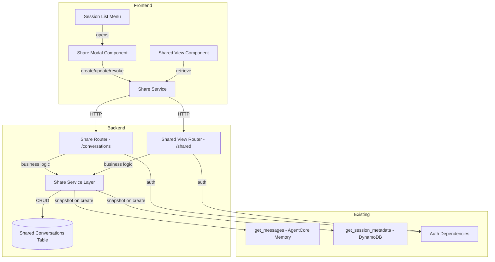

# Design: Share Conversations via Shareable URL

## Overview

This feature enables users to share point-in-time snapshots of conversations via shareable URLs. When a user shares a conversation, the system captures the current state (metadata + messages) and stores it independently in a dedicated DynamoDB table. Recipients access the snapshot through a read-only view at `/shared/{share_id}`.

Three access levels control visibility:
- **Private**: Only the owner can view (default)
- **Public**: Any authenticated user with the link can view
- **Specific**: Only designated email addresses (owner always included) can view

The design follows existing patterns: FastAPI router + service layer on the backend, Angular standalone component + injectable service on the frontend, and CDK-defined DynamoDB table in the infrastructure stack.

## Architecture



### Request Flow

1. **Create Share**: User clicks "Share" in session menu → Modal opens → User selects access level → POST `/conversations/{session_id}/share` → Service calls `get_messages()` and `get_session_metadata()` to build snapshot → Stores in DynamoDB → Returns share_id + URL
2. **View Share**: Recipient navigates to `/shared/{share_id}` → Frontend loads SharedView component → GET `/shared/{share_id}` → Service checks access control → Returns snapshot data → Renders read-only view
3. **Update Share**: Owner changes access level in modal → PATCH `/conversations/{session_id}/share` → Service updates access_level/allowed_emails in DynamoDB
4. **Revoke Share**: Owner clicks revoke → DELETE `/conversations/{session_id}/share` → Service deletes record from DynamoDB

## Components and Interfaces

### Backend Components

#### 1. Share Router (`backend/src/apis/app_api/shares/routes.py`)

New FastAPI router registered in `main.py` with prefix `/conversations`.

```python
# Endpoints:
POST   /conversations/{session_id}/share    # Create share snapshot
GET    /shared/{share_id}                    # Retrieve shared conversation
PATCH  /conversations/{session_id}/share     # Update access level / emails
DELETE /conversations/{session_id}/share     # Revoke share
```

The GET `/shared/{share_id}` endpoint is on a separate router with prefix `/shared` since it's a different resource path.

All endpoints require authentication via `get_current_user` dependency. The create/update/delete endpoints verify session ownership. The GET endpoint checks access based on access_level.

#### 2. Share Service (`backend/src/apis/app_api/shares/service.py`)

Business logic layer handling:
- **Snapshot creation**: Calls `get_messages(session_id, user_id)` and `get_session_metadata(session_id, user_id)` to capture current state, serializes to JSON-safe dicts
- **Access control**: Validates requester against access_level and allowed_emails
- **Owner email auto-inclusion**: When access_level is "specific", ensures owner email is in allowed_emails
- **Replace existing share**: Checks SessionShareIndex GSI for existing share; if found, deletes the old share before creating a new snapshot with a new share_id and URL (one active share per session)
- **DynamoDB operations**: Put, get, update, delete on the shared-conversations table

#### 3. Share Models (`backend/src/apis/app_api/shares/models.py`)

Pydantic models following existing patterns in `apis/shared/sessions/models.py`:

```python
class CreateShareRequest(BaseModel):
    access_level: Literal["public", "specific", "private"]
    allowed_emails: Optional[List[str]] = None  # Required when access_level == "specific"

class UpdateShareRequest(BaseModel):
    access_level: Optional[Literal["public", "specific", "private"]] = None
    allowed_emails: Optional[List[str]] = None  # Required when access_level is/becomes "specific"

class ShareResponse(BaseModel):
    share_id: str
    session_id: str
    owner_id: str
    access_level: Literal["public", "specific", "private"]
    allowed_emails: Optional[List[str]] = None
    created_at: str
    share_url: str

class SharedConversationResponse(BaseModel):
    share_id: str
    title: str
    access_level: Literal["public", "specific", "private"]
    created_at: str
    owner_id: str
    messages: List[MessageResponse]  # Reuses existing MessageResponse model
```

### Frontend Components

#### 4. Share Service (`frontend/ai.client/src/app/session/services/share/share.service.ts`)

Angular injectable service following the pattern in `session.service.ts`:

```typescript
@Injectable({ providedIn: 'root' })
export class ShareService {
  createShare(sessionId: string, accessLevel: string, allowedEmails?: string[]): Promise<ShareResponse>
  getSharedConversation(shareId: string): Promise<SharedConversationResponse>
  updateShare(sessionId: string, accessLevel?: string, allowedEmails?: string[]): Promise<ShareResponse>
  revokeShare(sessionId: string): Promise<void>
}
```

Uses `HttpClient`, `ConfigService` for base URL, and `AuthService.ensureAuthenticated()` before each call.

#### 5. Share Modal Component (`frontend/ai.client/src/app/session/components/share-modal/`)

Standalone Angular component rendered as a dialog overlay. Contains:
- Three radio-style access options (private/public/specific)
- Email input with tag-style chips when "specific" is selected
- Owner email shown as non-removable chip
- "Create share link" / "Update" button
- Generated URL display with "Copy link" button
- "Chat shared" confirmation with "Future messages aren't included" note
- Error state with retry

Opens via the session list ellipsis menu. When opened for a session with an existing share, displays current settings for editing plus a "Create new share link" button to replace the existing share with a fresh snapshot (note: "This will replace the existing share link").

#### 6. Shared View Component (`frontend/ai.client/src/app/shared/shared-view.page.ts`)

Standalone page component at route `/shared/:shareId`:
- Fetches shared conversation via `ShareService.getSharedConversation()`
- Renders conversation title, creation timestamp, and messages
- Reuses existing message rendering components (text, code blocks, images, tool results)
- No message input field or editing controls
- Displays "Shared read-only snapshot" banner
- Shows error states for 404/403

#### 7. Session List Menu Update

Add "Share" menu item between "Rename" and "Delete" in `session-list.html`:
- Icon: `heroArrowUpOnSquare`
- Click handler opens Share Modal for the selected session

#### 8. Route Configuration

Add to `app.routes.ts`:
```typescript
{
    path: 'shared/:shareId',
    loadComponent: () => import('./shared/shared-view.page').then(m => m.SharedViewPage),
    canActivate: [authGuard],
}
```

### Infrastructure Components

#### 9. Shared Conversations DynamoDB Table

Defined in `infrastructure/lib/infrastructure-stack.ts` following existing table patterns:

- Table name: `{projectPrefix}-shared-conversations`
- Partition key: `share_id` (String)
- Billing: PAY_PER_REQUEST
- Point-in-time recovery: enabled
- Encryption: AWS_MANAGED
- GSI `SessionShareIndex`: PK = `session_id` (String) — lookup shares by original session
- GSI `OwnerShareIndex`: PK = `owner_id` (String), SK = `created_at` (String) — list shares by owner
- SSM exports: `/{projectPrefix}/shares/shared-conversations-table-name` and `/{projectPrefix}/shares/shared-conversations-table-arn`
- Table permissions granted to App API Fargate task role

## Data Models

### DynamoDB Item Schema (Shared Conversations Table)

| Field | Type | Description |
|-------|------|-------------|
| `share_id` | String (PK) | UUID, unique identifier for the share |
| `session_id` | String | Original session ID (GSI `SessionShareIndex` PK) |
| `owner_id` | String | User ID of the share creator (GSI `OwnerShareIndex` PK) |
| `access_level` | String | "public", "specific", or "private" |
| `allowed_emails` | List\<String\> | Email addresses allowed access (only when access_level = "specific") |
| `created_at` | String | ISO 8601 timestamp (GSI `OwnerShareIndex` SK) |
| `metadata` | Map | Snapshot of session metadata (title, created_at, message_count, etc.) |
| `messages` | List\<Map\> | Snapshot of all messages at share time (role, content blocks, timestamps) |

### Access Control Matrix

| access_level | Owner | Email in allowed_emails | Other authenticated user |
|-------------|-------|------------------------|------------------------|
| private | ✅ | ❌ | ❌ |
| public | ✅ | ✅ | ✅ |
| specific | ✅ | ✅ | ❌ |


## Correctness Properties

*A property is a characteristic or behavior that should hold true across all valid executions of a system — essentially, a formal statement about what the system should do. Properties serve as the bridge between human-readable specifications and machine-verifiable correctness guarantees.*

### Property 1: Share creation snapshot round-trip

*For any* valid session with metadata and messages, creating a share (with any access_level) and then retrieving it should return a snapshot whose metadata title and messages content match the original session data at the time of creation, and the stored record should contain all required fields (share_id, session_id, owner_id, access_level, created_at, metadata, messages).

**Validates: Requirements 1.1, 1.4, 1.8**

### Property 2: Owner email auto-inclusion invariant

*For any* create or update operation where access_level is "specific" and any set of allowed_emails, the resulting stored allowed_emails list shall always contain the owner's email address, regardless of whether it was explicitly included in the input.

**Validates: Requirements 1.2, 4.2, 4.5**

### Property 3: "Specific" access requires non-empty allowed_emails

*For any* create or update request where access_level is "specific" and allowed_emails is empty or missing, the API shall return a 422 validation error and no share record shall be created or modified.

**Validates: Requirements 1.3, 4.3**

### Property 4: Non-owner operations return 403

*For any* share operation (create, update, or delete) attempted by a user who does not own the target session, the API shall return a 403 Forbidden error and the share state shall remain unchanged.

**Validates: Requirements 1.5, 3.2, 4.6**

### Property 5: Access control matrix

*For any* shared conversation and any authenticated requesting user: if access_level is "public", retrieval succeeds; if access_level is "specific", retrieval succeeds if and only if the requester's email is in allowed_emails or the requester is the owner; if access_level is "private", retrieval succeeds if and only if the requester is the owner.

**Validates: Requirements 2.1, 2.2, 2.3, 2.4, 2.5**

### Property 6: Re-share replaces existing share

*For any* session that already has an active share, sending a create share request shall delete the old share record, create a new share with a different share_id, and the old share_id shall return 404 on subsequent retrieval.

**Validates: Requirements 1.7**

### Property 7: Revocation removes access

*For any* existing share, after the owner sends a delete request, subsequent GET requests for that share_id shall return 404 Not Found.

**Validates: Requirements 3.1, 3.4**

### Property 8: Non-specific access levels clear allowed_emails

*For any* existing share updated to access_level "public" or "private", the resulting stored record shall have the allowed_emails field cleared (empty or absent).

**Validates: Requirements 4.1, 4.4**

### Property 9: ShareResponse serialization round-trip

*For any* valid ShareResponse object, serializing to JSON and then deserializing back shall produce an equivalent object with all fields preserved.

**Validates: Requirements 10.5**

### Property 10: Shared view renders all snapshot data

*For any* SharedConversationResponse, the rendered shared view shall display the conversation title, the share creation timestamp, and all messages from the snapshot.

**Validates: Requirements 7.2**

## Error Handling

### Backend Error Handling

| Scenario | HTTP Status | Error Detail |
|----------|-------------|-------------|
| Missing/invalid auth token | 401 | "Authentication required" (handled by `get_current_user` dependency) |
| User doesn't own the session | 403 | "You do not have permission to share this session" |
| User not in allowed_emails for specific share | 403 | "Access denied" |
| Non-owner accessing private share | 403 | "Access denied" |
| Session not found | 404 | "Session not found: {session_id}" |
| Share not found | 404 | "Share not found" |
| Revoked share accessed | 404 | "Share not found" |
| access_level "specific" with empty allowed_emails | 422 | "allowed_emails is required when access_level is 'specific'" |
| Invalid access_level value | 422 | Pydantic validation error (automatic from Literal type) |
| DynamoDB write failure | 503 | "Failed to create share" |
| AgentCore Memory retrieval failure | 500 | "Failed to snapshot conversation messages" |

### Frontend Error Handling

- **Share creation failure**: Modal displays error message with retry button; does not close modal
- **Share retrieval failure (403)**: Shared view displays "Access denied — you don't have permission to view this conversation"
- **Share retrieval failure (404)**: Shared view displays "Conversation not found — this share link may have been revoked"
- **Network errors**: Toast notification with retry option
- **Clipboard copy failure**: Fallback to selecting the URL text for manual copy

### Retry Strategy

- Frontend retries are user-initiated (retry button in error states)
- No automatic retries on 4xx errors (client errors are deterministic)
- DynamoDB operations use boto3's built-in retry with exponential backoff

## Testing Strategy

### Unit Tests (pytest / Vitest)

Focus on specific examples, edge cases, and integration points:

- **Backend unit tests** (`backend/tests/apis/app_api/shares/`):
  - Pydantic model validation (valid/invalid inputs for CreateShareRequest, UpdateShareRequest)
  - Access control logic with specific user/email combinations
  - Share service methods with mocked DynamoDB and AgentCore Memory
  - Router endpoint integration tests with TestClient
  - Edge cases: empty session (no messages), very long email lists, unicode in metadata

- **Frontend unit tests** (`frontend/ai.client/src/app/`):
  - Share service HTTP calls with mocked HttpClient
  - Share modal component: radio selection, email input, validation states
  - Shared view component: loading, success, error states
  - Session list menu: "Share" item presence and click handler

### Property-Based Tests (Hypothesis for Python / fast-check for TypeScript)

Each property test runs a minimum of 100 iterations with randomly generated inputs. Each test is tagged with its corresponding design property.

- **Backend property tests** (`backend/tests/apis/app_api/shares/test_share_properties.py`):
  - **Feature: share-conversations, Property 1**: Generate random session metadata + messages, create share, retrieve, verify round-trip
  - **Feature: share-conversations, Property 2**: Generate random email lists and owner emails, verify owner always in result
  - **Feature: share-conversations, Property 3**: Generate requests with access_level "specific" and empty/None allowed_emails, verify 422
  - **Feature: share-conversations, Property 4**: Generate random non-owner user IDs, verify 403 on all operations
  - **Feature: share-conversations, Property 5**: Generate random (access_level, requester_email, owner_id, allowed_emails) tuples, verify access decision matches matrix
  - **Feature: share-conversations, Property 6**: Create share, then create again for same session, verify new share_id returned and old share_id returns 404
  - **Feature: share-conversations, Property 7**: Create then delete share, verify retrieval returns 404
  - **Feature: share-conversations, Property 8**: Generate random shares, update to public/private, verify allowed_emails cleared
  - **Feature: share-conversations, Property 9**: Generate random valid ShareResponse objects, serialize/deserialize, verify equality

- **Frontend property tests** (fast-check):
  - **Feature: share-conversations, Property 10**: Generate random SharedConversationResponse data, render component, verify title/timestamp/messages present

### Testing Libraries

- **Backend**: `hypothesis` (already in use — `.hypothesis/` directory exists in `backend/`)
- **Frontend**: `fast-check` (to be added to `package.json`)
- **Minimum iterations**: 100 per property test
- **Tag format**: `# Feature: share-conversations, Property {N}: {title}`
