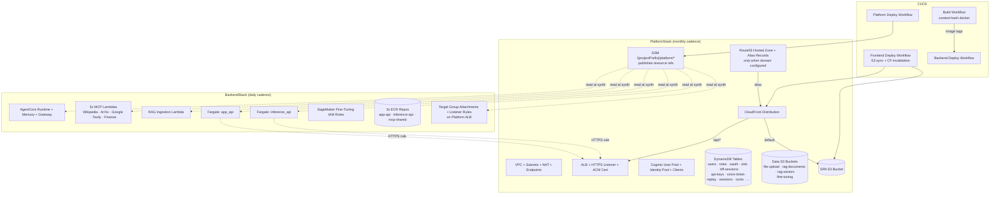
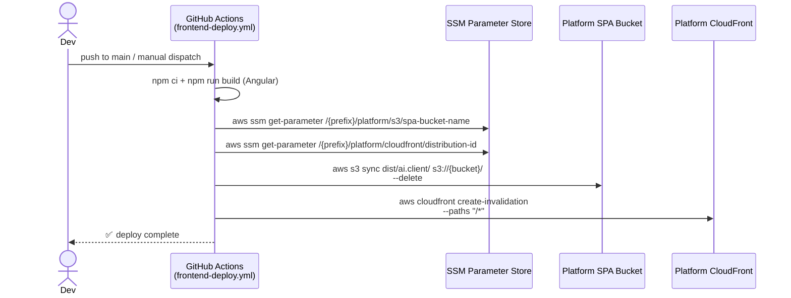
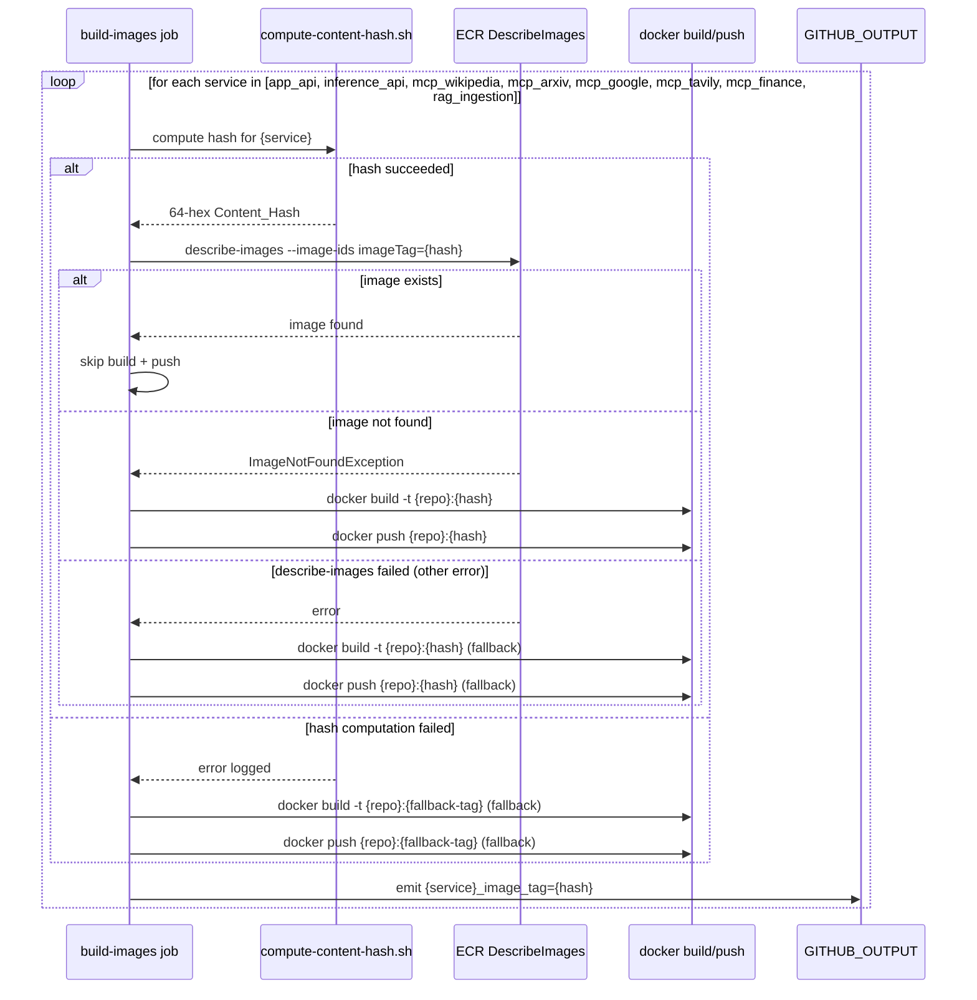
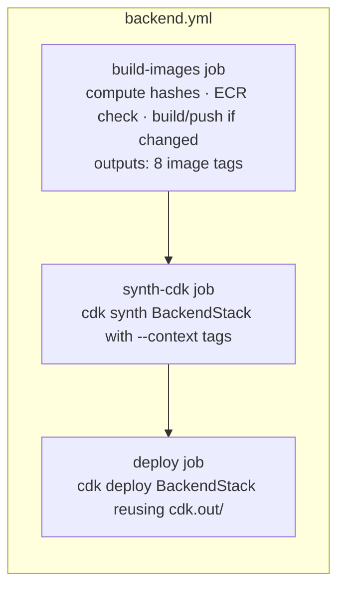
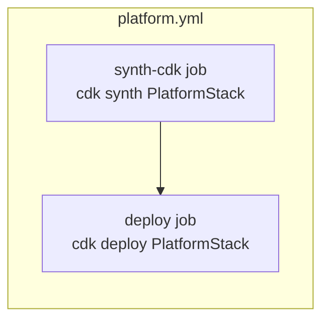

# Design Document

## Overview

This design consolidates the current eight-stack CDK architecture (`InfrastructureStack`, `AppApiStack`, `InferenceApiStack`, `GatewayStack`, `RagIngestionStack`, `SageMakerFineTuningStack`, `ArtifactsStack`, `McpSandboxStack`, `FrontendStack`) into exactly two stacks — `PlatformStack` and `BackendStack` — partitioned by change cadence. The frontend leaves CDK entirely and becomes a CI workflow that builds the Angular SPA and syncs it into the Platform-owned S3 bucket. A content-hash–based Docker build cache turns the slowest segment of every deploy (5–15 minute container builds) into a no-op when source content has not changed.

The split principle is deliberate: PlatformStack owns every resource that does not run application code, and BackendStack owns only the slivers it needs.

- `PlatformStack` — long-lived, monthly-cadence foundation: VPC, ALB, Cognito, every shared DynamoDB table (including OAuth tables), every data S3 bucket (file upload, RAG, fine-tuning), the SPA bucket, the CloudFront distribution that fronts both the SPA and the Platform ALB at `/api/*`, the Route53 hosted zone (when a domain is configured), and the alias records pointing the configured frontend domain at the distribution.
- `BackendStack` — daily-cadence application/AI compute: AgentCore Runtime/Memory/Gateway, the five MCP Lambdas, the RAG ingestion Lambda, the two Fargate services (`app_api`, `inference_api`), the SageMaker Fine-Tuning IAM roles, the three ECR repositories, and target group attachments on the Platform-owned ALB. Zero S3 buckets, zero DynamoDB tables, zero Route53 records.

Cross-stack data flows exclusively through SSM Parameter Store under `/{projectPrefix}/platform/`. There are no `Fn::ImportValue` references and no CloudFormation `Export` declarations between the two stacks. This keeps the dependency one-way (Backend → Platform) and decouples the two deploy cadences: a Backend deploy never has to wait for, or coordinate with, a Platform deploy.

This is greenfield work on the `develop` branch. There is no production traffic to preserve and no backwards compatibility to maintain; the legacy stacks and their per-service workflows are replaced wholesale.

### Goals

1. **Two stacks, two cadences.** PlatformStack changes when foundations change (VPC topology, IdP config, table schema). BackendStack changes when application code or AI configuration changes. One deploy = one shipped feature.
2. **One-way dependencies through SSM.** No `Fn::ImportValue` between stacks, no `Export` declarations, no CloudFormation cross-stack references. PlatformStack publishes; BackendStack reads.
3. **Frontend out of CDK.** Angular SPA is a CI artifact synced into Platform-owned S3 + CloudFront, not a CDK stack. No more `cdk deploy FrontendStack` on a frontend-only change.
4. **Content-aware Docker builds.** Compute a SHA-256 content hash over each container's Dockerfile + source tree + dependency manifests, use it as the ECR tag, and skip `docker build` and `docker push` when the tag already exists in ECR.
5. **Decoupled image tags.** BackendStack consumes image tags as deploy-time parameters from the build pipeline, so an unchanged image produces zero resource churn in `cdk diff`. When only the MCP Lambda image tag changes (and every other image tag matches its currently deployed value), the diff isolates to that single Lambda function. When multiple image tags change in a single deploy — e.g., the build pipeline rebuilds both `app_api` and an MCP Lambda — each compute resource is updated through the normal CloudFormation update path and there is no special isolation rule.

### Non-Goals

- Migrating live data from existing CloudFormation stacks. Operators who have legacy stacks deployed are instructed to delete them via CloudFormation and redeploy from scratch (Requirement 9.4).
- Adding new business functionality. Feature parity with the existing architecture is the bar; behavioral changes belong in their own specs.
- Building a multi-account or multi-region story. The two stacks deploy into a single `(account, region)` pair selected by configuration.
- Reorganizing application code in `backend/` or `frontend/`. This spec is purely the infrastructure topology and the build pipeline that feeds it.

### Key Design Decisions

| Decision | Choice | Rationale |
| --- | --- | --- |
| Cross-stack reference mechanism | SSM Parameter Store under `/{projectPrefix}/platform/` | Avoids `Fn::ImportValue` lock-in (deletes blocked while exports are referenced); makes BackendStack independently deployable; matches existing repo convention. |
| Frontend deployment | CI workflow (S3 sync + CloudFront invalidation), not a CDK stack | SPA changes are content-only, not infrastructure. Removing a CDK round-trip cuts frontend deploy time from ~3 min to ~30 s and eliminates the FrontendStack changeset surface. |
| Image tag transport | CDK context parameter (`--context appApiImageTag=...`) populated by the build job | Pins compute resources to specific immutable tags; enables `cdk diff` to show "no change" when image content is unchanged. Each tag context value targets exactly one compute resource, so when only the MCP Lambda tag changes (and every other tag matches its currently deployed value), the diff isolates to that single Lambda; when multiple tags change in the same deploy, each compute resource is updated through the normal update path with no special isolation. |
| Content hash algorithm | SHA-256, lowercase hex, 64 chars, computed over Dockerfile + source tree + `pyproject.toml` + `uv.lock` | Deterministic, collision-resistant, valid as an ECR tag, matches industry practice (Docker, OCI, Git). |
| Skip-build decision | ECR `DescribeImages` call before each build, gated on tag existence | Single source of truth (the registry) avoids drift between local cache and remote state. Failure modes fall back to building. |
| ALB ownership | PlatformStack owns ALB + listener; BackendStack attaches target groups + listener rules | The ALB is a long-lived endpoint; replacing it churns DNS and SSL. Target groups are short-lived per-service constructs. |
| `/api/*` path stripping | CloudFront Function on the `/api/*` cache behavior | Function (not Lambda@Edge) — runs at the edge, sub-millisecond, no cold start, supports the simple string rewrite required. |
| MCP Lambda packaging | Container images out of a single shared ECR repository, one repo per architecture (not per function) | Five MCP Lambdas with similar dependency profiles share one ECR repository tagged per-function (e.g. `mcp-wikipedia-{hash}`, `mcp-arxiv-{hash}`); cuts ECR cost and per-repo IAM surface. |
| Cross-stack reference for ALB attachment | BackendStack reads ALB ARN + listener ARN from SSM, calls `ApplicationListener.fromApplicationListenerAttributes` | Avoids importing the full ALB construct (which would require its security group and VPC); listener-level attributes are sufficient to register target groups and listener rules. |

### Research and Findings

- **CDK cross-stack patterns.** The repository already uses SSM Parameter Store for cross-stack references (`InfrastructureStack` publishes `/auth-platform-network/...` parameters that the existing service stacks read). The `cdk-infrastructure` skill in `.claude/skills/cdk-infrastructure/` codifies "use SSM, never `fromLookup`" as the repo norm. This design extends that pattern, formalizing the prefix as `/{projectPrefix}/platform/` for everything published by PlatformStack.
- **CDK two-stack with target group cross-attach.** The `aws-cdk-lib/aws-elasticloadbalancingv2` module exposes `ApplicationListener.fromApplicationListenerAttributes({ listenerArn, securityGroup })` for importing an existing listener into a downstream stack. This is the supported way to add target groups and rules from a different stack without coupling the load balancer construct itself ([CDK API ref](https://docs.aws.amazon.com/cdk/api/v2/docs/aws-cdk-lib.aws_elasticloadbalancingv2.ApplicationListener.html#static-fromwbrapplicationwbrlistenerwbrattributesscope-id-attrs)).
- **CloudFront `/api/*` to ALB origin.** CloudFront supports an HTTP origin pointing at an ALB DNS name with a CloudFront Function attached at the viewer-request stage to rewrite the URI. AWS documents this as the canonical pattern for SPA + same-origin BFF ([CloudFront Functions URL rewriting](https://docs.aws.amazon.com/AmazonCloudFront/latest/DeveloperGuide/example-function-url-rewrite-single-page-applications.html)). The function runtime is `cloudfront-js-2.0`, supports request/response manipulation, and is region-agnostic (CloudFront global).
- **ECR `DescribeImages` for tag existence.** AWS CLI exposes `aws ecr describe-images --repository-name <repo> --image-ids imageTag=<tag>` which exits non-zero with `ImageNotFoundException` when the tag is absent. This is the supported way to test for tag existence without pulling the image ([ECR DescribeImages reference](https://docs.aws.amazon.com/cli/latest/reference/ecr/describe-images.html)).
- **GitHub Actions output passing.** `GITHUB_OUTPUT` is the supported channel for cross-job value passing, and `outputs:` on a job exposes step outputs to downstream `needs:` jobs. Image tags computed in the build job flow to the deploy job via this mechanism, then into CDK as `--context <name>=<value>` flags.
- **Content-hash computation.** Git's `ls-files` plus `sha256sum` on a sorted file list is the standard cheap pattern for a deterministic content hash over a tracked source tree. `git ls-files` enforces gitignore semantics and produces a stable order. Hashing the file list itself (not a tar of the files) avoids tar-format nondeterminism (timestamps, ownership, padding).

## Architecture

### High-level architecture

The two-stack architecture maps cleanly onto two deploy cadences:



### CDK app structure

`infrastructure/bin/infrastructure.ts` instantiates exactly two stacks. The `Stack.addDependency` from BackendStack to PlatformStack is the only cross-stack dependency edge.

```mermaid
graph LR
    APP[CDK App<br/>infrastructure/bin/infrastructure.ts]
    APP --> P[PlatformStack<br/>infrastructure/lib/platform-stack.ts]
    APP --> B[BackendStack<br/>infrastructure/lib/backend-stack.ts]
    B -->|Stack.addDependency| P
    P --> SSM[(SSM Parameter Store<br/>/{projectPrefix}/platform/*)]
    B -. ssm.StringParameter.valueForStringParameter .-> SSM
```

### Cross-stack data flow

Every cross-stack value is published as an SSM parameter by PlatformStack and read at synth time by BackendStack. The contract is the parameter naming convention; nothing else couples the two stacks.

| Resource | Published by Platform at | Read by Backend for |
| --- | --- | --- |
| VPC ID + CIDR | `/{prefix}/platform/network/vpc-id`, `.../vpc-cidr` | Fargate services, RAG Lambda VPC config |
| Private subnet IDs | `/{prefix}/platform/network/private-subnet-ids` | Fargate task placement, Lambda VPC config |
| AZ list | `/{prefix}/platform/network/availability-zones` | `Vpc.fromVpcAttributes` reconstruction |
| ECS cluster ARN + name | `/{prefix}/platform/ecs/cluster-arn`, `.../cluster-name` | Fargate service registration |
| ALB ARN | `/{prefix}/platform/alb/arn` | Read lazily by Backend at target-group registration time (Requirement 13.5) |
| ALB DNS name | `/{prefix}/platform/alb/dns-name` | (informational; CloudFront origin uses ALB ARN-derived DNS) |
| ALB HTTPS listener ARN | `/{prefix}/platform/alb/listener-arn` | Read lazily by Backend at target-group / listener-rule registration time (Requirements 13.5, 13.6) |
| ALB security group ID | `/{prefix}/platform/alb/security-group-id` | Read lazily alongside the listener ARN; used to allow Fargate task SG to receive traffic from ALB SG (Requirement 13.5) |
| Cognito User Pool ID + Client IDs | `/{prefix}/platform/cognito/user-pool-id`, `.../client-id`, `.../identity-pool-id` | App API auth config, AgentCore Runtime JWT authorizer |
| DynamoDB table names + ARNs | `/{prefix}/platform/dynamodb/{table-name}` | Fargate IAM policy + container env, RAG Lambda env |
| File upload S3 bucket name + ARN | `/{prefix}/platform/s3/file-upload-bucket-name`, `.../arn` | App API IAM policy + container env |
| RAG documents bucket + vector bucket + index | `/{prefix}/platform/s3/rag-documents-bucket-name`, `.../rag-vector-bucket-name`, `.../rag-vector-index-name` | RAG ingestion Lambda env + IAM policy |
| SageMaker Fine-Tuning bucket | `/{prefix}/platform/s3/fine-tuning-bucket-name`, `.../arn` | SageMaker IAM role inline policy |
| SPA S3 bucket name | `/{prefix}/platform/s3/spa-bucket-name` | Frontend deploy workflow |
| CloudFront distribution ID + domain | `/{prefix}/platform/cloudfront/distribution-id`, `.../domain-name` | Frontend deploy workflow (invalidation) |
| Hosted zone ID (if configured) | `/{prefix}/platform/route53/hosted-zone-id` | (currently unused by Backend; kept for future symmetry) |

BackendStack reads each parameter via `ssm.StringParameter.valueForStringParameter(this, '/...')` which resolves at synth time. If a parameter is absent at synth, CDK throws `Cannot find SSM parameter`, and the Infrastructure_App terminates with that message naming the missing parameter (Requirement 3.10).

### Frontend deploy flow

The frontend lifecycle is fully decoupled from CDK after PlatformStack is in place:



The workflow never invokes `cdk synth` or `cdk deploy`. SPA changes ship without touching infrastructure.

### Content-hash Docker build flow

The content-hash mechanism is a single bash function, applied uniformly to every container service. It runs as a step in the BackendStack deploy workflow before the deploy step.



The `outputs:` block on the build job exposes each `*_image_tag` value to the downstream deploy job, which passes them to CDK as `--context` flags.

## Components and Interfaces

### `PlatformStack` (`infrastructure/lib/platform-stack.ts`)

Top-level CDK stack for foundation resources. Construct id `PlatformStack`; CloudFormation stack name `{projectPrefix}-PlatformStack`. Owns the resources listed in Requirement 2.

```typescript
// infrastructure/lib/platform-stack.ts
import * as cdk from 'aws-cdk-lib';
import { Construct } from 'constructs';
import { AppConfig, applyStandardTags } from './config';
import { NetworkConstruct } from './constructs/network-construct';
import { LoadBalancerConstruct } from './constructs/load-balancer-construct';
import { CognitoConstruct } from './constructs/cognito-construct';
import { DataTablesConstruct } from './constructs/data-tables-construct';
import { DataBucketsConstruct } from './constructs/data-buckets-construct';
import { SpaDistributionConstruct } from './constructs/spa-distribution-construct';
import { Route53Construct } from './constructs/route53-construct';

export interface PlatformStackProps extends cdk.StackProps {
  config: AppConfig;
}

export class PlatformStack extends cdk.Stack {
  public readonly network: NetworkConstruct;
  public readonly loadBalancer: LoadBalancerConstruct;
  public readonly cognito: CognitoConstruct;
  public readonly dataTables: DataTablesConstruct;
  public readonly dataBuckets: DataBucketsConstruct;
  public readonly spaDistribution: SpaDistributionConstruct;
  public readonly route53?: Route53Construct;

  constructor(scope: Construct, id: string, props: PlatformStackProps) {
    super(scope, id, props);
    applyStandardTags(this, props.config);

    this.network = new NetworkConstruct(this, 'Network', { config: props.config });
    this.loadBalancer = new LoadBalancerConstruct(this, 'LoadBalancer', {
      config: props.config,
      vpc: this.network.vpc,
    });
    this.cognito = new CognitoConstruct(this, 'Cognito', { config: props.config });
    this.dataTables = new DataTablesConstruct(this, 'DataTables', { config: props.config });
    this.dataBuckets = new DataBucketsConstruct(this, 'DataBuckets', { config: props.config });
    this.spaDistribution = new SpaDistributionConstruct(this, 'SpaDistribution', {
      config: props.config,
      alb: this.loadBalancer.alb,
    });
    // Route53 hosted zone + ACM cert + alias record are enabled together by the
    // Configuration_Loader's domain-name presence switch (Requirements 10.10, 10.11).
    if (props.config.domainName) {
      this.route53 = new Route53Construct(this, 'Route53', {
        config: props.config,
        distribution: this.spaDistribution.distribution,
      });
    }
  }
}
```

Each child construct publishes its outputs to SSM under `/{projectPrefix}/platform/...`. The stack class itself contains no resource declarations beyond the construct instances and the tag application.

**Removed surface (auth-provider Secrets Manager).** PlatformStack does not provision `{projectPrefix}-auth-provider-secrets` or any other Secrets Manager secret intended to hold OIDC auth provider client secrets, and does not publish a `/{projectPrefix}/auth/auth-provider-secrets-arn` SSM parameter (Requirement 2.16). The synthesized PlatformStack template contains zero `AWS::SecretsManager::Secret` resources whose `Name` begins with `{projectPrefix}-auth-provider-secrets`. The `CognitoConstruct` covers IdP configuration directly through Cognito's federated-identity surface; there is no separate secret store for OIDC client secrets in this design.

### `BackendStack` (`infrastructure/lib/backend-stack.ts`)

Top-level CDK stack for compute. Construct id `BackendStack`; CloudFormation stack name `{projectPrefix}-BackendStack`. Owns the resources listed in Requirement 3. Declares `Stack.addDependency(platformStack)` so CDK refuses to deploy Backend before Platform.

```typescript
// infrastructure/lib/backend-stack.ts
import * as cdk from 'aws-cdk-lib';
import { Construct } from 'constructs';
import { AppConfig, applyStandardTags } from './config';
import { PlatformImports } from './constructs/platform-imports';
import { EcrRepositoriesConstruct } from './constructs/ecr-repositories-construct';
import { McpLambdasConstruct } from './constructs/mcp-lambdas-construct';
import { AgentCoreConstruct } from './constructs/agentcore-construct';
import { AppApiServiceConstruct } from './constructs/app-api-service-construct';
import { InferenceApiServiceConstruct } from './constructs/inference-api-service-construct';
import { RagIngestionLambdaConstruct } from './constructs/rag-ingestion-lambda-construct';
import { FineTuningRolesConstruct } from './constructs/fine-tuning-roles-construct';

export interface BackendStackProps extends cdk.StackProps {
  config: AppConfig;
  imageTags: ImageTagSet;
}

export interface ImageTagSet {
  appApi: string;
  inferenceApi: string;
  mcpWikipedia: string;
  mcpArxiv: string;
  mcpGoogle: string;
  mcpTavily: string;
  mcpFinance: string;
  ragIngestion: string;
}

export class BackendStack extends cdk.Stack {
  constructor(scope: Construct, id: string, props: BackendStackProps) {
    super(scope, id, props);
    applyStandardTags(this, props.config);

    // Resolve all Platform-owned resources via SSM.
    const platform = new PlatformImports(this, 'Platform', { config: props.config });

    // ECR repositories owned by Backend (3 total).
    const ecr = new EcrRepositoriesConstruct(this, 'Ecr', { config: props.config });

    // 5 MCP Lambdas, each pinned to a per-function image tag.
    new McpLambdasConstruct(this, 'McpLambdas', {
      config: props.config,
      sharedRepo: ecr.mcpSharedRepository,
      tags: {
        wikipedia: props.imageTags.mcpWikipedia,
        arxiv: props.imageTags.mcpArxiv,
        google: props.imageTags.mcpGoogle,
        tavily: props.imageTags.mcpTavily,
        finance: props.imageTags.mcpFinance,
      },
    });

    new AgentCoreConstruct(this, 'AgentCore', { config: props.config, platform });

    new AppApiServiceConstruct(this, 'AppApi', {
      config: props.config,
      platform,
      repository: ecr.appApiRepository,
      imageTag: props.imageTags.appApi,
    });

    new InferenceApiServiceConstruct(this, 'InferenceApi', {
      config: props.config,
      platform,
      repository: ecr.inferenceApiRepository,
      imageTag: props.imageTags.inferenceApi,
    });

    new RagIngestionLambdaConstruct(this, 'RagIngestion', {
      config: props.config,
      platform,
      sharedRepo: ecr.mcpSharedRepository, // shares the MCP repo for cost
      imageTag: props.imageTags.ragIngestion,
    });

    new FineTuningRolesConstruct(this, 'FineTuning', { config: props.config, platform });
  }
}
```

**Removed surface (auth-provider Secrets Manager).** BackendStack does not inject an `AUTH_PROVIDER_SECRETS_ARN` environment variable into the `app_api` Fargate task, the `inference_api` Fargate task, or any AgentCore Runtime configuration; does not grant `secretsmanager:GetSecretValue`, `secretsmanager:PutSecretValue`, or `secretsmanager:DescribeSecret` against any secret whose name begins with `{projectPrefix}-auth-provider-secrets`; and does not read `/{projectPrefix}/auth/auth-provider-secrets-arn` or any equivalent parameter path (Requirement 3.15). The Fargate task definitions defined by `AppApiServiceConstruct` and `InferenceApiServiceConstruct` therefore do not enumerate that env var, and the IAM policies attached to the task roles, the AgentCore Runtime role, and any role created in this stack contain no `secretsmanager:*` action against an auth-provider-secrets ARN pattern.

### `PlatformImports` (`infrastructure/lib/constructs/platform-imports.ts`)

A non-resource construct that centralizes every SSM read. It gives BackendStack a single typed surface for Platform-owned references and ensures the SSM parameter names live in exactly one place.

The construct resolves SSM reads in two phases:

- **Eager**: VPC, ECS cluster, Cognito, DynamoDB tables, and S3 buckets — references that a wide range of Backend constructs need at instantiation time for IAM grants, env vars, and Fargate task placement.
- **Lazy (at target-group registration time, per Requirement 13.5)**: the Platform ALB ARN, the HTTPS listener ARN, and the ALB security group ID. These three parameters are read from SSM Parameter Store ONLY when a downstream construct (e.g., `AppApiServiceConstruct`, `InferenceApiServiceConstruct`) calls `attachTargetGroup(...)` to register a target group. They are NOT read during `PlatformImports` construction, configuration validation, or any pre-flight check. Listener rules likewise import the listener through this same lazy entry point and are not gated on the existence of any target group, satisfying Requirement 13.6 (rules may be created independently of target groups).

```typescript
export interface PlatformImportsProps {
  config: AppConfig;
}

export class PlatformImports extends Construct {
  public readonly vpc: ec2.IVpc;
  public readonly ecsCluster: ecs.ICluster;
  public readonly userPool: cognito.IUserPool;
  public readonly userPoolClient: cognito.IUserPoolClient;
  // ... DynamoDB tables, S3 buckets etc., all imported by SSM-resolved ARN/name.

  private readonly platformPrefix: string;

  constructor(scope: Construct, id: string, props: PlatformImportsProps) {
    super(scope, id);
    this.platformPrefix = `/${props.config.projectPrefix}/platform`;

    // Network — eager, every Backend construct needs the VPC.
    this.vpc = ec2.Vpc.fromVpcAttributes(this, 'Vpc', {
      vpcId: ssm.StringParameter.valueForStringParameter(this, `${this.platformPrefix}/network/vpc-id`),
      vpcCidrBlock: ssm.StringParameter.valueForStringParameter(this, `${this.platformPrefix}/network/vpc-cidr`),
      availabilityZones: cdk.Fn.split(',', ssm.StringParameter.valueForStringParameter(this, `${this.platformPrefix}/network/availability-zones`)),
      privateSubnetIds: cdk.Fn.split(',', ssm.StringParameter.valueForStringParameter(this, `${this.platformPrefix}/network/private-subnet-ids`)),
    });

    // ECS cluster, Cognito, DynamoDB tables, S3 buckets — same eager pattern.

    // NOTE: ALB ARN, listener ARN, and ALB security group ID are intentionally
    // NOT read here. They are resolved lazily by `attachTargetGroup(...)` and
    // `addListenerRule(...)` below, at the moment a downstream construct
    // registers a target group or listener rule on the Platform ALB
    // (Requirement 13.5).
  }

  /**
   * Register a target group on the Platform-owned ALB listener.
   *
   * Per Requirement 13.5, the ALB ARN and listener ARN are read from SSM
   * Parameter Store ONLY at this call site — never during initial
   * `PlatformImports` setup, configuration validation, or any pre-flight
   * check.
   */
  public attachTargetGroup(
    scope: Construct,
    id: string,
    opts: { targetGroup: elbv2.IApplicationTargetGroup; conditions: elbv2.ListenerCondition[]; priority: number },
  ): void {
    const listener = this.importListener(scope, `${id}Listener`);
    listener.addAction(`${id}Action`, {
      action: elbv2.ListenerAction.forward([opts.targetGroup]),
      conditions: opts.conditions,
      priority: opts.priority,
    });
  }

  /**
   * Add a listener rule to the Platform-owned ALB without requiring a
   * target group. Per Requirement 13.6, listener rules MAY be created
   * even when no target groups exist; the listener import is the same
   * lazy SSM-read entry point used by `attachTargetGroup`.
   */
  public addListenerRule(
    scope: Construct,
    id: string,
    opts: { action: elbv2.ListenerAction; conditions: elbv2.ListenerCondition[]; priority: number },
  ): void {
    const listener = this.importListener(scope, `${id}Listener`);
    listener.addAction(`${id}Action`, {
      action: opts.action,
      conditions: opts.conditions,
      priority: opts.priority,
    });
  }

  private importListener(scope: Construct, id: string): elbv2.IApplicationListener {
    const albListenerArn = ssm.StringParameter.valueForStringParameter(scope, `${this.platformPrefix}/alb/listener-arn`);
    const albSgId = ssm.StringParameter.valueForStringParameter(scope, `${this.platformPrefix}/alb/security-group-id`);
    const sg = ec2.SecurityGroup.fromSecurityGroupId(scope, `${id}AlbSg`, albSgId);
    return elbv2.ApplicationListener.fromApplicationListenerAttributes(scope, id, {
      listenerArn: albListenerArn,
      securityGroup: sg,
    });
  }
}
```

This construct is the only place that knows the SSM parameter naming convention; downstream constructs in BackendStack receive typed `IVpc`, `ICluster`, `IUserPool`, etc., and call `attachTargetGroup(...)` or `addListenerRule(...)` at the precise moment they need to interact with the Platform ALB.

### Reusable constructs

The two top-level stack files stay small. Resource-specific logic lives under `infrastructure/lib/constructs/`:

| Construct | Owner | Purpose |
| --- | --- | --- |
| `NetworkConstruct` | Platform | VPC, subnets, NAT, VPC endpoints, security groups (non-ALB) |
| `LoadBalancerConstruct` | Platform | ALB, HTTPS listener, ACM cert import, default 404 fixed-response action |
| `CognitoConstruct` | Platform | User Pool, Identity Pool, app clients, optional federated IdP wiring |
| `DataTablesConstruct` | Platform | All shared DynamoDB tables (oidc-state, bff-sessions, users, app-roles, api-keys, voice-ticket-replay, sessions, costs, files, assistants, oauth-* etc.) |
| `DataBucketsConstruct` | Platform | File upload, RAG documents, RAG vector, fine-tuning, plus CORS via `buildCorsOrigins` |
| `SpaDistributionConstruct` | Platform | SPA S3 bucket + Origin Access Control + CloudFront distribution + `/api/*` cache behavior + URL-rewrite CloudFront Function |
| `Route53Construct` | Platform | Hosted zone + ACM certificate + alias record (only instantiated when `config.domainName` is set; per Requirements 10.10, 10.11 these three components are enabled together by the Configuration_Loader's domain-name presence switch) |
| `PlatformImports` | Backend | SSM-driven import of every Platform-owned reference |
| `EcrRepositoriesConstruct` | Backend | The 3 ECR repositories (`app-api`, `inference-api`, `mcp-shared`) |
| `McpLambdasConstruct` | Backend | The 5 MCP Lambda functions, container-image-based, each pinned to its own per-function image tag (`mcpWikipediaImageTag`, `mcpArxivImageTag`, `mcpGoogleImageTag`, `mcpTavilyImageTag`, `mcpFinanceImageTag`). The five Lambdas are sibling resources within the construct, each one consuming exactly one image tag context value and rendering it onto its own `AWS::Lambda::Function.Code.ImageUri`, so a change to a single MCP tag (when every other image tag matches its currently deployed value) produces a CloudFormation diff containing only that one Lambda function. When multiple image tags change in the same deploy, the construct does not coordinate updates across siblings — every changed tag flows through the normal update path. |
| `AgentCoreConstruct` | Backend | AgentCore Runtime, Memory, Gateway + targets, Code Interpreter, Browser |
| `AppApiServiceConstruct` | Backend | Fargate task def + service + target group + listener rule on Platform ALB; the listener rule is registered via `PlatformImports.attachTargetGroup(...)`, which lazily reads the ALB ARN, listener ARN, and ALB security group ID from SSM at registration time (Requirement 13.5) |
| `InferenceApiServiceConstruct` | Backend | Fargate task def + service + target group + listener rule on Platform ALB; same lazy `attachTargetGroup(...)` flow as `AppApiServiceConstruct` |
| `RagIngestionLambdaConstruct` | Backend | Container-image Lambda + IAM (reads Platform-owned RAG bucket and DDB) + S3 notification subscription |
| `FineTuningRolesConstruct` | Backend | SageMaker execution role(s) — IAM only, no DDB or S3 |

Construct code is migrated incrementally; the spec allows the two top-level stack files to exist before every helper construct is extracted, AND it explicitly allows each top-level stack file to mix `import` statements consuming definitions from `infrastructure/lib/constructs/` with inline construct logic in the same file (Requirement 8.4). The `PlatformStack` and `BackendStack` snippets above are end-state shapes; an intermediate migration revision may, for example, leave `DataTablesConstruct` instantiation inline in `platform-stack.ts` while `NetworkConstruct` and `LoadBalancerConstruct` are already imported from `infrastructure/lib/constructs/`. Any reusable definition that has been factored out lives under `infrastructure/lib/constructs/` and is consumed via `import` rather than redeclared inline (Requirement 8.3); definitions that have not yet been extracted remain inline in the top-level stack file. The d.ts files left over from prior incomplete migrations (`platform-stack.d.ts`, `backend-stack.d.ts`, `config.d.ts`, `platform-construct.d.ts`, etc.) are deleted as part of this work and not regenerated except by `npm run build`. Any commit landed on the migration branch must still satisfy Requirement 8.7 (`npm run build` exits 0 with zero TypeScript errors), regardless of how much construct extraction has happened.

### `Configuration_Loader` (`infrastructure/lib/config.ts`)

The existing `loadConfig` function is retained but tightened to satisfy Requirement 10:

- All inputs come from `cdk.context.json`. The legacy `process.env.CDK_*` fallbacks are removed; the Configuration_Loader reads only `scope.node.tryGetContext(...)`. Environment variables flow into context via `scripts/common/load-env.sh` calling `cdk synth/deploy --context key=value`, which is the existing repo pattern; there is just no second resolution path inside `config.ts`.
- The `domainName` field stays optional (Requirement 10.9). The Configuration_Loader treats domain-presence as the single switch that decides whether the Route53 hosted zone, the ACM certificate, and the Route53 alias record are enabled across both stacks (Requirements 10.10, 10.11). When `domainName` is absent across all sources in the precedence chain, the Configuration_Loader produces a valid configuration object with those three components disabled and synthesis proceeds to completion: PlatformStack contains zero `AWS::Route53::*` resources, zero ACM cert references, and `Route53Construct` is not instantiated; the `/api/*` cache behavior on CloudFront stays in place using the distribution's default `cloudfront.net` domain. When `domainName` resolves to a non-empty value, the Configuration_Loader produces a configuration object in which the same three components are enabled and the `Route53Construct` is instantiated unconditionally inside PlatformStack. The decision is made once by the Configuration_Loader and surfaced through the typed `AppConfig` (e.g., a derived `routing.domainEnabled: boolean` field) so downstream constructs do not duplicate the presence check.
- Schema validation runs before stack synthesis. Errors are thrown with messages naming the offending key, observed value, and expected type/range.
- Fields that only existed for legacy stacks (`frontend.bucketName`, `frontend.cloudFrontPriceClass`, `frontend.certificateArn`, `frontend.enabled`, `gateway.enabled`, `mcpSandbox.*`, `artifacts.*`, `appApi.imageTag`, `inferenceApi.imageTag`, etc.) are removed. Image tags move to a new typed `imageTags` interface populated from CDK context, not from the legacy per-service `imageTag` fields.
- The `AUTH_PROVIDER_SECRETS_ARN` configuration input is removed from the Configuration_Loader entirely (Requirement 10.12). The loader does not read that environment variable, does not consume it from `cdk.context.json`, and does not surface it on the typed `AppConfig`. Downstream code in either stack that previously depended on it is removed in lockstep with this change. The Configuration_Loader does not introduce, define, or require the existence of any AWS Secrets Manager secret intended to hold OIDC auth provider client secrets.

```typescript
// infrastructure/lib/config.ts (excerpt)
export interface ImageTagsConfig {
  appApi: string;
  inferenceApi: string;
  mcpWikipedia: string;
  mcpArxiv: string;
  mcpGoogle: string;
  mcpTavily: string;
  mcpFinance: string;
  ragIngestion: string;
}

const IMAGE_TAG_PATTERN = /^[a-zA-Z0-9._-]{1,128}$/;

export function loadImageTags(scope: cdk.App): ImageTagsConfig {
  const required = [
    'appApiImageTag', 'inferenceApiImageTag',
    'mcpWikipediaImageTag', 'mcpArxivImageTag', 'mcpGoogleImageTag',
    'mcpTavilyImageTag', 'mcpFinanceImageTag', 'ragIngestionImageTag',
  ] as const;

  const out: Partial<Record<typeof required[number], string>> = {};
  for (const key of required) {
    const value = scope.node.tryGetContext(key);
    if (typeof value !== 'string' || value.length === 0) {
      throw new Error(`Missing required image tag context value '${key}' for BackendStack`);
    }
    if (!IMAGE_TAG_PATTERN.test(value)) {
      throw new Error(
        `Image tag context value '${key}' is malformed: '${value}' ` +
        `must match ${IMAGE_TAG_PATTERN.source}`
      );
    }
    out[key] = value;
  }
  return {
    appApi: out.appApiImageTag!, inferenceApi: out.inferenceApiImageTag!,
    mcpWikipedia: out.mcpWikipediaImageTag!, mcpArxiv: out.mcpArxivImageTag!,
    mcpGoogle: out.mcpGoogleImageTag!, mcpTavily: out.mcpTavilyImageTag!,
    mcpFinance: out.mcpFinanceImageTag!, ragIngestion: out.ragIngestionImageTag!,
  };
}
```

### `infrastructure/bin/infrastructure.ts`

Reduces to:

```typescript
#!/usr/bin/env node
import * as cdk from 'aws-cdk-lib/core';
import { PlatformStack } from '../lib/platform-stack';
import { BackendStack } from '../lib/backend-stack';
import { loadConfig, loadImageTags, getStackEnv, validateProjectPrefix } from '../lib/config';

const app = new cdk.App();
const config = loadConfig(app);
validateProjectPrefix(config.projectPrefix);
const env = getStackEnv(config);

const platform = new PlatformStack(app, 'PlatformStack', {
  config,
  env,
  description: `${config.projectPrefix} Platform Stack — VPC, ALB, Cognito, DynamoDB, S3, CloudFront, Route53`,
  stackName: `${config.projectPrefix}-PlatformStack`,
});

// Image tags only required for BackendStack; loadImageTags throws on missing/malformed.
const imageTags = loadImageTags(app);

const backend = new BackendStack(app, 'BackendStack', {
  config,
  imageTags,
  env,
  description: `${config.projectPrefix} Backend Stack — AgentCore, MCP Lambdas, Fargate, RAG Lambda`,
  stackName: `${config.projectPrefix}-BackendStack`,
});

backend.addDependency(platform);
app.synth();
```

No conditional `if (config.x.enabled)` blocks — both stacks always instantiate (Requirement 9.1).

### Build_System: content-hash Docker pipeline

The build pipeline lives in `scripts/build/`:

- `scripts/build/compute-content-hash.sh` — pure function from `(serviceName, sourceDir, dockerfile)` to a 64-hex SHA-256.
- `scripts/build/build-and-push-if-changed.sh` — wraps hash + ECR check + conditional build/push.
- `scripts/build/build-all-images.sh` — invokes `build-and-push-if-changed.sh` once per service and emits the resolved tags to `GITHUB_OUTPUT`.

#### `compute-content-hash.sh` interface

```bash
# Usage:
#   compute-content-hash.sh \
#     --service app_api \
#     --dockerfile backend/Dockerfile.app-api \
#     --source-dir backend/src/apis/app_api \
#     --shared-dir backend/src/apis/shared \
#     --manifest backend/pyproject.toml --manifest backend/uv.lock
#
# Stdout: 64-character lowercase hex SHA-256 on success.
# Exit 0 on success, non-zero on failure (caller falls back to unconditional build).
```

The hash is computed as:

1. Collect file paths: `--dockerfile`, every `--manifest`, plus `git ls-files <source-dir> <shared-dir>` for tracked source files. Untracked files are intentionally excluded so a stray local file does not invalidate the cache.
2. Sort the path list lexicographically (LC_ALL=C) for determinism.
3. For each path, append `path\0<sha256(file_contents)>\n` to a buffer.
4. SHA-256 the buffer; emit lowercase hex.

This makes the hash:
- **Deterministic**: identical inputs produce byte-identical output (Requirement 5.1).
- **Path-aware**: renaming a file changes the hash, so file moves are not silently elided.
- **Order-independent**: relies on sorted paths, not filesystem walk order.
- **Safe for non-printable file content**: hashes file contents byte-by-byte, no text decoding.

#### `build-and-push-if-changed.sh` interface

```bash
# Usage:
#   build-and-push-if-changed.sh \
#     --service app_api \
#     --repository-name myproj-app-api \
#     --dockerfile backend/Dockerfile.app-api \
#     --source-dir backend/src/apis/app_api \
#     --shared-dir backend/src/apis/shared \
#     --manifest backend/pyproject.toml --manifest backend/uv.lock
#
# Stdout: the resolved image tag (Content_Hash, or fallback tag on hash failure).
# Exit 0 on success, non-zero only on docker build/push failure.
```

Algorithm:

```
1. tag = compute-content-hash.sh ...   # may fail
2. if hash succeeded:
     if aws ecr describe-images --image-ids imageTag=$tag succeeds:
       echo $tag      # skip build + push (Requirement 5.3, 5.4)
       exit 0
     elif describe-images failed with ImageNotFoundException:
       docker build --tag $repo:$tag . (Requirement 5.5)
       docker push $repo:$tag (Requirement 5.6)
       echo $tag
     else:                              # unknown ECR failure
       log "ECR existence-check failed: $err"          (Requirement 5.10)
       fallback_tag = "fallback-$(date +%s)-${GITHUB_SHA:-unknown}"
       docker build --tag $repo:$fallback_tag .        (fallback)
       docker push $repo:$fallback_tag                 (fallback)
       echo $fallback_tag
   else:                                # hash computation failed
     log "Content hash computation failed: $err"        (Requirement 5.9)
     fallback_tag = "fallback-$(date +%s)-${GITHUB_SHA:-unknown}"
     docker build --tag $repo:$fallback_tag .           (Requirement 5.8)
     docker push $repo:$fallback_tag
     echo $fallback_tag
```

The fallback tag still matches the format defined in Requirement 6.1 (`^[a-zA-Z0-9._-]+$`, ≤128 chars) so BackendStack synthesis accepts it (Requirement 6.6).

#### `build-all-images.sh` outputs

For each of the eight services, the script computes a tag and writes:

```
{service}_image_tag={tag}
```

to `$GITHUB_OUTPUT`. The build job's `outputs:` block exposes those values to the deploy job. Service names are `app_api`, `inference_api`, `mcp_wikipedia`, `mcp_arxiv`, `mcp_google`, `mcp_tavily`, `mcp_finance`, `rag_ingestion`.

### CI_System: workflow consolidation

After this change, `.github/workflows/` contains:

| File | Purpose | Status |
| --- | --- | --- |
| `platform.yml` | Synth + deploy PlatformStack | NEW (replaces `infrastructure.yml`) |
| `backend.yml` | Build images (with content-hash skip), then synth + deploy BackendStack | NEW (replaces `app-api.yml`, `inference-api.yml`, `gateway.yml`, `mcp-sandbox.yml`, `sagemaker-fine-tuning.yml`, `rag-ingestion.yml`, `bootstrap-data-seeding.yml`) |
| `frontend-deploy.yml` | Build SPA, sync to S3, invalidate CloudFront | NEW (replaces `frontend.yml`) |
| `codeql.yml` | Static analysis | RETAINED |
| `version-check.yml` | Version bump enforcement | RETAINED |
| `release.yml` | Release tagging | RETAINED |
| `nightly.yml` | Nightly scheduled run | RETAINED, refs updated to PlatformStack/BackendStack |
| `nightly-deploy-pipeline.yml` | Nightly deploy chain | RETAINED, refs updated to PlatformStack/BackendStack |
| `artifacts.yml` | Artifact retention housekeeping | RETAINED |

#### `backend.yml` job graph



If `build-images` fails, the workflow halts before `synth-cdk` and `deploy` (Requirement 7.3). The synth and deploy jobs have no separate "Validate CloudFormation Template" step (Requirement 7.11); CDK synthesis itself is the validation gate, and the prior repo's `test-cdk.sh` is removed.

#### `platform.yml` job graph



No image build step; PlatformStack owns no compute, so its deploy is hash-independent.

#### `frontend-deploy.yml` job graph

```mermaid
graph LR
    subgraph frontend-deploy.yml
        BUILD[build job<br/>npm ci · npm run build] --> RESOLVE[resolve targets<br/>aws ssm get-parameter]
        RESOLVE --> SYNC[aws s3 sync dist/ s3://{spa-bucket}/]
        SYNC --> INV[aws cloudfront create-invalidation --paths /*]
    end
```

If the SPA build fails, the workflow halts before any S3 or CloudFront invocation (Requirement 7.6).

### `Frontend_Deploy_Workflow` resolution of Platform resources

The workflow reads two SSM parameters at runtime:

```bash
SPA_BUCKET=$(aws ssm get-parameter \
  --name "/${PROJECT_PREFIX}/platform/s3/spa-bucket-name" \
  --query 'Parameter.Value' --output text)

DISTRIBUTION_ID=$(aws ssm get-parameter \
  --name "/${PROJECT_PREFIX}/platform/cloudfront/distribution-id" \
  --query 'Parameter.Value' --output text)
```

Both names are governed by Requirement 7.5 (path prefix `/{projectPrefix}/platform/`).

### CloudFront `/api/*` URL-rewrite function

```javascript
// platform/spa-distribution/api-rewrite.js
function handler(event) {
  var req = event.request;
  // /api/foo  → /foo;  /api → /
  if (req.uri === '/api') {
    req.uri = '/';
  } else if (req.uri.startsWith('/api/')) {
    req.uri = req.uri.substring(4);
  }
  return req;
}
```

Associated with the `/api/*` cache behavior at the viewer-request stage (Requirement 2.10, 13.2). The function is deployed inline by `SpaDistributionConstruct`; no separate Lambda@Edge is involved.

## Data Models

This feature defines no application-level data models. The "data" being designed is the SSM parameter contract between the two stacks and the input/output contracts of the build scripts and CDK app.

### SSM parameter contract (`/{projectPrefix}/platform/...`)

Every parameter is a `String`-typed SSM parameter (no `SecureString`, no parameter hierarchies that span beyond the `/platform/` namespace).

| Path | Type | Producer | Consumer |
| --- | --- | --- | --- |
| `/{prefix}/platform/network/vpc-id` | `String` (vpc-xxx) | NetworkConstruct | PlatformImports.vpc |
| `/{prefix}/platform/network/vpc-cidr` | `String` (CIDR) | NetworkConstruct | PlatformImports.vpc |
| `/{prefix}/platform/network/private-subnet-ids` | `String` (comma-separated subnet-xxx list) | NetworkConstruct | PlatformImports.vpc |
| `/{prefix}/platform/network/public-subnet-ids` | `String` (comma-separated) | NetworkConstruct | (reserved for future use) |
| `/{prefix}/platform/network/availability-zones` | `String` (comma-separated AZs) | NetworkConstruct | PlatformImports.vpc |
| `/{prefix}/platform/ecs/cluster-name` | `String` | NetworkConstruct | Fargate service constructs |
| `/{prefix}/platform/ecs/cluster-arn` | `String` | NetworkConstruct | Fargate service constructs |
| `/{prefix}/platform/alb/arn` | `String` | LoadBalancerConstruct | (informational) |
| `/{prefix}/platform/alb/dns-name` | `String` | LoadBalancerConstruct | (informational) |
| `/{prefix}/platform/alb/listener-arn` | `String` | LoadBalancerConstruct | `PlatformImports.attachTargetGroup` / `addListenerRule` (lazy, at registration time, Requirement 13.5) |
| `/{prefix}/platform/alb/security-group-id` | `String` | LoadBalancerConstruct | `PlatformImports.attachTargetGroup` / `addListenerRule` (lazy, at registration time, Requirement 13.5) |
| `/{prefix}/platform/cognito/user-pool-id` | `String` | CognitoConstruct | PlatformImports.userPool |
| `/{prefix}/platform/cognito/user-pool-client-id` | `String` | CognitoConstruct | PlatformImports.userPoolClient |
| `/{prefix}/platform/cognito/identity-pool-id` | `String` | CognitoConstruct | PlatformImports |
| `/{prefix}/platform/dynamodb/{logicalName}-name` | `String` | DataTablesConstruct | Service constructs (env vars, IAM) |
| `/{prefix}/platform/dynamodb/{logicalName}-arn` | `String` | DataTablesConstruct | Service constructs (IAM) |
| `/{prefix}/platform/s3/file-upload-bucket-name` | `String` | DataBucketsConstruct | App API service env + IAM |
| `/{prefix}/platform/s3/file-upload-bucket-arn` | `String` | DataBucketsConstruct | App API IAM |
| `/{prefix}/platform/s3/rag-documents-bucket-name` | `String` | DataBucketsConstruct | RAG Lambda env + IAM |
| `/{prefix}/platform/s3/rag-vector-bucket-name` | `String` | DataBucketsConstruct | RAG Lambda env + IAM |
| `/{prefix}/platform/s3/rag-vector-index-name` | `String` | DataBucketsConstruct | RAG Lambda env |
| `/{prefix}/platform/s3/fine-tuning-bucket-name` | `String` | DataBucketsConstruct | SageMaker IAM role |
| `/{prefix}/platform/s3/fine-tuning-bucket-arn` | `String` | DataBucketsConstruct | SageMaker IAM role |
| `/{prefix}/platform/s3/spa-bucket-name` | `String` | SpaDistributionConstruct | Frontend deploy workflow |
| `/{prefix}/platform/cloudfront/distribution-id` | `String` (E3*) | SpaDistributionConstruct | Frontend deploy workflow |
| `/{prefix}/platform/cloudfront/distribution-domain-name` | `String` | SpaDistributionConstruct | Frontend deploy workflow (informational) |
| `/{prefix}/platform/route53/hosted-zone-id` | `String` (Z*) | Route53Construct (only when `domainName` set) | (reserved) |

The `{logicalName}` token is the camelCased table name, e.g. `users`, `app-roles`, `bff-sessions`, `oidc-state`, `api-keys`, `voice-ticket-replay`, `sessions`, `costs`, `files`, `assistants`, `oauth-providers`, `oauth-identities`, `auth-providers`, `tools`, `messages`, `user-settings`, etc.

### CDK context contract (image tags)

BackendStack reads exactly eight image tag context values:

| Context key | Format | Used by |
| --- | --- | --- |
| `appApiImageTag` | `^[a-zA-Z0-9._-]{1,128}$` | AppApiServiceConstruct (Fargate task def) |
| `inferenceApiImageTag` | `^[a-zA-Z0-9._-]{1,128}$` | InferenceApiServiceConstruct (Fargate task def) |
| `mcpWikipediaImageTag` | `^[a-zA-Z0-9._-]{1,128}$` | McpLambdasConstruct (Wikipedia Lambda) |
| `mcpArxivImageTag` | `^[a-zA-Z0-9._-]{1,128}$` | McpLambdasConstruct (ArXiv Lambda) |
| `mcpGoogleImageTag` | `^[a-zA-Z0-9._-]{1,128}$` | McpLambdasConstruct (Google Lambda) |
| `mcpTavilyImageTag` | `^[a-zA-Z0-9._-]{1,128}$` | McpLambdasConstruct (Tavily Lambda) |
| `mcpFinanceImageTag` | `^[a-zA-Z0-9._-]{1,128}$` | McpLambdasConstruct (Finance Lambda) |
| `ragIngestionImageTag` | `^[a-zA-Z0-9._-]{1,128}$` | RagIngestionLambdaConstruct |

Missing or malformed values cause `loadImageTags` to throw, which terminates `cdk synth` with a non-zero exit and a message naming the offending key (Requirements 6.5, 6.6, 12.5).

### Build script I/O contracts

| Script | Inputs (all required unless noted) | Stdout on success | Exit code |
| --- | --- | --- | --- |
| `compute-content-hash.sh` | `--service`, `--dockerfile`, `--source-dir` (≥1), `--manifest` (≥1), `--shared-dir` (optional, ≥0) | 64 lowercase hex chars | `0` on success; non-zero on hash failure |
| `build-and-push-if-changed.sh` | same as above, plus `--repository-name` | resolved image tag (Content_Hash or fallback tag) | `0` on success or skip; non-zero only on docker build/push failure |
| `build-all-images.sh` | environment variables `CDK_PROJECT_PREFIX`, `AWS_REGION` | nothing on stdout; writes `*_image_tag` lines to `$GITHUB_OUTPUT` | `0` on success; non-zero on any per-service docker failure |

### Project prefix format

Requirements 11.1 and 11.3 fix the `projectPrefix` format. The validator in `config.ts`:

```typescript
const PROJECT_PREFIX_PATTERN = /^[A-Za-z][A-Za-z0-9-]{0,99}$/;

export function validateProjectPrefix(value: string | undefined): asserts value is string {
  if (!value || !PROJECT_PREFIX_PATTERN.test(value)) {
    throw new Error(
      `Invalid projectPrefix: '${value ?? ''}'. ` +
      `Must be 1-100 chars, alphanumeric or '-', and begin with a letter.`
    );
  }
}
```

`bin/infrastructure.ts` calls this before instantiating any stack so that an invalid prefix produces zero CloudFormation templates (Requirement 11.3).


## Correctness Properties

*A property is a characteristic or behavior that should hold true across all valid executions of a system — essentially, a formal statement about what the system should do. Properties serve as the bridge between human-readable specifications and machine-verifiable correctness guarantees.*

This feature is dominantly Infrastructure-as-Code and CI workflow plumbing. Most acceptance criteria are CDK synthesis assertions ("the template contains resource X"), repo-shape checks ("file Y exists / does not exist"), and YAML-shape assertions ("workflow Z declares `needs: build-images`"), all of which the workflow guidance directs to example-based tests and snapshot tests rather than property-based tests. The error-path criteria (missing parameters, malformed values, validation failures) are deterministic edge cases best served by single-invocation example tests.

Two components within this feature are pure-function logic with genuinely universal behavior, and they DO benefit from property-based testing: (a) the `compute-content-hash.sh` script, whose determinism, output format, and use as a build/push tag are universal claims; and (b) the CloudFront `/api/*` URL-rewrite JavaScript function, whose path-stripping behavior is a universal claim over all incoming URIs. Properties below are scoped to those components.

### Property 1: Content_Hash determinism and format

*For any* tracked source tree (Dockerfile + source directory + manifest files), invoking `compute-content-hash.sh` twice with identical inputs SHALL produce byte-identical output, AND the output SHALL be a 64-character lowercase hexadecimal string matching `^[a-f0-9]{64}$`.

**Validates: Requirements 5.1**

### Property 2: Content_Hash sensitivity

*For any* two tracked source trees that differ in at least one tracked file's content, Dockerfile, or manifest, invoking `compute-content-hash.sh` on each tree SHALL produce different output values.

**Validates: Requirements 5.1**

### Property 3: Content_Hash is the image tag round-trip

*For any* service whose Content_Hash was successfully computed and whose ECR registry does not contain an image with that tag, the resolved image tag emitted to `GITHUB_OUTPUT`, the tag argument passed to `docker build`, and the tag argument passed to `docker push` SHALL all equal that Content_Hash byte-for-byte, with no prefix, suffix, or transformation applied.

**Validates: Requirements 5.2, 5.5, 5.6, 5.7**

### Property 4: Image tag format validation

*For any* string matching `^[a-zA-Z0-9._-]{1,128}$`, `loadImageTags` SHALL accept the value and emit it unchanged on the typed `ImageTagsConfig` interface; *for any* string failing that pattern (including the empty string and strings exceeding 128 characters), `loadImageTags` SHALL throw an error whose message names the offending context key.

**Validates: Requirements 6.1, 6.6**

### Property 5: Project prefix validation

*For any* string matching `^[A-Za-z][A-Za-z0-9-]{0,99}$`, `validateProjectPrefix` SHALL succeed and downstream stack-name composition SHALL produce `{prefix}-PlatformStack` and `{prefix}-BackendStack` as CloudFormation stack names; *for any* string failing that pattern (including the empty string, missing input, strings beginning with a digit or hyphen, and strings exceeding 100 characters), `validateProjectPrefix` SHALL throw an error and the Infrastructure_App SHALL emit zero CloudFormation templates.

**Validates: Requirements 11.1, 11.3**

### Property 6: CloudFront `/api/*` prefix stripping

*For any* request URI of the form `/api/<rest>` (where `<rest>` is any string, including the empty string), the CloudFront URL-rewrite function SHALL produce a rewritten URI equal to `/<rest>`; *for any* request URI not beginning with `/api`, the function SHALL leave the URI unchanged.

**Validates: Requirements 2.10, 13.2**

## Error Handling

Error handling for this feature spans three layers: CDK synthesis (configuration and image-tag validation), the build pipeline (hash computation and ECR interaction), and CloudFormation (deploy-time provisioning).

### CDK synthesis errors

| Error | Where caught | Behavior |
| --- | --- | --- |
| `projectPrefix` missing or invalid | `validateProjectPrefix` in `bin/infrastructure.ts` (called before stack instantiation) | Throws with message naming the invalid value; `cdk synth` exits non-zero, no `cdk.out/` templates emitted (Requirement 11.3). |
| Required `cdk.context.json` value missing | `loadConfig` in `config.ts` | Throws with message naming the missing key (Requirement 10.3). |
| Configuration value fails type/range check | `validateConfig` in `config.ts` | Throws with message naming the key, observed value, and expected type/range (Requirement 10.4). |
| `cdk.context.json` missing or unparseable | `loadConfig` in `config.ts` | Throws with message naming the file and parse-failure reason (Requirement 10.5). |
| Image tag context value missing | `loadImageTags` in `config.ts` | Throws naming the missing context key and the requiring stack (Requirements 6.5, 12.5). |
| Image tag context value malformed | `loadImageTags` in `config.ts` | Throws naming the malformed key and the regex pattern (Requirement 6.6). |
| SSM parameter required by BackendStack absent | `ssm.StringParameter.valueForStringParameter` resolution at synth time | CDK throws `Cannot find SSM parameter ...`; the message names the parameter path. The Infrastructure_App propagates this error and `cdk synth` exits non-zero (Requirement 3.10). |

### Build pipeline errors

| Error | Where caught | Behavior |
| --- | --- | --- |
| Content_Hash computation fails (e.g., missing source dir, sha256sum failure) | `compute-content-hash.sh` returns non-zero | `build-and-push-if-changed.sh` logs the failure reason on stderr, falls back to a fallback tag of the form `fallback-<unix>-<short-sha>`, and unconditionally builds and pushes (Requirements 5.8, 5.9). |
| ECR `describe-images` returns `ImageNotFoundException` | `build-and-push-if-changed.sh` | Treated as the "image not present" success path: build and push are invoked with the Content_Hash (Requirements 5.5, 5.6). |
| ECR `describe-images` returns any other error (auth, network, throttling) | `build-and-push-if-changed.sh` | Logs the failure reason on stderr, falls back to unconditional build and push using the Content_Hash as the tag (Requirement 5.10). |
| `docker build` fails | `build-and-push-if-changed.sh` | Exits non-zero; the calling job in `backend.yml` halts; deploy job does not run (Requirement 7.3). |
| `docker push` fails | `build-and-push-if-changed.sh` | Exits non-zero; same halt path as `docker build` failure. |

### Deploy errors

| Error | Where surfaced | Behavior |
| --- | --- | --- |
| PlatformStack `CREATE_FAILED` or `UPDATE_FAILED` on a resource | CloudFormation rollback | CFN preserves previously deployed resources; SSM parameters for the failed resource are NOT created or updated (Requirement 2.15). The deploy script captures stack events and surfaces them to the operator (Requirement 9.6). |
| BackendStack `CREATE_FAILED` because PlatformStack hasn't been deployed | CloudFormation `Stack does not exist` or missing SSM lookup | CDK refuses to deploy due to `Stack.addDependency` (Requirement 4.1); if the operator overrides with `cdk deploy BackendStack` directly, the SSM lookups fail at synth and the deploy is aborted before reaching CFN. |
| Frontend SPA build fails | `frontend-deploy.yml` build step | Subsequent `aws s3 sync` and `aws cloudfront create-invalidation` steps are not executed (`needs:` semantics); the workflow run is marked failed (Requirement 7.6). |
| `aws s3 sync` partial failure | Workflow `aws s3 sync` step | Step exits non-zero; CloudFront invalidation step is not reached; workflow run is marked failed. |
| `aws cloudfront create-invalidation` failure | Workflow CloudFront step | Step exits non-zero; workflow run is marked failed. The S3 sync has already completed, so the SPA bucket holds the new content but cached responses may still be served until the next successful invalidation. The deploy script logs the invalidation command for retry. |

### Deployment_Procedure success contract

The Deployment_Procedure documented in `infrastructure/README.md` is the union of three independent components:

1. **PlatformStack** reaches `CREATE_COMPLETE` (or `UPDATE_COMPLETE` on subsequent runs).
2. **BackendStack** reaches `CREATE_COMPLETE` (or `UPDATE_COMPLETE`).
3. **Frontend_Deploy_Workflow** completes successfully (build + `aws s3 sync` + `aws cloudfront create-invalidation` all succeed).

All three SHALL succeed for the Deployment_Procedure to be considered an overall success. Per Requirement 9.7, the procedure is considered an overall failure if any one of the three fails: PlatformStack failing to reach `CREATE_COMPLETE`, OR BackendStack failing to reach `CREATE_COMPLETE`, OR the Frontend_Deploy_Workflow failing to complete successfully. The components are independently authored (`platform.yml`, `backend.yml`, `frontend-deploy.yml`) and report status independently to GitHub Actions; there is no single workflow that aggregates the three. The end-to-end success contract is therefore enforced at the orchestration layer:

- The `nightly-deploy-pipeline.yml` workflow runs all three deploys in dependency order (Platform → Backend → Frontend), with each downstream job using `needs:` on the prior. A failure in any stage marks the pipeline run as failed and short-circuits the remaining stages.
- For manual operator-driven deploys, the post-deployment verification step in `infrastructure/README.md` instructs the operator to confirm all three components succeeded before declaring the deploy complete (Requirements 9.3, 9.5, 9.7).
- The CDK assertion tests do not directly assert this end-to-end contract; the smoke deploy in the nightly pipeline (`nightly-deploy-pipeline.yml`) is the authoritative end-to-end check (Requirement 9.5).

## Testing Strategy

This feature does not warrant property-based testing as the dominant testing strategy. The bulk of the work is CDK synthesis topology, SSM parameter contracts, CI workflow shape, and repo file-shape changes — all of which produce deterministic outputs from fixed inputs and are best served by example-based assertion tests, snapshot tests, and grep-based static checks. PBT is reserved for the small subset of pure-function logic identified in Correctness Properties.

### Test categories

| Category | Tools | Scope |
| --- | --- | --- |
| **CDK assertion tests** | `aws-cdk-lib/assertions` (`Template.fromStack`, `hasResourceProperties`, `resourceCountIs`) | Every "PlatformStack/BackendStack SHALL provision X" criterion in Requirements 2, 3, 4, 12, 13. Run via `npm test` in `infrastructure/`. |
| **CDK snapshot tests** | Vitest + JSON snapshots of `Template.fromStack(stack).toJSON()` | Detect unintended drift in the synthesized templates. One snapshot per stack per representative config (with-domain, without-domain). |
| **CDK structural property tests** | Existing repo PBT library (`fast-check`) plus CDK `Template` API | Property 4 (image tag format validation) and Property 5 (project prefix format validation). For each, generate conforming and non-conforming strings and assert the expected accept/reject behavior. Minimum 100 iterations per direction. |
| **Build script unit tests** | bats-core (bash test framework) plus `fast-check` for property-based fixtures via a thin Node wrapper | Properties 1, 2, 3 over `compute-content-hash.sh` and `build-and-push-if-changed.sh`. Use mocked `aws ecr describe-images`, `docker build`, `docker push` (via shimmed PATH) so tests run offline. Minimum 100 iterations per property. |
| **CloudFront Function unit tests** | Vitest + `fast-check` running the rewrite function as plain JS | Property 6 over the URL-rewrite function. Generate arbitrary URI strings and assert path-stripping invariants. Minimum 100 iterations. |
| **Static repo-shape tests** | Vitest tests that read the repo file tree | Requirements 7.1, 7.7-7.11, 8.1-8.6, 9.1, 9.2, 10.1, 10.6 — all "the repo SHALL contain / SHALL NOT contain" claims. Single-invocation, deterministic. |
| **Workflow YAML shape tests** | Vitest + `js-yaml` parser | Requirements 7.2, 7.4, 7.5 — parse `.github/workflows/*.yml` and assert on job graph shape (`needs:`, step ordering, env vars, SSM parameter references). |
| **Configuration loader tests** | Vitest example tests | Requirements 10.2-10.5, 10.7, 10.8 — drive `loadConfig` with constructed context objects and assert success or specific error messages. |
| **Cross-stack reference tests** | CDK `Template.fromStack(...).toJSON()` plus string search | Requirements 3.9, 4.2, 4.3 — serialize both templates, assert zero `Fn::ImportValue` and zero `Outputs.*.Export`. |
| **Smoke deploy test (nightly)** | `nightly-deploy-pipeline.yml` against a sandbox AWS account | Requirement 9.5 — full fresh deploy of PlatformStack, BackendStack, then frontend-deploy workflow; assert both stacks reach `CREATE_COMPLETE`. Single-execution, not parametrized. |

### Property-based test requirements

For the property tests above:

- **Library**: `fast-check` (already used in the repo). For shell scripts (`compute-content-hash.sh`, `build-and-push-if-changed.sh`), the property is exercised through a thin Node wrapper that shells out and asserts on captured output.
- **Iterations**: minimum 100 iterations per property test (`fc.assert` with `numRuns: 100`).
- **Tagging**: each property test must include a comment header in the form:
  - `// Feature: stack-architecture-simplification, Property 1: Content_Hash determinism and format`
  - `// Feature: stack-architecture-simplification, Property 2: Content_Hash sensitivity`
  - `// Feature: stack-architecture-simplification, Property 3: Content_Hash is the image tag round-trip`
  - `// Feature: stack-architecture-simplification, Property 4: Image tag format validation`
  - `// Feature: stack-architecture-simplification, Property 5: Project prefix validation`
  - `// Feature: stack-architecture-simplification, Property 6: CloudFront /api/* prefix stripping`
- **Single property = single test**: each design Property is implemented by exactly one property-based test (the test file may contain helper code, but one `fc.assert` invocation maps to one design Property).
- **Generators**: 
  - For Properties 1 and 2: `fast-check` arbitraries that build a temporary directory containing a Dockerfile, source tree (with random nested paths and random binary content), and manifest files. Use `git init` + `git add` to make `git ls-files` work, since the hash relies on tracked files only.
  - For Property 3: `fast-check` arbitrary 64-char hex strings, plus a mock harness for `aws ecr describe-images`, `docker build`, and `docker push` that records invocations.
  - For Properties 4, 5: regex-conforming and non-conforming string generators using `fc.string`, `fc.stringMatching`, and a complementary "outside the pattern" generator.
  - For Property 6: arbitrary string URIs, with a sub-arbitrary biased toward `/api`-prefixed strings to ensure the relevant branch is hit on most iterations.

### Unit and integration test balance

- **Unit tests** cover specific examples and edge cases that property generators may miss in 100 iterations: empty strings, single-character inputs, unicode-only filenames in the source tree, manifest files with trailing newlines, etc. Keep these focused — broad coverage comes from the property tests.
- **CDK assertion tests** are the workhorse for IaC correctness. Each acceptance criterion in Requirements 2, 3, 4, 12, 13 maps to one or two assertion tests.
- **Integration tests** are limited to the nightly smoke deploy (Requirement 9.5). Per-criterion integration testing is too slow; rely on CDK assertion tests at synth time and CloudFormation's own deploy-time validation.
- **Snapshot tests** catch unintended changes in synthesized templates that aren't covered by explicit assertions. One snapshot per stack per config variant.

### Coverage matrix

| Requirement group | Test category | Notes |
| --- | --- | --- |
| 1 (two-stack consolidation) | CDK app structure tests + CDK list integration test | One-off `cdk list` invocation in CI. |
| 2 (PlatformStack contents) | CDK assertion tests (per-resource) | One assertion per resource type listed in 2.1-2.14. |
| 3 (BackendStack contents) | CDK assertion tests + zero-resource counts | `resourceCountIs(..., 0)` for forbidden resource types in 3.11-3.14. |
| 4 (dependency direction) | CDK structural tests + template string search | Cross-stack reference scan via `JSON.stringify(template)` checks. |
| 5 (content-hash build) | Property tests (Properties 1, 2, 3) + edge-case unit tests for fallback paths | The fallback paths (5.8-5.10) are deterministic and tested with single-shot mocks. |
| 6 (image tag decoupling) | Property test (Property 4) + CDK diff localization tests | Diff localization via two synth runs and resource-id comparison. |
| 7 (CI consolidation) | Workflow YAML shape tests + repo-shape tests | Parse YAML, walk file tree. |
| 8 (CDK source layout) | Repo-shape tests + `npm run build` in CI | File-presence assertions plus tsc invocation. |
| 9 (greenfield) | Repo-shape tests + nightly smoke deploy | Static grep for "migration"/"legacy" plus end-to-end deploy. |
| 10 (configuration) | Loader unit tests + repo-shape grep | Loader tests cover validation; grep enforces single source. |
| 11 (stack naming) | Property test (Property 5) + CDK naming assertion | Combined coverage. |
| 12 (synth verification) | CDK synth integration test + per-stack assertion suites | Driven from `npm test`. |
| 13 (BFF routing) | Property test (Property 6) + CDK assertion tests + bundle-grep test | Bundle test runs after `npm run build` in `frontend/ai.client/`. |
