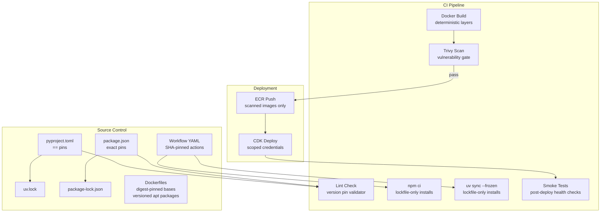

# Design Document: Supply Chain Hardening

## Overview

This design addresses 17 supply chain hardening findings across the AgentCore Public Stack's CI/CD infrastructure. The changes span four domains: GitHub Actions workflows (13 YAML files), dependency manifests (`pyproject.toml`, two `package.json` files), Dockerfiles (3 files), and shell scripts (`scripts/`). The goal is to eliminate non-determinism in builds, reduce the blast radius of compromised dependencies, and establish guardrails that prevent regressions.

All changes are configuration-level — no application code is modified. The implementation is purely additive or substitutive (replacing floating references with pinned ones), so the risk of functional regression is minimal.

### Key Design Decisions

1. **SHA pinning with version comments**: Every third-party GitHub Action reference becomes `owner/action@<sha> # vX.Y.Z`. The comment preserves human readability while the SHA provides immutability.
2. **Trivy over Grype for image scanning**: Trivy is chosen because it has a first-party GitHub Action (`aquasecurity/trivy-action`), produces SARIF output natively, and is already widely adopted in the GitHub Actions ecosystem.
3. **Lint-time enforcement over runtime enforcement**: Where possible (e.g., exact version pins), we add CI lint checks that fail fast rather than relying on developers to remember conventions.
4. **Incremental rollout**: Requirements are grouped by priority (HIGH first, then MEDIUM) and can be merged independently. No requirement depends on another being completed first.

## Architecture

The supply chain hardening touches the CI/CD layer only. No changes to the application runtime architecture are needed.



### Affected Files Summary

| Domain | Files | Requirements |
|--------|-------|-------------|
| GitHub Actions workflows | `.github/workflows/*.yml` (13 files) | 1, 8, 13, 15, 17 |
| Composite action | `.github/actions/configure-aws-credentials/action.yml` | 1 |
| Dependabot config | `.github/dependabot.yml` | 9 |
| Python manifest | `backend/pyproject.toml` | 2, 12 |
| Frontend manifest | `frontend/ai.client/package.json` | 3 |
| Infrastructure manifest | `infrastructure/package.json` | 5 |
| Dockerfiles | `backend/Dockerfile.{app-api,inference-api,rag-ingestion}` | 10 |
| Install scripts | `scripts/common/install-deps.sh`, `scripts/stack-*/install.sh` | 4, 6 |
| New files | `CONTRIBUTING.md`, `.github/ARTIFACT_RETENTION.md` | 11, 14 |
| Smoke test scripts | `scripts/stack-*/smoke-test.sh` (new) | 16 |
| Image scanning | `nightly.yml` track addition | 7 |

## Components and Interfaces

### Component 1: GitHub Actions SHA Pinning (Requirements 1, 13)

**Current state**: All workflows reference actions by mutable tag (e.g., `actions/checkout@v5`, `actions/upload-artifact@v6`, `docker/build-push-action@v7`). The composite action at `.github/actions/configure-aws-credentials/action.yml` internally references `aws-actions/configure-aws-credentials@v6`.

**Target state**: Every third-party action reference is replaced with its SHA-256 digest plus a version comment:

```yaml
# Before
- uses: actions/checkout@v5

# After
- uses: actions/checkout@11bd71901bbe5b1630ceea73d27597364c9af683 # v4.2.2
```

**Approach**:
- For each action used across all 13 workflow files + 1 composite action, resolve the current tag to its commit SHA using `git ls-remote` or the GitHub API.
- Standardize on a single version of `actions/checkout` across all files (Requirement 13).
- The local composite action (`.github/actions/configure-aws-credentials`) continues to be referenced by relative path — exempt from SHA pinning per Requirement 1.4.
- Third-party actions inside the composite action (`aws-actions/configure-aws-credentials@v6`) are also SHA-pinned.

**Actions to pin** (deduplicated across all workflows):
- `actions/checkout`
- `actions/cache/restore`
- `actions/cache/save`
- `actions/upload-artifact`
- `actions/download-artifact`
- `docker/setup-buildx-action`
- `docker/build-push-action`
- `aws-actions/configure-aws-credentials` (inside composite action)

### Component 2: Dependency Version Pinning (Requirements 2, 3, 5)

**Python (`backend/pyproject.toml`)** — Requirement 2:

Current state has a mix of exact (`==`) and floor (`>=`) pins. All `>=` pins must become `==`:

```toml
# Before
"boto3>=1.40.1",
"python-dotenv>=1.0.0",

# After
"boto3==1.40.1",
"python-dotenv==1.0.0",
```

This applies to all sections: `dependencies`, `[project.optional-dependencies].agentcore`, and `[project.optional-dependencies].dev`. After pinning, regenerate `uv.lock` with `uv lock`.

**Frontend (`frontend/ai.client/package.json`)** — Requirement 3:

For each dependency, look up the actual resolved version in `package-lock.json` and pin to that exact version. Do NOT simply strip the `^`/`~` prefix — the lockfile may have resolved to a higher version than the floor specified in `package.json`.

```json
// Before (package.json says ^21.0.0, but lockfile resolved to 21.2.5)
"@angular/core": "^21.0.0",

// After (use the version from package-lock.json)
"@angular/core": "21.2.5",
```

Process:
1. Parse `package-lock.json` to extract the resolved version for each direct dependency
2. Replace the version string in `package.json` with the exact resolved version (no `^`, `~`, or range operators)
3. Run `npm install` to regenerate `package-lock.json` consistent with the new exact pins
4. Verify with `npm ci` that the lockfile is in sync

**Infrastructure (`infrastructure/package.json`)** — Requirement 5:

Same approach — read resolved versions from `infrastructure/package-lock.json`:

```json
// Before (package.json says ^2.235.1, lockfile resolved to e.g. 2.235.1)
"aws-cdk-lib": "^2.235.1",
"aws-cdk": "^2.1033.0",

// After (use exact versions from package-lock.json, upgrading to latest stable)
"aws-cdk-lib": "2.244.0",
"aws-cdk": "2.1113.0",
```

Process:
1. Parse `infrastructure/package-lock.json` to extract resolved versions
2. Replace version strings in `package.json` with exact resolved versions
3. Run `npm install` to regenerate `package-lock.json`
4. Verify with `npm ci`

### Component 3: Install Script Hardening (Requirements 4, 6)

**Global tool pinning** — Requirement 4:

In `scripts/common/install-deps.sh`, the CDK CLI install is unpinned:
```bash
# Before
npm install -g aws-cdk

# After
npm install -g aws-cdk@2.1113.0
```

Same fix in `scripts/stack-infrastructure/install.sh`. Node.js is already installed from a versioned distribution URL (`setup_20.x`), satisfying Requirement 4.2.

**npm ci enforcement** — Requirement 6:

Several install scripts use `npm install` instead of `npm ci`:
- `scripts/stack-app-api/install.sh` — uses `npm install` for infrastructure
- `scripts/stack-infrastructure/install.sh` — uses `npm install`

Fix: Replace `npm install` with `npm ci` and add a lockfile existence check:

```bash
if [ ! -f "package-lock.json" ]; then
    log_error "package-lock.json not found. Cannot run npm ci."
    exit 1
fi
npm ci
```

`scripts/stack-frontend/install.sh` already uses `npm ci` with a lockfile check — this is the reference pattern.

### Component 4: Container Image Scanning (Requirement 7)

**Approach**: Instead of adding a hard gate to the per-stack deploy workflows, add image scanning as a new optional track in the nightly build system (`nightly.yml`). This follows the existing track-based architecture where `resolve-tracks` parses comma-separated track tokens into boolean flags.

**New track token**: `scan-images-<branch>` (e.g., `scan-images-develop`, `scan-images-main`)

When `all` is specified, the scan track runs alongside the existing test/deploy/MV tracks. It can also be triggered independently via `workflow_dispatch`.

**Track resolution** — add to `resolve-tracks` job in `nightly.yml`:

```bash
scan-images-*)
  run_scan_images=true
  scan_images_ref="${token#scan-images-}"
  ;;
```

And include `scan-images` in the `all` case:
```bash
all)
  # ... existing tracks ...
  run_scan_images=true
  scan_images_ref="develop"
  ;;
```

**New jobs in `nightly.yml`**:

1. `scan-images` — builds all three Docker images (app-api, inference-api, rag-ingestion) and runs Trivy against each. This job does NOT block any deploy track. It runs in parallel with the existing test and deploy tracks.

```yaml
scan-images:
  name: Scan Docker Images
  runs-on: ubuntu-24.04
  needs: resolve-tracks
  if: needs.resolve-tracks.outputs.run_scan_images == 'true'
  outputs:
    status: ${{ steps.summary.outputs.status }}
    duration: ${{ steps.summary.outputs.duration }}
  steps:
    - name: Checkout code
      uses: actions/checkout@<sha>
      with:
        ref: ${{ needs.resolve-tracks.outputs.scan_images_ref }}

    - name: Build and scan app-api image
      run: |
        docker build -f backend/Dockerfile.app-api -t app-api:scan .
        docker save app-api:scan -o /tmp/app-api.tar

    - name: Trivy scan app-api
      uses: aquasecurity/trivy-action@<sha> # v0.28.0
      with:
        input: /tmp/app-api.tar
        format: 'table'
        exit-code: '0'  # advisory — does NOT fail the job
        severity: 'CRITICAL,HIGH'
        output: trivy-app-api.txt

    # Repeat for inference-api and rag-ingestion...

    - name: Upload scan reports
      if: always()
      uses: actions/upload-artifact@<sha>
      with:
        name: trivy-scan-reports
        path: trivy-*.txt
        retention-days: 30

    - name: Generate summary
      id: summary
      if: always()
      run: |
        # Parse Trivy outputs and write to GITHUB_STEP_SUMMARY
        # Report counts of CRITICAL/HIGH/MEDIUM findings per image
        ...
```

**Key design choices**:
- `exit-code: '0'` — the scan is advisory, not a hard gate. Findings appear in the nightly summary and as artifacts, but don't block anything.
- The scan job is added to the `summary` job's `needs` list so results appear in the nightly summary report.
- The `all` track includes scanning by default, so scheduled nightly runs get image scanning automatically.
- Forks that don't set `NIGHTLY_TRACKS` get no scanning (fork-safe default, consistent with existing tracks).

**Nightly summary integration** — add a row to the summary job:
```bash
if [ "$RUN_SCAN_IMAGES" = "true" ]; then
  status="$(map_status "${{ needs.scan-images.result }}")"
  ROWS+=("Image Scan|${status}|${{ needs.scan-images.outputs.duration || '0' }}")
fi
```

### Component 5: Runner Version Pinning (Requirement 8)

Replace all `ubuntu-latest` references with `ubuntu-24.04`:

```yaml
# Before
runs-on: ubuntu-latest

# After
runs-on: ubuntu-24.04
```

Some jobs already use `ubuntu-24.04-arm` (e.g., `synth-cdk` in app-api, `build-docker` in inference-api). These are already pinned and remain unchanged.

### Component 6: Dependabot Enhancement (Requirement 9)

The existing `.github/dependabot.yml` already has a `github-actions` ecosystem entry targeting `develop` with grouped minor/patch updates. This satisfies all three acceptance criteria. The only change needed is to verify the configuration works correctly with SHA-pinned actions (Dependabot natively supports SHA digest bumps for GitHub Actions).

No file changes required — the current configuration already meets Requirement 9.

### Component 7: Docker apt-get Pinning (Requirement 10)

Pin all apt-get packages in the three Dockerfiles to specific versions. The exact versions depend on the base image's package repository.

**`Dockerfile.app-api` and `Dockerfile.inference-api`** (builder stage):
```dockerfile
# Before
RUN apt-get update && apt-get install -y \
    gcc \
    g++

# After  
RUN apt-get update && apt-get install -y \
    gcc=12.2.0-14 \
    g++=12.2.0-14
```

**Production stage** (both files):
```dockerfile
# Before
RUN apt-get update && apt-get install -y \
    curl

# After
RUN apt-get update && apt-get install -y \
    curl=7.88.1-10+deb12u12
```

**`Dockerfile.rag-ingestion`** uses `dnf` (Amazon Linux 2023), not `apt-get`. The same principle applies — pin package versions where the package manager supports it. For `dnf`, version pinning uses `package-version` syntax. Where exact versions are unavailable or impractical (e.g., `mesa-libGL` on AL2023), document the constraint as a comment.

### Component 8: CONTRIBUTING.md (Requirement 11)

Create `CONTRIBUTING.md` at the repository root documenting:
- Prerequisites (Node.js 20+, Python 3.13+, Docker, AWS CLI v2, uv)
- Clone and install steps for backend, frontend, and infrastructure
- Environment variable configuration (referencing `backend/src/.env` and `frontend/ai.client/src/environments/`)
- How to run test suites (`uv run pytest`, `npm test`, `npx cdk synth`)
- AWS credential setup for local development

### Component 9: mypy Version Fix (Requirement 12)

```toml
# Before
[tool.mypy]
python_version = "3.9"

# After
[tool.mypy]
python_version = "3.10"
```

The `requires-python = ">=3.10"` in `pyproject.toml` means the minimum supported version is 3.10. mypy's `python_version` must match.

### Component 10: Artifact Retention Policy (Requirement 14)

Create `.github/ARTIFACT_RETENTION.md` documenting retention periods:

| Artifact Type | Retention | Rationale |
|--------------|-----------|-----------|
| Docker image tarballs | 1 day | Ephemeral build artifacts, images live in ECR |
| CDK synthesized templates | 7 days | Needed for deploy job, then disposable |
| Test results / coverage | 7 days | Debugging window for failed PRs |
| Deployment outputs (stack outputs) | 30 days | Audit trail for deployments |
| Trivy scan reports | 30 days | Security audit trail |

Verify all `retention-days` values in workflow files match this policy. Current state already uses 1/7/30 day tiers consistently.

### Component 11: Frontend cancel-in-progress (Requirement 15)

After review, the frontend workflow includes a CDK deploy step (`deploy-cdk.sh` for the CloudFront/S3 stack). Cancelling a CDK deploy mid-execution can leave CloudFormation in a `ROLLBACK_IN_PROGRESS` or `UPDATE_ROLLBACK_FAILED` state. Therefore `cancel-in-progress: false` is the correct setting for the frontend workflow as well.

**No change required.** Requirement 15 is satisfied by documenting the rationale: all workflows that include CDK deploys must retain `cancel-in-progress: false`.

### Component 12: Post-Deployment Smoke Tests (Requirement 16)

**Deferred.** Post-deployment smoke tests for the per-stack workflows (app-api, inference-api, frontend) are out of scope for this iteration. The nightly deploy pipeline already has a comprehensive smoke test job. This can be revisited later.

### Component 13: Secret Scoping (Requirement 17)

**Current state**: Several workflows define AWS credentials (`AWS_ROLE_ARN`, `AWS_ACCESS_KEY_ID`, `AWS_SECRET_ACCESS_KEY`) at the workflow-level `env:` block, making them available to all jobs including those that don't need AWS access (e.g., `install`, `build-cdk`, `test-python`, `check-stack-dependencies`).

**Target state**: Move AWS credential env vars from workflow-level to job-level, only on jobs that actually use AWS (jobs with `configure-aws-credentials` step, ECR push, or CDK deploy).

Jobs that do NOT need AWS credentials:
- `check-stack-dependencies`
- `install`
- `build-docker` (builds locally, no ECR interaction)
- `build-cdk`
- `build-frontend`
- `test-python`
- `test-frontend`

Currently, the workflows already define most secrets at the job level (inside `env:` blocks on specific jobs). The workflow-level `env:` only contains non-sensitive config (`CDK_REQUIRE_APPROVAL`, `FORCE_JAVASCRIPT_ACTIONS_TO_NODE24`, `LOAD_ENV_QUIET`). This is already correct for most workflows. We need to audit each workflow and confirm no secrets leak to the workflow-level `env:`.

## Data Models

This feature does not introduce new data models. All changes are to configuration files (YAML, TOML, JSON, Dockerfile, shell scripts) and documentation (Markdown). No database schemas, API contracts, or runtime data structures are affected.

### Configuration File Formats

**Version pin format** (pyproject.toml):
```
"package==X.Y.Z"
```

**Version pin format** (package.json):
```
"package": "X.Y.Z"
```

**SHA pin format** (GitHub Actions):
```
uses: owner/action@<40-char-sha> # vX.Y.Z
```

**apt-get pin format** (Dockerfile):
```
package=X.Y.Z-release
```


## Correctness Properties

*A property is a characteristic or behavior that should hold true across all valid executions of a system — essentially, a formal statement about what the system should do. Properties serve as the bridge between human-readable specifications and machine-verifiable correctness guarantees.*

### Property 1: Third-party actions are SHA-pinned with version comments

*For any* `uses:` reference in any workflow YAML file (`.github/workflows/*.yml`) or composite action YAML, if the reference is to a third-party action (not starting with `./`), then it must match the pattern `owner/action@<40-char-hex-sha> # vX.Y.Z`.

**Validates: Requirements 1.1**

### Property 2: All Python dependencies use exact version pins

*For any* dependency string in any section of `pyproject.toml` (`dependencies`, `[project.optional-dependencies].agentcore`, `[project.optional-dependencies].dev`), the version specifier must use the `==` operator. Strings containing `>=`, `~=`, `>`, `<`, or no version constraint must be rejected.

**Validates: Requirements 2.1, 2.2, 2.4**

### Property 3: All npm dependencies use exact version pins

*For any* dependency entry in the `dependencies` or `devDependencies` sections of `frontend/ai.client/package.json` and `infrastructure/package.json`, the version string must not begin with `^`, `~`, `>`, `<`, or `*`.

**Validates: Requirements 3.1, 3.2, 5.1, 5.2**

### Property 4: Global npm installs specify exact versions

*For any* `npm install -g` command in any shell script under `scripts/`, the package name must include an `@version` suffix (e.g., `aws-cdk@2.1033.0`).

**Validates: Requirements 4.1, 4.3**

### Property 5: CI install paths use npm ci with lockfile check

*For any* shell script under `scripts/` that installs npm dependencies for a project directory, the script must use `npm ci` (not `npm install`) when a `package-lock.json` is present, and must exit non-zero if the lockfile is missing.

**Validates: Requirements 6.1, 6.2**

### Property 6: Nightly workflow includes image scanning track

*For the* nightly workflow (`nightly.yml`), the `resolve-tracks` job must output a `run_scan_images` flag, and there must be a `scan-images` job that runs Trivy against all three Docker images (app-api, inference-api, rag-ingestion) when the flag is true. The scan must use `exit-code: '0'` (advisory mode) and upload reports as artifacts.

**Validates: Requirements 7.1, 7.4**

### Property 7: No workflow job uses floating runner aliases

*For any* `runs-on` value in any job in any workflow YAML file, the value must not contain the string `-latest`. It must specify an explicit OS version (e.g., `ubuntu-24.04`).

**Validates: Requirements 8.1**

### Property 8: Dependabot entries target develop with grouped updates

*For any* ecosystem entry in `.github/dependabot.yml`, the `target-branch` must be `"develop"` and the entry must contain a `groups` section that includes `update-types` covering both `"minor"` and `"patch"`.

**Validates: Requirements 9.2, 9.3**

### Property 9: Dockerfile apt-get packages have version pins

*For any* `apt-get install` command in any Dockerfile, every package name must include a version pin in the format `package=version` (for apt-get) or `package-version` (for dnf), unless accompanied by a comment documenting why the pin is omitted.

**Validates: Requirements 10.1, 10.2**

### Property 10: Consistent checkout action SHA across all workflows

*For any* two workflow YAML files that reference `actions/checkout`, the SHA digest used must be identical.

**Validates: Requirements 13.1**

### Property 11: Consistent artifact retention per artifact type

*For any* two `upload-artifact` steps across all workflow files that upload the same category of artifact (Docker image, CDK synth, test results, deployment outputs), the `retention-days` value must be identical.

**Validates: Requirements 14.2**

### Property 12: All deployment workflows retain cancel-in-progress false

*For any* workflow that contains a CDK deploy job (including frontend, which deploys the CloudFront/S3 stack via CDK), the workflow's `concurrency.cancel-in-progress` must be `false`.

**Validates: Requirements 15.2**

### Property 13: Deployment workflows have post-deployment smoke tests

**Deferred.** This property is out of scope for this iteration. The nightly deploy pipeline already includes a smoke test job.

**Validates: Requirements 16.1**

### Property 14: AWS credentials scoped to AWS-using jobs only

*For any* job in any workflow, the job's `env` block contains AWS credential variables (`AWS_ROLE_ARN`, `AWS_ACCESS_KEY_ID`, `AWS_SECRET_ACCESS_KEY`) if and only if the job contains a step that interacts with AWS (e.g., `configure-aws-credentials`, ECR login, CDK deploy). No AWS credentials may appear in the workflow-level `env` block.

**Validates: Requirements 17.1, 17.2**

## Error Handling

### Lint Check Failures (Requirements 2, 3, 4, 5)

When the version pin validator detects a non-exact pin:
- The CI job exits with a non-zero status code.
- The error message identifies the file, dependency name, and the offending version specifier.
- The message suggests the correct format (e.g., `"boto3==1.40.1"` instead of `"boto3>=1.40.1"`).

### Image Scan Results (Requirement 7)

When Trivy detects CRITICAL or HIGH vulnerabilities in the nightly scan track:
- The vulnerability table is printed to stdout (visible in the job log).
- The full report is uploaded as an artifact with 30-day retention.
- The scan job completes with success regardless of findings (`exit-code: '0'` — advisory mode).
- Results appear in the nightly summary report for visibility.
- No deploy or push is blocked — the scan is informational only.

### Smoke Test Failures (Requirement 16)

**Deferred.** Post-deployment smoke tests for per-stack workflows are out of scope for this iteration.

### Missing Lockfile (Requirement 6)

When `package-lock.json` is missing and `npm ci` is attempted:
- The install script exits immediately with code 1.
- The error message states: `"package-lock.json not found. Cannot run npm ci. Commit the lockfile first."`

### Unavailable apt-get Package Versions (Requirement 10)

When a pinned apt-get package version is not available in the base image's repository:
- The Docker build fails at the `apt-get install` step.
- Resolution: Update the version pin to match the available version in the base image, or document the constraint as a comment if exact pinning is impractical (e.g., AL2023 dnf packages).

## Testing Strategy

### Dual Testing Approach

This feature uses both unit tests (specific examples) and property-based tests (universal properties) for comprehensive coverage.

**Unit tests** verify:
- Specific examples: e.g., `CONTRIBUTING.md` exists and contains required sections (Req 11)
- Edge cases: e.g., missing lockfile causes non-zero exit (Req 6.3)
- Configuration examples: e.g., Trivy step has `exit-code: '1'` (Req 7.2), mypy version matches requires-python (Req 12.1)
- Specific file checks: e.g., frontend workflow has `cancel-in-progress: true` (Req 15.1)

**Property-based tests** verify:
- Universal properties across all workflow files, dependency manifests, Dockerfiles, and scripts
- Each property test generates or enumerates the relevant files and checks the invariant holds for every instance

### Property-Based Testing Configuration

- **Library**: Python `hypothesis` (already in dev dependencies) for property-based testing, combined with `pytest`
- **Minimum iterations**: 100 per property test (where randomization applies)
- **Tag format**: Each test is tagged with a comment: `# Feature: supply-chain-hardening, Property {N}: {title}`
- **Each correctness property maps to exactly one property-based test**

Since most properties in this feature are about static file analysis (parsing YAML/TOML/JSON/Dockerfile/shell files and checking structural invariants), the property tests will enumerate all relevant files and check the invariant holds for every entry. For properties where the input space is finite (e.g., all workflow files), the test exhaustively checks every instance rather than sampling.

### Test File Organization

```
backend/tests/supply_chain/
├── test_action_pinning.py       # Properties 1, 10
├── test_dependency_pinning.py   # Properties 2, 3
├── test_script_hardening.py     # Properties 4, 5
├── test_docker_scanning.py      # Property 6 (nightly scan track)
├── test_runner_pinning.py       # Property 7
├── test_dependabot_config.py    # Property 8
├── test_dockerfile_pinning.py   # Property 9
├── test_artifact_retention.py   # Property 11
├── test_concurrency_config.py   # Property 12
├── test_smoke_tests.py          # Property 13
├── test_secret_scoping.py       # Property 14
└── test_documentation.py        # Unit tests for Reqs 11, 12, 14
```

### Example Test Patterns

**Property test** (Property 1 — SHA pinning):
```python
# Feature: supply-chain-hardening, Property 1: Third-party actions are SHA-pinned
import re, yaml, glob

def test_all_third_party_actions_are_sha_pinned():
    sha_pattern = re.compile(r'^[\w-]+/[\w-]+@[0-9a-f]{40}\s+#\s+v[\d.]+')
    for wf in glob.glob('.github/workflows/*.yml'):
        # parse YAML, find all uses: values, check pattern
        ...
```

**Unit test** (Requirement 12 — mypy version):
```python
def test_mypy_version_matches_requires_python():
    # parse pyproject.toml
    # extract requires-python minimum version
    # extract [tool.mypy].python_version
    # assert they match
    ...
```
